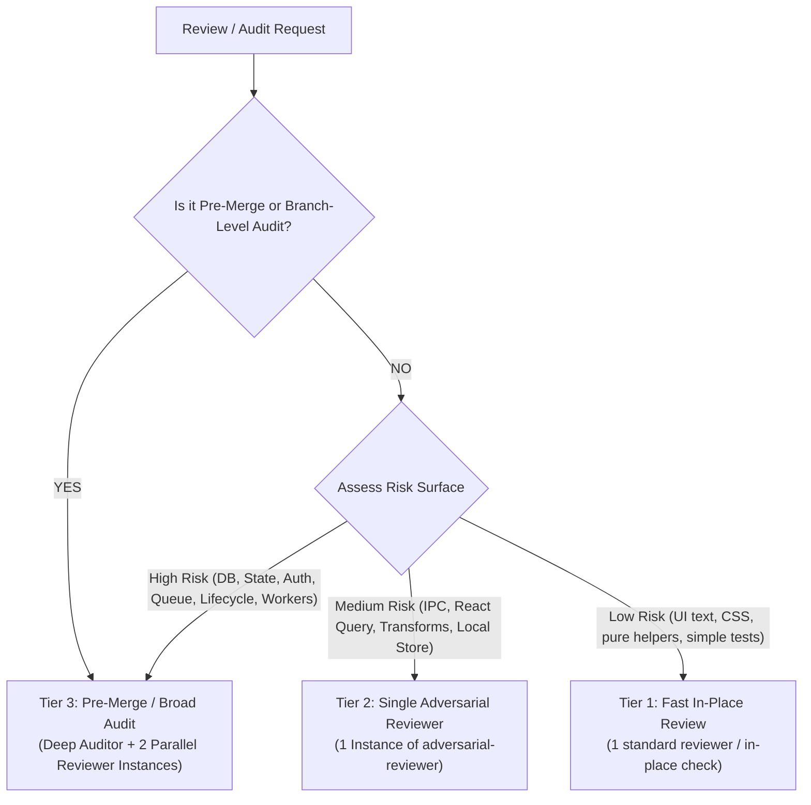

# Nora Audit & Review Routing Rules

This document establishes the canonical routing, risk classification, and verification rules for code reviews, subsystem audits, and pre-merge evaluations in the Nora repository.

---

## 1. Risk-Proportional Review Routing

Review intensity and agent allocation must match the **blast radius and risk level** of the change.



### Routing Tier Definitions

| Tier | Change Surface / Trigger Condition | Review Topology | Verification Bar |
| :--- | :--- | :--- | :--- |
| **Tier 1: Low Risk** | • UI copy, text, CSS, Tailwind styling<br/>• Isolated pure utilities (`utils/formatters.ts`)<br/>• Simple component visual adjustments | **1 Agent** (Standard review or direct orchestrator inspection) | Syntax, rendering, unit tests. |
| **Tier 2: Medium Risk** | • New IPC handler / DTO shape<br/>• React Query cache invalidation & keys<br/>• Metadata parser transformations<br/>• Local Zustand store modifications | **1 Agent** (`adversarial-reviewer` attacking diff, concurrency, and negative space) | Concurrency check, cache staleness proof, error propagation. |
| **Tier 3: High Risk & Pre-Merge** | • **Pre-Merge / Branch-Level Audits** (*"is this merge ready?"*, branch vs master)<br/>• SQLite schema & migrations<br/>• Queue & audio engine playback pipeline<br/>• Authentication, keychain & token lifecycle<br/>• Background workers & synchronization<br/>• App startup, ungraceful shutdown & restart | **3 Execution Contexts**:<br/>1. `deep-auditor` (Reality mapping)<br/>2. `adversarial-reviewer` #1 (*Invariant & Claim Falsifier*)<br/>3. `adversarial-reviewer` #2 (*Negative Space Hunter*) | **Strict P0/P1 Proof Contract**: Line-level call-graph trace, execution conditions, reproduction path. |

---

## 2. Explainable Routing Decision Header

For any non-trivial review, the Orchestrator must output an explainable routing decision before presenting findings:

```markdown
### ROUTING DECISION

- **Selected Tier**: Tier 3 (High Risk & Pre-Merge)
- **Selection Criteria**:
  ✓ Pre-merge branch audit (`test/...` -> `master`)
  ✓ Cross-process / IPC changes detected
  ✓ State/lifecycle surface detected (Audio / Queue / Equalizer)
- **Review Strategy**:
  ✓ `deep-auditor` (Reality mapping)
  ✓ `adversarial-reviewer` #1 (Invariant & Claim Falsifier)
  ✓ `adversarial-reviewer` #2 (Negative Space Hunter)
```

---

## 3. Strict Proof Standard for Serious Findings (`P0` / `P1`)

To eliminate speculation and artificial skepticism, any finding claiming **`P0` (Critical)** or **`P1` (High)** must strictly provide the following 5-point proof:

```markdown
##### [P1] <Finding Title>
- **WHEN (Trigger Condition)**: Exact event sequence, network drop, user action, or timing race.
- **HOW (Execution Path)**: Exact step-by-step call chain with line numbers (e.g., `App.tsx:L12` -> `IPC.ts:L45` -> `Service.ts:L90`).
- **WHY (Concrete Impact)**: Verified permanent data loss, unrecoverable deadlock, or application crash.
- **PROOF (Testability)**: Reproducible test or undeniable code path proof.
- **CONFIDENCE**: High | Medium | Low (If evidence is inconclusive, mark as `UNRESOLVED` or downgrade to `P3`).
```

---

## 4. The 4 Terminal Challenge States

When evaluating claims or peer findings:
* **`CONFIRMED`**: Flaw or risk is verified with a clear, credible execution path and line-level evidence.
* **`DISPROVED`**: Existing safeguards, guards, or invalid assumptions were proven via code inspection.
* **`PARTIALLY CONFIRMED`**: Flaw is real, but the claimed severity or impact was overstated, or mitigating factors exist.
* **`UNRESOLVED`**: **A legitimate success state** when static repository evidence is inconclusive. Never manufacture certainty.

---

## 5. Action Decision Framework

Map every verified finding to an actionable decision:
* **`ACT NOW`**: Critical or high-impact defect (`P0`/`P1`) causing data loss, crashes, or broken primary workflows. Must be fixed before merging.
* **`PLAN`**: Valid structural weakness or missing capability (`P2`) that should be scheduled in a dedicated task.
* **`MONITOR`**: Potential edge case or theoretical risk where production impact is currently low or unproven.
* **`ACCEPT`**: Minor architectural imperfection or intentional tradeoff (`P3`) that does not justify refactoring overhead.

---

## 6. General Nora Architectural Invariants

When verifying or fixing findings:
* **Preserve Layering**: `Repository → Operations → Engine → IPC → Renderer`. Do not move business logic across layers.
* **Preserve State Ownership**: Authoritative data belongs in SQLite; transient UI state in Zustand/React Query. Do not duplicate sources of truth.
* **Transaction Scoping**: A transaction-scoped DB operation must never fall back to the global connection handle.
