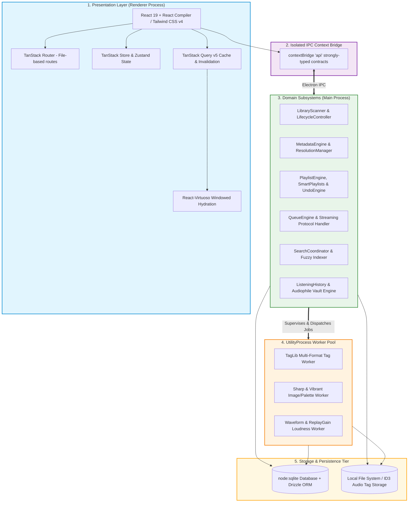

<div align="center">


# Sita Music Player

### An ultra-fast, local-first, modular desktop music player & listening intelligence platform

[](https://www.gnu.org/licenses/gpl-3.0.html)
[](https://github.com/Sandakan/Nora)
[](https://www.typescriptlang.org/)
[](https://react.dev/)
[](https://www.electronjs.org/)
[](https://vitejs.dev/)
[](https://tailwindcss.com/)
[](https://orm.drizzle.team/)
[](https://oxc.rs/)
[](https://vitest.dev/)

[✨ Key Features](#-key-features) • [📸 Visual Gallery](#-visual-gallery) • [🏛 Architecture & Tech Stack](#-architecture--tech-stack) • [🛠 Build From Source](#-build-from-source) • [⌨️ Keyboard Shortcuts](#-keyboard-shortcuts) • [🤝 Heritage & Credits](#-heritage--credits) • [Changelog](CHANGELOG.md)

</div>

---

> [!IMPORTANT]
> **Fork & Heritage Notice:** **Sita** is an advanced, high-performance fork of the open-source [Nora Music Player](https://github.com/Sandakan/Nora) originally created by [Sandakan Nipunajith](https://github.com/Sandakan) (inspired by [Oto Music](https://play.google.com/store/apps/details?id=com.piyush.music)). Sita heavily expands upon the original foundation with a native `node:sqlite` database engine, dedicated `utilityProcess` multi-worker pool architecture, multi-queue tab orchestration with canonical library projections, 200-bin peak waveform audio seekbars, real-time DSP Karaoke vocal reducer with LR4 crossover filtering, A-B loop repetition, an Audiophile Vault with listening analytics, circadian rhythm tracking, real-time Theme Layer Inspector, and robust transactional metadata auto-tagging.

---

## 🎯 Why Sita?

**Sita** is engineered for audiophiles, personal music collectors, and power listeners who demand uncompromising speed, deep listening analytics, pixel-perfect aesthetics, and absolute data sovereignty.

Built to effortlessly handle personal libraries ranging from hundreds to **over 50,000+ tracks**, Sita combines studio-grade audio playback, multi-queue tab session management, comprehensive listening intelligence (Audiophile Vault, Circadian Rhythm, format breakdowns), rich metadata enrichment (MusicBrainz, ISRC, Cover Art Archive, Last.fm, Spotify), multi-lingual synced lyrics with phonetic romanization, real-time waveform seeking, and a live CSS theme customizer — all while remaining **100% local-first, offline-capable, and privacy-respecting**.

---

## 📸 Visual Gallery

<div align="center">

### 🎵 Modern Audio Engine & Fast Local Library

_ID-first windowed hydration, 200-bin peak waveform seekbar & gapless playback_


<br><br>

|                                            📊 Audiophile Vault & Listening Stats                                            |                                       🌙 Circadian Rhythm & Taste Analytics                                       |
| :-------------------------------------------------------------------------------------------------------------------------: | :---------------------------------------------------------------------------------------------------------------: |
| [](resources/other/sita_showcase_insights_vault.webp) | [](resources/other/sita_showcase_circadian.webp) |
|                                      _Library bitrates, codec ratios & play velocity_                                       |                                 _24-hour activity clock, artist podiums & genres_                                 |

|                                       🎨 17+ Curated Theme Presets                                       |                                          🛠 Live Theme Layer Inspector                                           |
| :------------------------------------------------------------------------------------------------------: | :--------------------------------------------------------------------------------------------------------------: |
| [](resources/other/sita_showcase_themes.webp) | [](resources/other/sita_showcase_inspector.webp) |
|                             _Light, dark, obsidian & dynamic cover palettes_                             |                               _Real-time CSS variable tweaking with live preview_                                |

</div>

> [!TIP]
> Original high-resolution raw application screenshots are available in [`resources/screenshots/`](resources/screenshots/). You can customize or re-render these showcase mockups anytime using [`scripts/generate-showcase-artworks.mjs`](scripts/generate-showcase-artworks.mjs).

---

## ✨ Key Features

### ⚡ Extreme Performance & Scalability

- **ID-First Windowed Hydration:** Sub-15ms IPC payload transfers and near-instant load times via [`useWindowHydration`](src/renderer/src/hooks/useWindowHydration.ts) and virtualized lists ([`react-virtuoso`](https://virtuoso.dev/)). Maintains a flat ~14.5 MB heap and 60 FPS smooth scrolling across 50,000+ songs.
- **Off-Main-Thread Worker Pool:** CPU-intensive jobs (audio tag extraction via `node-taglib-sharp`, Sharp artwork resizing, Vibrant color palette extraction, 200-bin waveform generation, and ReplayGain loudness calculation) run in dedicated Electron `utilityProcess` workers with supervision, backpressure management, and crash recovery — ensuring **0 ms UI lockup**.
- **Native Embedded Relational Database:** Migrated from heavy database layers to native `node:sqlite` coupled with [Drizzle ORM](https://orm.drizzle.team/), providing transactional reliability, lightning-fast indexed queries, and zero background daemon overhead.

### 🎵 Studio-Grade Audio Playback & Visualization

- **Streaming File Protocol:** Custom audio streaming protocol utilizing native backpressure (`Readable.toWeb`), byte-range slicing (`206 Partial Content`), and Chromium media range caching.
- **200-Bin Peak Waveform Seekbar:** Real-time interactive waveform seekbar offering precision seeking and visual audio feedback.
- **Real-Time DSP Karaoke Mode (Vocal Reducer):** High-precision zero-latency center-channel vocal reduction powered by a parallel Linkwitz-Riley 4th-order (LR4) crossover filter topology. Suppresses centered lead vocals within the human voice midrange (220 Hz – 6,000 Hz) while phase-independently preserving punchy bass foundation (< 220 Hz) and high-frequency sparkle (> 6,000 Hz). Includes instant one-click toggle, real-time vocal attenuation slider (0–100%), and optional quick-access placement in the player bar.
- **A-B Loop Practice Mode:** Seamless segment looper with visual pin indicators on the waveform seekbar, gap-aware turnaround, and direct lyric line loop synchronization (`[` / `]` / `\`) for practice and transcription.
- **Audio FX & Night Mode:** Integrated audio effects modal featuring a dynamic range compressor (Night Mode) for comfortable night-time listening without jarring volume spikes.
- **EBU R128 / ITU-R BS.1770-4 Loudness Normalization:** Pure ReplayGain analysis engine with album-level loudness aggregation and decoupled playback volume policy.
- **Interactive Duration / Remaining Toggle:** Click the duration indicator in the main player bar, Fullscreen Player, or Theatre mode to toggle between total elapsed duration and remaining countdown time.
- **Seamless Playback Transitions:** Configurable volume fade on play/pause and gapless audio sequencing.

### 📑 Multi-Queue Tabs & Canonical Architecture

- **Multiple Concurrent Queue Tabs:** Organize playback across multiple independent queue sessions with a dedicated tab bar. Keep separate queues for workouts, deep work, album deep-dives, or casual listening sessions without overwriting your active playback list.
- **Independent Playback State & Background Curation:** Each queue tab retains its own isolated track list, playback cursor, shuffle permutation, and history. Seamlessly inspect, edit, reorder, or append tracks to background queues without interrupting the currently playing song.
- **Drag-and-Drop Reordering & Queue Locking:** Rearrange queue tabs effortlessly with fluid drag-and-drop (`@hello-pangea/dnd`). Lock critical queue tabs to safeguard your curated setlists against accidental clearance, replacement, or auto-detach.
- **Canonical All Songs Queue Engine:** High-performance projection architecture for your main library. Clicking any song in the library reuses a single canonical queue instance with zero allocation overhead, eliminating redundant queue tabs.
- **Library Version Provenance & Self-Healing:** Tracked via a monotonic `libraryVersion` counter. As tracks are scanned, edited, or blacklisted, the canonical queue automatically detects staleness and self-heals in place on the next play request.
- **Seamless Detachable Curation:** Manually modifying a canonical queue (adding, removing, or reordering tracks) smoothly detaches and demotes it into an independent custom queue while preserving all user edits.
- **Contextual Filtered Queues:** Filtering library views by genre, artist, language, or search query automatically provisions isolated contextual queues (`All Songs: <filter>`) without disrupting your primary listening session.

### 📊 Audiophile Vault & Listening Intelligence

- **Audiophile Vault:** Detailed technical inspection of your personal library, including average bitrate, total play duration, and lossless vs. lossy format breakdowns (`FLAC`, `M4A`, `MP3`, `OPUS`, `WAV`, `AAC`, `M4R`).
- **Circadian Rhythm Analysis:** 24-hour activity clock analyzing your listening patterns across Morning, Afternoon, Evening, and Night, pinpointing your peak listening hours.
- **Listening Trends & Playback Velocity:** Real-time metrics tracking total listening time, track play counts, unique songs explored, and completion rates across 7 days, 30 days, 6 months, 1 year, and All Time.
- **Musical Taste DNA & Artist Podiums:** Visual podium rankings for your most-played artists, alongside proportional distribution bars for your top genres.

### 🏷️ Next-Gen Metadata Platform & AutoTag

- **Multi-Format Native Tagging:** Powered by `node-taglib-sharp` with full read/write support for `MP3`, `FLAC`, `M4A`, `OGG`, `WAV`, `AAC`, `OPUS`, and `M4R`.
- **Multi-Provider AutoTag Resolution:** Automated identification and metadata fetching from **MusicBrainz** (Recording MBID & ISRC extraction), **Cover Art Archive** (with release-group fallbacks), **Last.fm**, and **Spotify**.
- **Intelligent Duplicate Song Detection & Resolution:** Multi-criteria audio fingerprinting and metadata matching engine that discovers exact and fuzzy track duplicates, complete with bitrate-aware keeper recommendations, category filters, and safe bulk cleanup.
- **Multi-Playlist Batch Import:** Drag-and-drop or file-dialog batch importing for `.m3u` and `.m3u8` playlists with automatic path reconciliation and library mapping.
- **Bulk & Manual Language Tagging:** Multi-song language assignment, clearing, and override synchronization across physical ID3 tags and relational storage.
- **Multi-Genre Tokenizer & Normalizer:** Centralized multi-genre delimiter parsing (`parseGenreList`) and localized guidance during tag diff previews.
- **Transactional Safety & Reversibility:** Atomic tag writing with deferred write coalescing for playing tracks and full rollback support via [`MetadataTransactionManager`](src/main/metadata/transactions/MetadataTransactionManager.ts).
- **Typo-Resistant Fuzzy Search:** High-performance fuzzy matching across songs, artists, albums, and genres.

### 🎤 Comprehensive Lyrics Engine & Romanization

- **Synchronized LRC Playback:** Auto-scrolling, synchronized lyrics with millisecond precision in Fullscreen, Theatre, and Mini-Player views.
- **Multi-Source Online Fetching:** Automatic lyrics retrieval from **LRCLIB** and **Musixmatch**, prioritizing local `.lrc` sidecar files with persistent offline caching.
- **Multi-Lingual Phonetic Romanization:** Instant phonetic transliteration for Asian scripts:
  - 🇯🇵 **Japanese:** Furigana & Romaji (via Kuroshiro & Kuromoji analyzer)
  - 🇨🇳 **Chinese:** Pinyin (via Pinyin-pro & Segmentit)
  - 🇰🇷 **Korean:** Romaja transliteration
- **Real-Time Lyrics Translation:** Instant foreign lyrics translation with an inline toggle while preserving original lines.

### 🎨 Theming, Customization & Layer Inspector

- **17+ Curated Theme Presets:**
  - 🌿 _Emerald (Mint)_
  - 🖤 _Monochrome (Black & White)_
  - 🩶 _Linear Slate_
  - 🌌 _Spotify Obsidian_
  - ❄️ _Nord (Arctic)_
  - 🧛 _Dracula (Purple)_
  - ☕ _Catppuccin_, _Tokyo Night_, _Rose Pine_, _Gruvbox_, _Solarized_, _Monokai_, and more.
- **Theme Layer Inspector:** Interactive live CSS custom property tweaker allowing you to customize surface layers (`--background-color-1/2/3`, `--side-bar-background`), text contrast tokens, and player seekbar colors with real-time reactive preview.
- **Adaptive Dynamic Themes:** Dynamically extracts vibrant color palettes directly from the currently playing track's cover art.
- **Floating Heart Burst Animations:** Fluid GPU-accelerated particle burst animations on favorite toggles with optimistic state updates.

### 🪟 Compact Mini Player & Player Bar Customization

- **Dedicated Mini Player (`Ctrl+Shift+N`) & Mini Mode (`Ctrl+N`):** Ultra-sleek, compact desktop overlay with playback controls, volume slider, interactive seekbar, and synchronized lyrics snippet.
- **Desktop Floating Lyrics (`Ctrl+Shift+L`):** Transparent, always-on-top desktop overlay displaying synchronized lyrics anywhere on your screen.
- **Configurable Player Bar 3-Dots Menu:** Choose which controls appear directly on the main player bar and which are consolidated into the 3-dots context menu (Mini Player, Fullscreen, Floating Lyrics, Audio FX, Karaoke, Queue).

### 🌐 Scrobbling & Social Integrations

- **ListenBrainz Integration:** Native scrobbling, live "Now Playing" broadcasts, and favorites synchronization.
- **Last.fm Scrobbling:** Resilient background scrobbler with persistent offline cache and exponential retry queue.
- **Discord Rich Presence:** Dynamic status broadcasts displaying track titles, artist, album art, elapsed time, and playback state.

---

## 🏛 Architecture & Tech Stack

Sita is built on strict layered domain architecture where presentation never directly accesses storage, and heavy CPU workloads are isolated in background processes.



### Core Technologies

| Layer / Domain        | Technology / Framework                                                                                          | Role in Sita                                                  |
| --------------------- | --------------------------------------------------------------------------------------------------------------- | ------------------------------------------------------------- |
| **UI Runtime**        | [React 19](https://react.dev/) + [React Compiler](https://react.dev/learn/react-compiler)                       | High-performance declarative UI without manual memo           |
| **App Shell**         | [Electron 41](https://www.electronjs.org/)                                                                      | Multi-process desktop container & utility process pool        |
| **Bundler**           | [electron-vite](https://electron-vite.org/) + [Vite 8](https://vitejs.dev/)                                     | Sub-second HMR and optimized ESM distribution                 |
| **Styling**           | [Tailwind CSS v4](https://tailwindcss.com/)                                                                     | Zero-runtime CSS styling & dynamic theme tokens               |
| **Routing**           | [TanStack Router](https://tanstack.com/router)                                                                  | 100% type-safe, file-based routing                            |
| **Data Fetching**     | [TanStack Query v5](https://tanstack.com/query)                                                                 | Windowed cache synchronization & targeted invalidation        |
| **Queue Engine**      | [QueuesManager](src/renderer/src/other/queuesManager.ts) + [PlayerQueue](src/renderer/src/other/playerQueue.ts) | Multi-queue tab orchestration, locking & canonical provenance |
| **Persistence**       | [node:sqlite](https://nodejs.org/api/sqlite.html) + [Drizzle ORM](https://orm.drizzle.team/)                    | Native high-speed transactional SQL storage                   |
| **Audio Metadata**    | [node-taglib-sharp](https://github.com/sandreas/node-taglib-sharp)                                              | Studio-grade multi-format audio metadata reading/writing      |
| **Image & Color**     | [Sharp](https://sharp.pixelplumbing.com/) + [Node-Vibrant](https://github.com/Vibrant-Colors/node-vibrant)      | Background artwork optimization & palette extraction          |
| **Audio Analysis**    | ITU-R BS.1770-4 / EBU R128 + Custom PCM Decoder                                                                 | ReplayGain normalization & 200-bin waveform synthesis         |
| **Phonetic Analysis** | Kuroshiro (JP), Pinyin-pro (CN)                                                                                 | Millisecond phonetic lyric romanization & ruby tags           |
| **Quality & Linting** | [Oxlint](https://oxc.rs/) + [Oxfmt](https://oxc.rs/)                                                            | Rust-powered lightning-fast linter & formatter                |
| **Testing**           | [Vitest](https://vitest.dev/) + [Testing Library](https://testing-library.com/)                                 | Comprehensive unit, integration, and parity test suites       |

---

## 🛠 Build From Source

### Prerequisites

- **Node.js**: v20.x or v22.x LTS (DevEngine npm `>=11.6.2`)
- **Git**
- C++ build tools (required for native bindings if compiling platform-specific packages)

### 1. Clone Repository

```bash
git clone https://github.com/vnyvk2/sita.git
cd sita
```

### 2. Install Dependencies

```bash
npm install
```

### 3. Start in Development Mode

```bash
npm run dev
```

### 4. Build Production Binaries

```bash
# Package for Windows (x64)
npm run build:win-x64

# Package for macOS (ARM64 / Universal)
npm run build:mac-arm64

# Package for Linux
npm run build:linux
```

### 📋 Useful NPM Scripts

| Script Command                            | Description                                                |
| ----------------------------------------- | ---------------------------------------------------------- |
| `npm run dev`                             | Launch Sita in development mode with HMR & source maps     |
| `npm run build`                           | Compile renderer, main, and preload bundles                |
| `npm run typecheck`                       | Validate TypeScript types across Node and Web targets      |
| `npm run lint` / `npm run lint-fix`       | Run Oxlint checks and apply automated fixes                |
| `npm run format` / `npm run format-check` | Run Oxfmt formatting checks and write fixes                |
| `npm test`                                | Execute Vitest unit & integration test suites              |
| `npm run coverage`                        | Run test suite with V8 code coverage analysis              |
| `npm run db:migrate`                      | Run Drizzle schema migrations against SQLite database      |
| `npm run db:studio`                       | Open Drizzle Studio visual database inspector              |
| `npm run fetch:binaries`                  | Fetch platform-specific utility binaries (ffmpeg, ffprobe) |
| `npm run memory:monitor`                  | Launch real-time background memory profiler harness        |

---

## ⌨️ Keyboard Shortcuts

| Shortcut Key                                                    | Assigned Action                             |
| --------------------------------------------------------------- | ------------------------------------------- |
| <kbd>Space</kbd>                                                | Play / Pause playback                       |
| <kbd>Ctrl</kbd> + <kbd>→</kbd> / <kbd>Ctrl</kbd> + <kbd>←</kbd> | Skip to Next / Previous track               |
| <kbd>Ctrl</kbd> + <kbd>↑</kbd> / <kbd>Ctrl</kbd> + <kbd>↓</kbd> | Increase / Decrease audio volume            |
| <kbd>Ctrl</kbd> + <kbd>M</kbd>                                  | Mute / Unmute audio                         |
| <kbd>[</kbd> / <kbd>]</kbd>                                     | Set A-B Loop Start (A) / End (B) point      |
| <kbd>\\</kbd>                                                   | Clear A-B Loop                              |
| <kbd>Ctrl</kbd> + <kbd>Shift</kbd> + <kbd>L</kbd>               | Toggle Desktop Floating Lyrics              |
| <kbd>Ctrl</kbd> + <kbd>Shift</kbd> + <kbd>N</kbd>               | Open / Toggle Compact Mini Player           |
| <kbd>Alt</kbd> + <kbd>Q</kbd>                                   | Toggle Queue panel & multi-queue view       |
| <kbd>Ctrl</kbd> + <kbd>L</kbd>                                  | Open Lyrics view                            |
| <kbd>F11</kbd>                                                  | Toggle Fullscreen Player mode               |
| <kbd>Ctrl</kbd> + <kbd>F</kbd>                                  | Focus global library search bar             |
| <kbd>Ctrl</kbd> + <kbd>/</kbd>                                  | Open In-App Keyboard Shortcuts dialog       |
| <kbd>Ctrl</kbd> + <kbd>Z</kbd> / <kbd>Ctrl</kbd> + <kbd>Y</kbd> | Undo / Redo last playlist or library action |

---

## 🤝 Heritage & Credits

This application is built upon an incredible open-source heritage. We extend our deepest gratitude to the original creators and the open-source community:

- **Upstream Project:** Forked from [Nora](https://github.com/Sandakan/Nora) by [Sandakan Nipunajith](https://github.com/Sandakan) ([@Sandakan](https://github.com/Sandakan)). Nora pioneered a modern React-Electron desktop music experience.
- **Original Inspiration:** Inspired by [Oto Music](https://play.google.com/store/apps/details?id=com.piyush.music) by Piyush.
- **Sita Enhancements & Maintenance:** Architected, heavily refactored, and maintained by [Vinay (@vnyvk2)](https://github.com/vnyvk2).
- **Core Ecosystem:** Built with love using [React](https://react.dev/), [Electron](https://www.electronjs.org/), [Drizzle ORM](https://orm.drizzle.team/), [Vite](https://vitejs.dev/), [Sharp](https://sharp.pixelplumbing.com/), [node-taglib-sharp](https://github.com/sandreas/node-taglib-sharp), [TanStack Query & Router](https://tanstack.com/), and [Oxlint](https://oxc.rs/).

_Disclaimer: All song metadata, album artwork, and artist biographies displayed in preview demonstrations are the property of their respective copyright holders and are used solely for illustrative and informational purposes._

---

## 📄 License

This project is licensed under the **GNU General Public License v3.0 (GPL-3.0-or-later)**. See the [LICENSE](LICENSE) file for complete details.

---

<div align="center">

Crafted with ❤️ for audiophiles and local music lovers.

</div>
