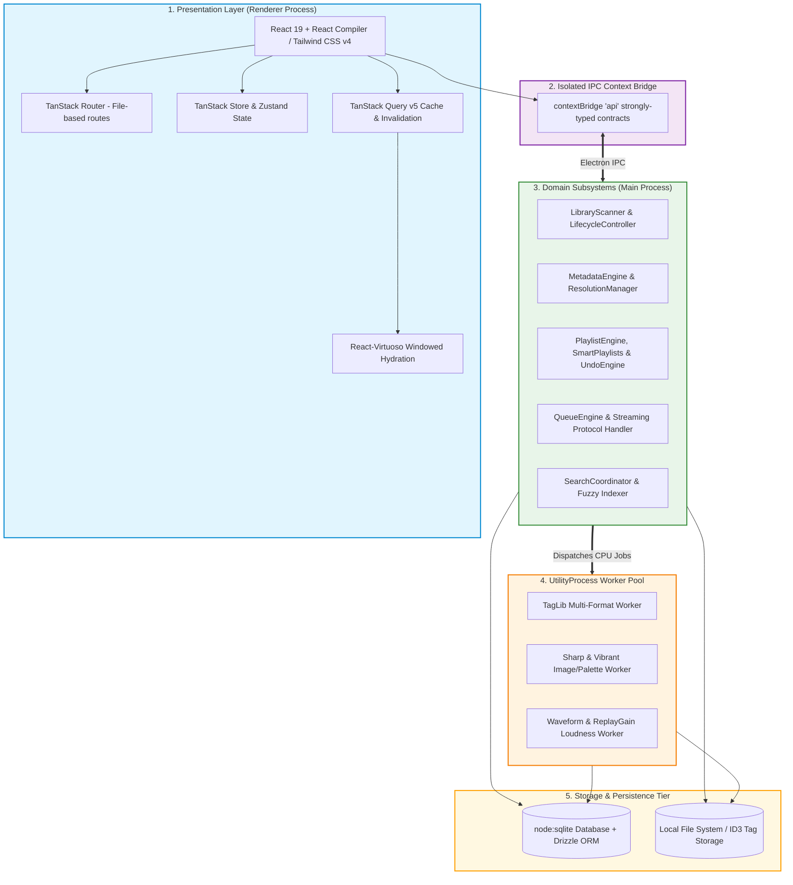

<div align="center">


# Nora Music Player

### An ultra-fast, local-first, modular desktop music player and intelligence platform

[](https://www.gnu.org/licenses/gpl-3.0.html)
[](https://www.typescriptlang.org/)
[](https://react.dev/)
[](https://www.electronjs.org/)
[](https://vitejs.dev/)
[](https://tailwindcss.com/)
[](https://orm.drizzle.team/)
[](https://oxc.rs/)
[](https://vitest.dev/)

[Key Features](#-key-features) • [Architecture & Tech Stack](#-architecture--tech-stack) • [Performance & Scale](#-performance--scale) • [Build From Source](#-build-from-source) • [Keyboard Shortcuts](#-keyboard-shortcuts) • [Architecture Docs](architecture/README.md) • [Changelog](CHANGELOG.md)

</div>

---

## 🎯 Why Nora?

**Nora** is not just another desktop audio player — it is a **modular music intelligence platform** engineered for speed, privacy, metadata integrity, and seamless local library management.

Built to effortlessly handle personal libraries ranging from hundreds to **over 50,000+ tracks**, Nora combines studio-grade audio playback, rich metadata enrichment (MusicBrainz, ISRC, Cover Art Archive, Wikipedia), multi-lingual synced lyrics with phonetic romanization, real-time audio visualization, and a deterministic undo/redo journal — all while remaining **100% local-first and privacy-respecting**.

---

## ✨ Key Features

### ⚡ High-Performance Architecture & Scale

- **ID-First Windowed Hydration:** Near-zero initial load times via [`useWindowHydration`](src/renderer/src/hooks/useWindowHydration.ts) and virtualized lists ([`react-virtuoso`](https://virtuoso.dev/)). Smooth 60 FPS scrolling with flat memory consumption even on 50,000+ track libraries.
- **Off-Main-Thread Worker Pools:** CPU-intensive extraction (audio tag parsing, Sharp image optimization, Vibrant color palette extraction, waveform synthesis, and ReplayGain analysis) runs in dedicated Electron `utilityProcess` background workers without ever stalling the UI.
- **Native Embedded Database:** Backed by native `node:sqlite` through [Drizzle ORM](https://orm.drizzle.team/), replacing heavy database layers with lightning-fast indexed relational storage.

### 🎵 Studio-Grade Audio Playback & Visualization

- **Streaming File Protocol:** Native audio protocol streaming with backpressure support, byte-range slicing (`206 Partial Content`), and browser media cache alignment.
- **200-Bin Peak Waveform Seekbar:** Real-time, interactive peak waveform rendering synchronized with playback progress.
- **EBU R128 / ITU-R BS.1770-4 Loudness Normalization:** Pure ReplayGain analysis engine with album-level loudness aggregation and decoupled playback volume policy.
- **Interactive Time Toggle:** Click the duration indicator to toggle between elapsed total duration and remaining countdown time.
- **Seamless Playback Transitions:** Configurable volume fade on play/pause and gapless audio sequencing.

### 🏷️ Next-Gen Metadata Platform & AutoTag

- **Multi-Format Native Tagging:** Powered by `node-taglib-sharp` with full read/write support for `MP3`, `FLAC`, `M4A`, `OGG`, `WAV`, `AAC`, `OPUS`, and `M4R`.
- **Multi-Provider AutoTag Resolution:** Automated track identification and metadata fetching from **MusicBrainz** (Recording MBID & ISRC extraction), **Cover Art Archive** (with release-group fallbacks), **Last.fm**, and **Spotify**.
- **Multi-Genre Tokenizer & Normalizer:** Clean delimiter splitting (`parseGenreList`) and localized guidance during tag diff previews.
- **Transactional Safety & Reversibility:** Atomic tag writing with deferred write coalescing for playing tracks and full rollback support via [`MetadataTransactionManager`](src/main/metadata/transactions/MetadataTransactionManager.ts).
- **Typo-Resistant Fuzzy Search:** Fast, typo-tolerant search across tracks, artists, albums, and genres.

### 🎤 Comprehensive Lyrics Engine & Romanization

- **Synchronized LRC Playback:** Auto-scrolling, synchronized lyrics with millisecond precision in Fullscreen, Theatre, and Mini-Player views.
- **Multi-Source Online Fetching:** Automatic lyrics retrieval from **LRCLIB** and **Musixmatch**, prioritizing local `.lrc` sidecar files with persistent offline caching.
- **Multi-Lingual Phonetic Romanization:** Instant phonetic transliteration for Asian scripts:
  - 🇯🇵 **Japanese:** Furigana & Romaji (via Kuroshiro & Kuromoji analyzer)
  - 🇨🇳 **Chinese:** Pinyin (via Pinyin-pro & Segmentit)
  - 🇰🇷 **Korean:** Romaja transliteration
- **Real-Time Lyrics Translation:** Translate foreign-language lyrics on the fly while retaining original lines.

### 👤 MusicBee-Style Enriched Artist Profiles

- **Wikipedia Biography Integration:** Automated, rich multi-source artist biographies with quality gating and i18n support.
- **Dynamic Discography & Artwork Fallbacks:** Context-aware artist imagery with multi-tiered fallback pipelines and album timelines.

### 📂 Collections, Smart Playlists & Operation Journaling

- **Deterministic Undo / Redo Engine:** Every collection mutation, track addition, reordering, and removal records an inverse operation in the persistent `operation_journal`.
- **Smart Playlists (AST Rule Engine):** Dynamic collections generated from custom rules and listening conditions.
- **Playlist Import & Export:** High-fidelity M3U/M3U8 import/export with typo-resistant fuzzy file-matching.

### 🌐 Scrobbling & Social Integrations

- **ListenBrainz Integration:** Native scrobbling, live "Now Playing" broadcasts, and favorites synchronization.
- **Last.fm Scrobbling:** Reliable background scrobbler with retry queues and offline caching.
- **Discord Rich Presence:** Dynamic status broadcasts displaying track titles, artist, album art, elapsed time, and playback state.

### 🎨 Theming & Visual Customization

- **Theme Layer Inspector:** Real-time CSS custom property live tweaker across surface layers (`--background-color-1/2/3`, `--side-bar-background`), text contrast tokens, and player accents.
- **Built-in Theme Presets:**
  - 🖤 _Monochrome (Black & White)_
  - 🩶 _Linear Slate_
  - 🌌 _Spotify Obsidian_
  - 🌓 _Adaptive Dynamic Theme_ (extracts vibrant palettes from current album art)
  - ☀️ _Light & Dark Standard Modes_
- **Floating Heart Burst Animations:** Fluid GPU-accelerated particle animations on favorite toggles.

### 🪟 Compact Mini Player

- **Dedicated Mini Player (`Ctrl+Shift+N`):** Ultra-sleek, compact desktop overlay with playback controls, volume, progress, and synchronized lyrics snippet.

---

## 📸 Gallery

<div align="center">

|            Library & Virtualized Grid             |      Synchronized Lyrics with Romanization       |
| :-----------------------------------------------: | :----------------------------------------------: |
|  |  |

|                   Light & Dark Modes                   |               Enriched Artist Profiles               |
| :----------------------------------------------------: | :--------------------------------------------------: |
|  |  |

|              Smart Search & Filtering              |                  Scrobbling & Integrations                  |
| :------------------------------------------------: | :---------------------------------------------------------: |
|  |  |

|               Metadata Tag Editor               |               Compact Mini Player                |
| :---------------------------------------------: | :----------------------------------------------: |
|  |  |

</div>

---

## 🏛 Architecture & Tech Stack

Nora is built upon strict layered domain principles where presentation never directly accesses persistence, and heavy workloads are strictly offloaded from the main and renderer event loops.



### Core Technologies

| Domain               | Technology / Library                                                                                                       | Purpose                                                  |
| -------------------- | -------------------------------------------------------------------------------------------------------------------------- | -------------------------------------------------------- |
| **UI Runtime**       | [React 19](https://react.dev/) + [React Compiler](https://react.dev/learn/react-compiler)                                  | Zero-memoization high-performance rendering              |
| **Bundler & Dev**    | [electron-vite](https://electron-vite.org/) + [Vite 8](https://vitejs.dev/)                                                | Sub-second HMR and optimized ESM distribution            |
| **Styling**          | [Tailwind CSS v4](https://tailwindcss.com/)                                                                                | Modern CSS styling and dynamic design tokens             |
| **Routing**          | [TanStack Router](https://tanstack.com/router)                                                                             | 100% type-safe, file-based client routing                |
| **Data Fetching**    | [TanStack Query v5](https://tanstack.com/query)                                                                            | Windowed cache synchronization & targeted invalidation   |
| **Persistence**      | [node:sqlite](https://nodejs.org/api/sqlite.html) + [Drizzle ORM](https://orm.drizzle.team/)                               | Native high-speed transactional SQL storage              |
| **Metadata Tagging** | [node-taglib-sharp](https://github.com/sandreas/node-taglib-sharp)                                                         | Studio-grade multi-format audio metadata reading/writing |
| **Image Processing** | [Sharp](https://sharp.pixelplumbing.com/) (WASM / Native) + [Node-Vibrant](https://github.com/Vibrant-Colors/node-vibrant) | Async cover artwork resizing and palette extraction      |
| **Audio Analysis**   | ITU-R BS.1770-4 / EBU R128 + Custom PCM Decoder                                                                            | ReplayGain loudness normalization & waveform generation  |
| **Code Quality**     | [Oxlint](https://oxc.rs/) + [Oxfmt](https://oxc.rs/)                                                                       | Next-generation Rust-powered linting and formatting      |
| **Testing**          | [Vitest](https://vitest.dev/) + [Testing Library](https://testing-library.com/)                                            | Unit, integration, and golden-master parity testing      |

---

## ⚡ Performance & Scale

Nora was systematically profiled and re-engineered to conquer large library scaling bottlenecks:

| Metric                    | Legacy Architecture      | Nora Windowed Hydration                                 |
| ------------------------- | ------------------------ | ------------------------------------------------------- |
| **50,000 Tracks Payload** | 51.3 MB JSON payload     | **~199 KB windowed slice + ~10 KB IDs**                 |
| **IPC Transfer Duration** | 11,500 – 33,000 ms       | **< 15 ms instantaneous transfer**                      |
| **Renderer Heap Memory**  | ~480+ MB (linear growth) | **Flat ~14.5 MB stable heap**                           |
| **Tag Extraction Impact** | Froze UI during scans    | **0 ms UI lockup (100% offloaded to `utilityProcess`)** |

---

## 🛠 Build From Source

### Prerequisites

- **Node.js**: v20.x or v22.x LTS (DevEngine npm `>=11.6.2`)
- **Git**
- C++ build tools (for native bindings, if compiling platform-specific packages)

### 1. Clone Repository

```bash
git clone https://github.com/vnyvk2/Nora.git
cd Nora
```

### 2. Install Dependencies

```bash
npm install
```

### 3. Start in Development Mode

```bash
npm run dev
```

### 4. Build Production Binaries

```bash
# Package for Windows (x64)
npm run build:win-x64

# Package for macOS (ARM64 / Universal)
npm run build:mac-arm64

# Package for Linux
npm run build:linux
```

### 📋 Useful NPM Scripts

| Command                                   | Action                                                        |
| ----------------------------------------- | ------------------------------------------------------------- |
| `npm run dev`                             | Launch app in development mode with live reload & source maps |
| `npm run build`                           | Build renderer, main, and preload bundles                     |
| `npm run typecheck`                       | Run type checking for both Node and Web contexts              |
| `npm run lint` / `npm run lint-fix`       | Run Oxlint fast checks and auto-fixes                         |
| `npm run format` / `npm run format-check` | Run Oxfmt formatting checks and writes                        |
| `npm test`                                | Run Vitest unit & integration test suites                     |
| `npm run coverage`                        | Run test suite with V8 code coverage report                   |
| `npm run db:migrate`                      | Apply latest Drizzle schema migrations                        |
| `npm run db:studio`                       | Open Drizzle Studio visual database inspector                 |
| `npm run fetch:binaries`                  | Download native prebuilt utility binaries                     |
| `npm run memory:monitor`                  | Launch real-time background memory profiler script            |

---

## ⌨️ Keyboard Shortcuts

| Shortcut                                                        | Action                                      |
| --------------------------------------------------------------- | ------------------------------------------- |
| <kbd>Space</kbd>                                                | Play / Pause playback                       |
| <kbd>Ctrl</kbd> + <kbd>→</kbd> / <kbd>Ctrl</kbd> + <kbd>←</kbd> | Skip to Next / Previous track               |
| <kbd>Ctrl</kbd> + <kbd>↑</kbd> / <kbd>Ctrl</kbd> + <kbd>↓</kbd> | Increase / Decrease volume                  |
| <kbd>Ctrl</kbd> + <kbd>M</kbd>                                  | Mute / Unmute audio                         |
| <kbd>Ctrl</kbd> + <kbd>Shift</kbd> + <kbd>N</kbd>               | Open / Toggle Compact Mini Player           |
| <kbd>Ctrl</kbd> + <kbd>L</kbd>                                  | Open Lyrics view                            |
| <kbd>F11</kbd>                                                  | Toggle Fullscreen Player mode               |
| <kbd>Ctrl</kbd> + <kbd>F</kbd>                                  | Focus global search bar                     |
| <kbd>Ctrl</kbd> + <kbd>Z</kbd> / <kbd>Ctrl</kbd> + <kbd>Y</kbd> | Undo / Redo last playlist or library action |

---

## 📄 License & Attribution

This project is licensed under the **GNU General Public License v3.0 (GPL-3.0-or-later)**. See the [LICENSE](LICENSE) file for details.

### Heritage & Credits

- **Original Project:** Originally based on [Nora by Sandakan Nipunajith](https://github.com/Sandakan/Nora) (inspired by [Oto Music](https://play.google.com/store/apps/details?id=com.piyush.music)).
- **Major Overhaul & Architecture:** Evolved, re-architected, and maintained by [Vinay (@vnyvk2)](https://github.com/vnyvk2).
- All song metadata, album artwork, and artist biographies displayed in promotional demonstrations are the property of their respective copyright holders.

---

<div align="center">

Made with ❤️ for high-fidelity music lovers.

</div>
