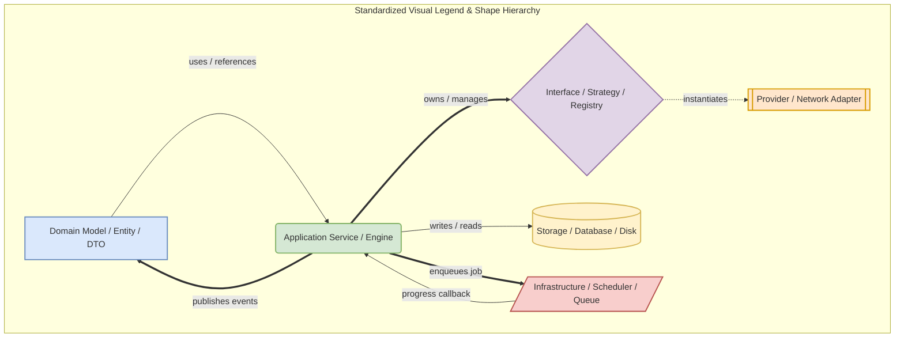

# 00. Master Architectural Principles & Standardized Legend

This document serves as the **Architecture Constitution** for the entire Nora Music Player codebase. It defines non-negotiable design invariants, system-wide architectural rules, and standardizes the diagram notation used throughout this Architecture Atlas.

---

## 1. The Nora Architectural Constitution (10 Core Rules)

Every subsystem, engine, service, and refactoring phase across Nora must strictly adhere to these 10 core principles:

> [!IMPORTANT]
> **Non-Negotiable System Invariants**

### Rule 1: No Shortcuts or Embedded Hacks
If a feature requires a new capability or abstraction, build a dedicated subsystem or service rather than hacking state or embedding business logic into unrelated modules.

### Rule 2: Strict Architectural Layer Hierarchy
Dependencies must strictly flow downwards:
$$\text{Presentation (Renderer)} \longrightarrow \text{IPC Bridge} \longrightarrow \text{Application Services / Engines} \longrightarrow \text{Domain Models} \longrightarrow \text{Infrastructure / Adapters} \longrightarrow \text{Storage / DB / Filesystem}$$
- Higher layers may consume lower layers.
- Lower layers must **NEVER** import, invoke, or depend upon higher layers.
- Presentation components never access SQLite repositories or filesystem I/O directly.

### Rule 3: Single Domain Authority & Data Ownership
Every subsystem is the sole source of truth for its domain:
- **`LibraryScanner` & `LibraryLifecycleController`** own library discovery, filesystem diffing, and scan states.
- **`MetadataEngine`** is the single authority for metadata resolution, identity tracking, and tag mutations.
- **`QueueEngine`** owns ephemeral playback state, shuffle permutations, and active playback history.
- **`PlaylistEngine`** & **`OperationExecutor`** own collection mutations, hierarchy, and reversible journaling.
- **`SearchCoordinator`** owns query federation, match tier scoring, and hydration orchestration.
- UI, Search, AI, and Rules never own metadata or persist domain state directly.

### Rule 4: Engines Communicate Through Typed Contracts & Event Buses
Subsystems never reach into another engine's private repositories or internal state variables. Communication occurs exclusively through public API contracts or asynchronous event buses ([`CollectionEventBus`](file:///C:/Users/VINAY/.gemini/antigravity/worktrees/Nora/document_project_architecture_graphs/src/main/collections/events/CollectionEventBus.ts), [`MetadataEventBus`](file:///C:/Users/VINAY/.gemini/antigravity/worktrees/Nora/document_project_architecture_graphs/src/main/metadata/events/MetadataEventBus.ts), [`LibraryEventBus`](file:///C:/Users/VINAY/.gemini/antigravity/worktrees/Nora/document_project_architecture_graphs/src/main/events/LibraryEventBus.ts)).

### Rule 5: Repositories Only Perform Persistence
Repositories ([`PlaylistRepository`](file:///C:/Users/VINAY/.gemini/antigravity/worktrees/Nora/document_project_architecture_graphs/src/main/collections/repositories/PlaylistRepository.ts), [`DatabaseMetadataRepository`](file:///C:/Users/VINAY/.gemini/antigravity/worktrees/Nora/document_project_architecture_graphs/src/main/metadata/repository/DatabaseMetadataRepository.ts)) execute SQL queries and enforce database schema constraints. Business calculations, AST rule evaluations, and validation belong exclusively in Application Services and Engines.

### Rule 6: Loosely Coupled Composition Root
Service instantiation and dependency injection occur exclusively inside dedicated composition roots ([`MetadataBootstrap`](file:///C:/Users/VINAY/.gemini/antigravity/worktrees/Nora/document_project_architecture_graphs/src/main/metadata/setup.ts), [`collections/setup.ts`](file:///C:/Users/VINAY/.gemini/antigravity/worktrees/Nora/document_project_architecture_graphs/src/main/collections/setup.ts), [`initializeIPC`](file:///C:/Users/VINAY/.gemini/antigravity/worktrees/Nora/document_project_architecture_graphs/src/main/ipc.ts)). IPC handlers perform zero ad-hoc service constructions.

### Rule 7: Design for Extensibility & Federation
Remote integrations (MusicBrainz, Discogs, Cover Art Archive, Last.fm, Musixmatch) participate through pluggable adapter registries. No third-party network API endpoint is hardcoded into application workflows.

### Rule 8: Backward Compatibility & Inversion Guarantees
All user collections, playback states, and metadata edits must support deterministic forward and backward evolution:
- Mutations in Collections produce exact inverse operations stored in [`operation_journal`](file:///C:/Users/VINAY/.gemini/antigravity/worktrees/Nora/document_project_architecture_graphs/src/main/db/schema.ts).
- Metadata batch writes support atomic rollback via [`MetadataTransactionManager`](file:///C:/Users/VINAY/.gemini/antigravity/worktrees/Nora/document_project_architecture_graphs/src/main/metadata/transactions/MetadataTransactionManager.ts).

### Rule 9: Every Phase Must Be Production-Ready
No placeholder functions, no unhandled error swallows, no infinite retry loops, and no dead code.

### Rule 10: Asynchronous Non-Blocking Usability
CPU-intensive extraction (artwork resizing via Sharp, palette generation, waveform synthesis, lyrics fetching) is decoupled from core metadata parsing. The user library is immediately usable upon database commit, while derived assets process asynchronously in the background via [`JobScheduler`](file:///C:/Users/VINAY/.gemini/antigravity/worktrees/Nora/document_project_architecture_graphs/src/main/workers/jobScheduler.ts).

---

## 2. Standardized Diagram Notation Legend

Every diagram in this Architecture Atlas strictly adheres to the following visual shape, color, and arrow conventions:

### Node Shape & Color Standards
- `[ Domain Model / Entity / DTO ]` — Pure data structures, ASTs, domain models, and value objects (`#dae8fc`, Blue border).
- `( Application Service / Engine / Coordinator )` — Application-level orchestrators, use-case coordinators, and workflows (`#d5e8d4`, Green border).
- `{ Interface / Strategy / Registry / Policy }` — Structural contracts, strategy interfaces, and abstract policies (`#e1d5e7`, Purple border).
- `[[ Provider / External Network Adapter ]]` — Remote network adapters, third-party APIs, and data providers (`#ffe6cc`, Orange border).
- `[( Storage / Database / Filesystem )]` — Physical disk storage, SQLite/PGlite tables, and persistent repositories (`#fff2cc`, Yellow border).
- `[/ Infrastructure / Worker / Queue / Platform /]` — Low-level networking pipelines, rate limiters, circuit breakers, worker pools, and scheduler queues (`#f8cecc`, Red border).

### Connection & Arrow Standards
- `A -->|uses / calls| B` — Direct synchronous or asynchronous method invocation.
- `A ==>|owns / composes| B` — Structural composition and lifetime ownership.
- `A -.->|creates / instantiates| B` — Factory creation, DI construction, or builder instantiation.
- `A -- callback / listener --> B` — Asynchronous event callback or progress notification.
- `A ==>|events / publishes| B` — Typed EventBus broadcast.

