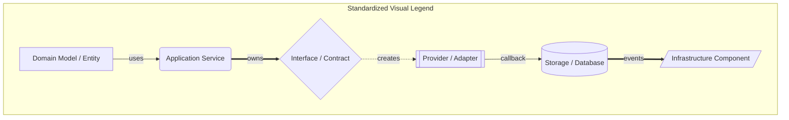

# 00. Core Architectural Principles & Standardized Legend

This document serves as the **Architecture Constitution** for Nora's Metadata Platform. It defines non-negotiable design principles and standardizes the diagram notation used throughout this Atlas.

---

## 1. Core Principles (The Constitution)

> [!IMPORTANT]
> **Non-Negotiable Architecture Principles**

- **P1. Single Authority**: `MetadataEngine` is the single authority for internal library entity state.
- **P2. Provider Read-Only Invariant**: Provider adapters never mutate physical files or database state directly.
- **P3. Transaction Ownership**: All physical ID3 file tag writes and relational SQLite updates must be coordinated by `MetadataTransactionManager`.
- **P4. Field-Based Intent**: Application services request metadata fields (`title`, `artist`, `album`, `genre`, `artworkUrl`) rather than requesting provider-specific APIs.
- **P5. Encapsulated Merge**: `MetadataMergeEngine` is an internal implementation detail of the Resolution layer and is never exposed directly on `MetadataContainer`.
- **P6. Single Composition Root**: All service construction and dependency injection occurs exclusively inside `MetadataBootstrap`.
- **P7. Layer Isolation**: Presentation (Renderer/UI) components never invoke infrastructure or storage layers directly; all calls route through IPC handlers to Application Services.

---

## 2. Standardized Diagram Notation Legend

Every diagram across this Architecture Atlas strictly adheres to the following visual shape and arrow conventions:

### Node Shape Standards
- `[ Domain Model / Entity ]` — Pure data structures, domain models, and value objects.
- `( Application Service )` — Application-level orchestrators, use-case coordinators, and workflows.
- `{ Interface / Contract }` — Structural contracts, strategy interfaces, and abstract policies.
- `[[ Provider / Adapter ]]` — External network adapters and data provider implementations.
- `[( Storage / Database )]` — Physical disk storage, SQLite database tables, and persistent repositories.
- `[/ Infrastructure /]` — Low-level networking, rate limiters, circuit breakers, and thread utilities.

### Connection & Arrow Standards
- `A -->|uses| B` — Direct method invocation / runtime consumption dependency.
- `A ==>|owns| B` — Structural composition / lifetime ownership.
- `A -.->|creates| B` — Instantiation / Factory creation / Dependency injection.
- `A -- callback --> B` — Asynchronous listener / event handler.
- `A ==>|events| B` — EventBus publication.

