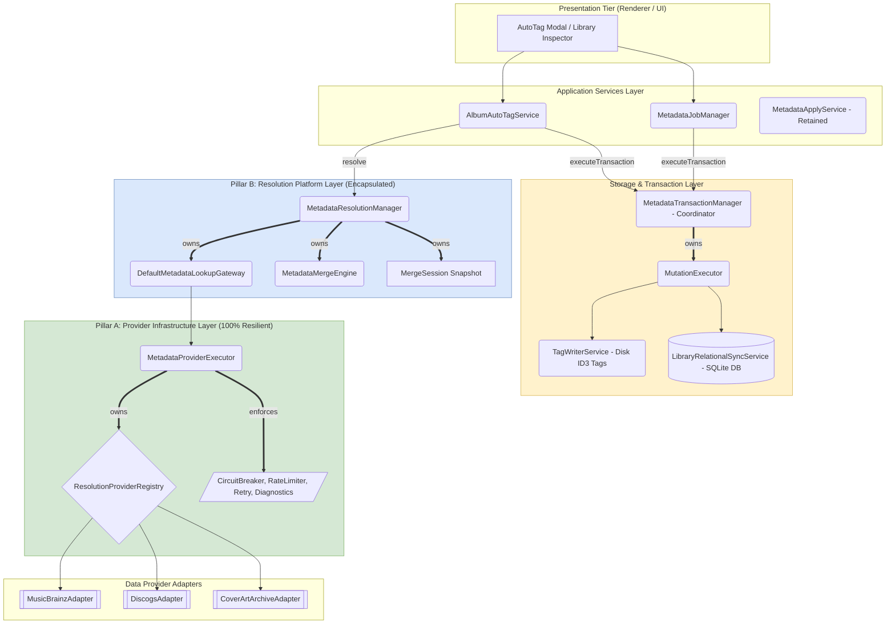

# 01. System Overview Architecture

This document presents the high-level tier breakdown and subsystem boundaries of Nora's Metadata Platform.

---

## 1. Subsystem Tier Architecture

---

## 2. Invariants & Layering Control Rules

1. **Strict Dependency Order**:
   - `Renderer` $\rightarrow$ `IPC` $\rightarrow$ `AlbumAutoTagService` $\rightarrow$ `MetadataResolutionManager` $\rightarrow$ `DefaultMetadataLookupGateway` $\rightarrow$ `MetadataProviderExecutor` $\rightarrow$ `ResolutionProviderRegistry` $\rightarrow$ `Adapters`.
2. **Merge Engine Encapsulation**:
   - `MetadataMergeEngine` is an internal implementation detail of the Resolution layer and is **never** exposed directly on `MetadataContainer`. Expose only `resolutionManager`.
3. **Resilience Routing Guarantee**:
   - 100% of remote HTTP queries MUST pass through `MetadataProviderExecutor` resilience policies (circuit breakers, rate limiters, retries, timeouts, diagnostics).
