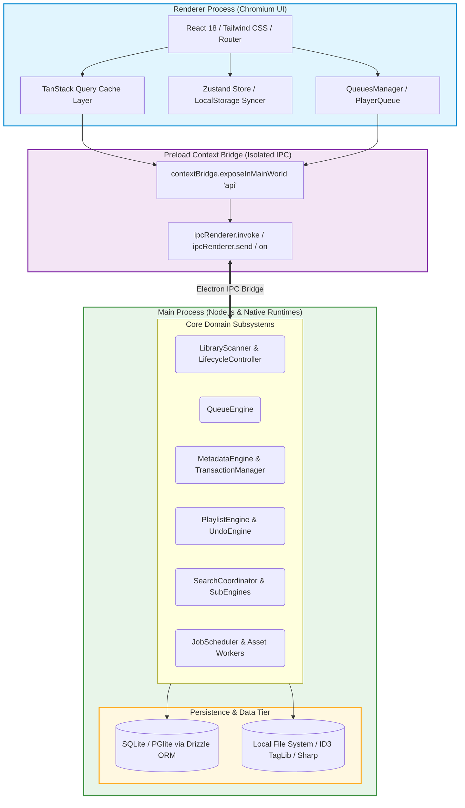
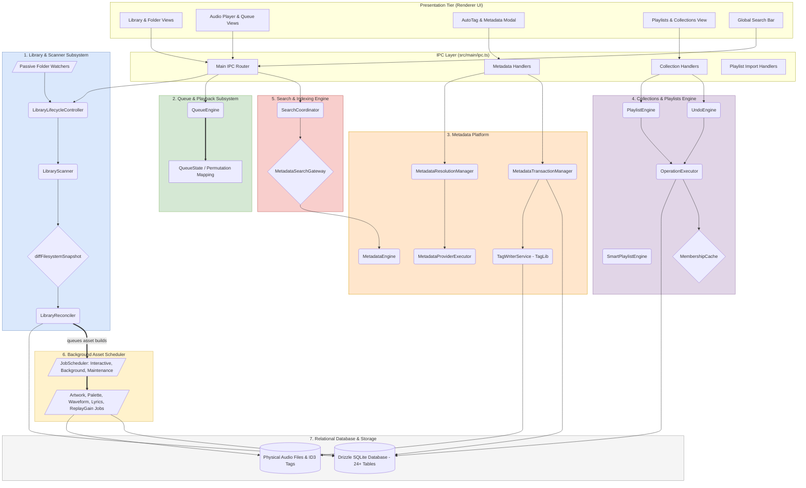
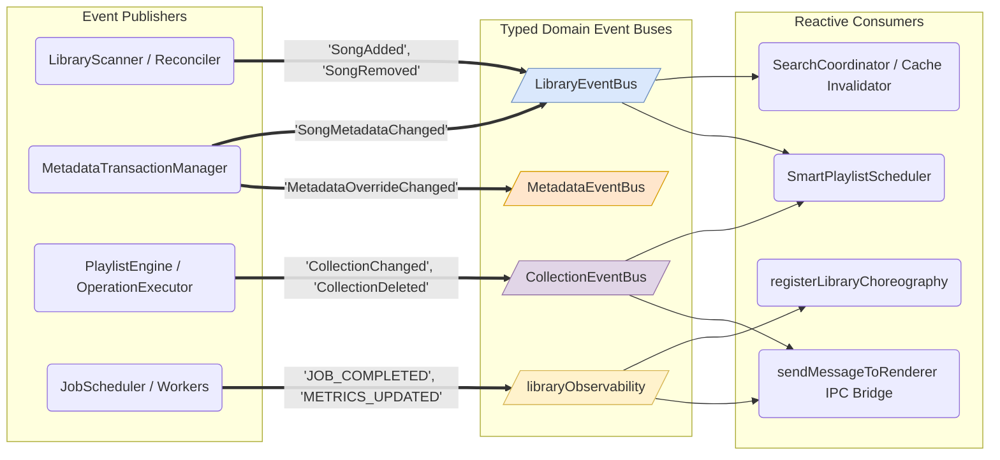

# 01. System Overview Architecture

This document presents the complete system topology, subsystem boundaries, and cross-cutting event flows of the Nora Music Player application.

---

## 1. High-Level System Topology

Nora is built as an Electron-based desktop application structured into three distinct execution boundaries:

---

## 2. Master Subsystem Interaction Map

The following composite architecture graph maps the primary collaboration pathways across all 8 major subsystems in Nora:

---

## 3. Cross-Cutting Event Bus Topology

Engines communicate reactively using typed asynchronous event buses rather than tight couplings:

---

## 4. Subsystem Directory Mapping

| Subsystem                     | Main Source Directory                                                                                                                                                                                                                                                                                                                                                                                        | Renderer Source Directory                                                                                                                                                                             | Key Architectural Roles                                                                                                |
| ----------------------------- | ------------------------------------------------------------------------------------------------------------------------------------------------------------------------------------------------------------------------------------------------------------------------------------------------------------------------------------------------------------------------------------------------------------ | ----------------------------------------------------------------------------------------------------------------------------------------------------------------------------------------------------- | ---------------------------------------------------------------------------------------------------------------------- |
| **Library Scanner & Builder** | [`src/main/library/`](file:///C:/Users/VINAY/.gemini/antigravity/worktrees/Nora/document_project_architecture_graphs/src/main/library), [`src/main/fs/`](file:///C:/Users/VINAY/.gemini/antigravity/worktrees/Nora/document_project_architecture_graphs/src/main/fs), [`src/main/workers/`](file:///C:/Users/VINAY/.gemini/antigravity/worktrees/Nora/document_project_architecture_graphs/src/main/workers) | `src/renderer/src/components/MusicFoldersPage/`                                                                                                                                                       | Disk discovery, diff engine, hierarchy creation, bounded worker pool ingestion, asynchronous asset scheduler.          |
| **Queue & Playback**          | [`src/main/queue/`](file:///C:/Users/VINAY/.gemini/antigravity/worktrees/Nora/document_project_architecture_graphs/src/main/queue)                                                                                                                                                                                                                                                                           | [`src/renderer/src/other/queuesManager.ts`](file:///C:/Users/VINAY/.gemini/antigravity/worktrees/Nora/document_project_architecture_graphs/src/renderer/src/other/queuesManager.ts), `playerQueue.ts` | In-memory playback state, shuffle permutation index translation, active track anchoring, multi-queue management.       |
| **Metadata Platform**         | [`src/main/metadata/`](file:///C:/Users/VINAY/.gemini/antigravity/worktrees/Nora/document_project_architecture_graphs/src/main/metadata)                                                                                                                                                                                                                                                                     | `src/renderer/src/components/autotag/`, `metadatacenter/`                                                                                                                                             | Single metadata authority, provider federation (MusicBrainz, Discogs, CAA), Option A atomic transactions, undo tokens. |
| **Collections & Playlists**   | [`src/main/collections/`](file:///C:/Users/VINAY/.gemini/antigravity/worktrees/Nora/document_project_architecture_graphs/src/main/collections), `playlistImport/`, `playlistSync/`                                                                                                                                                                                                                           | `src/renderer/src/components/PlaylistsPage/`                                                                                                                                                          | Operation framework, reversible journal, linear pointer undo/redo, smart playlist AST compiler, M3U import & repair.   |
| **Search & Indexing**         | [`src/main/search/`](file:///C:/Users/VINAY/.gemini/antigravity/worktrees/Nora/document_project_architecture_graphs/src/main/search)                                                                                                                                                                                                                                                                         | `src/renderer/src/components/SearchPage/`                                                                                                                                                             | Query normalization, parallel engine dispatch, match tier ranking, single-pass batched hydration via search gateway.   |
| **Database & Persistence**    | [`src/main/db/`](file:///C:/Users/VINAY/.gemini/antigravity/worktrees/Nora/document_project_architecture_graphs/src/main/db)                                                                                                                                                                                                                                                                                 | N/A (Isolated to Main)                                                                                                                                                                                | Drizzle ORM schema (24+ tables), trigram indexes, foreign key cascades, atomic transactions.                           |
| **IPC & Platform Bridge**     | [`src/main/ipc.ts`](file:///C:/Users/VINAY/.gemini/antigravity/worktrees/Nora/document_project_architecture_graphs/src/main/ipc.ts), `main.ts`, `platform/`                                                                                                                                                                                                                                                  | `src/preload/index.ts`, `api/`                                                                                                                                                                        | ContextBridge isolation, typed IPC invocation, power monitor, Discord RPC, Last.fm scrobbling, window management.      |
