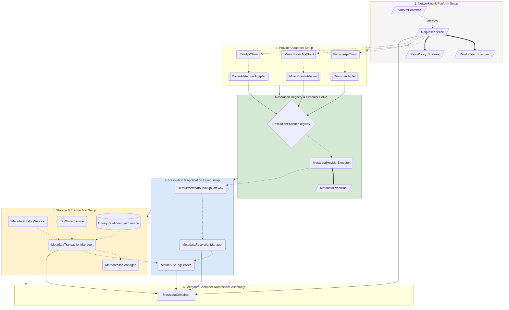

# 02. Composition Root Architecture (`MetadataBootstrap`)

All dependency injection and service wiring in the metadata module takes place inside a single composition root: [`MetadataBootstrap`](file:///c:/Users/VINAY/intellije-workspace/Nora/src/main/metadata/setup.ts).

---

## 1. Construction Order View



---

## 2. Container Namespace Boundaries

`MetadataContainer` groups initialized services into structured domain namespaces:

```ts
return {
  application: {
    userService,
    albumMetadataService,
    autoTagService
  },
  resolution: {
    resolutionManager,
    lookupGateway
  },
  transactions: {
    transactionManager,
    historyService,
    jobManager
  },
  infrastructure: {
    requestPipeline
  }
};
```
