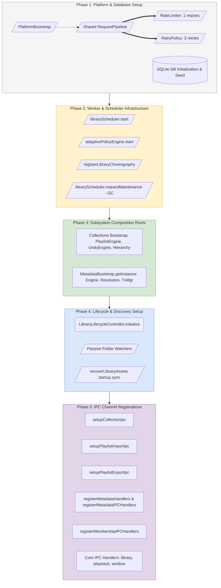
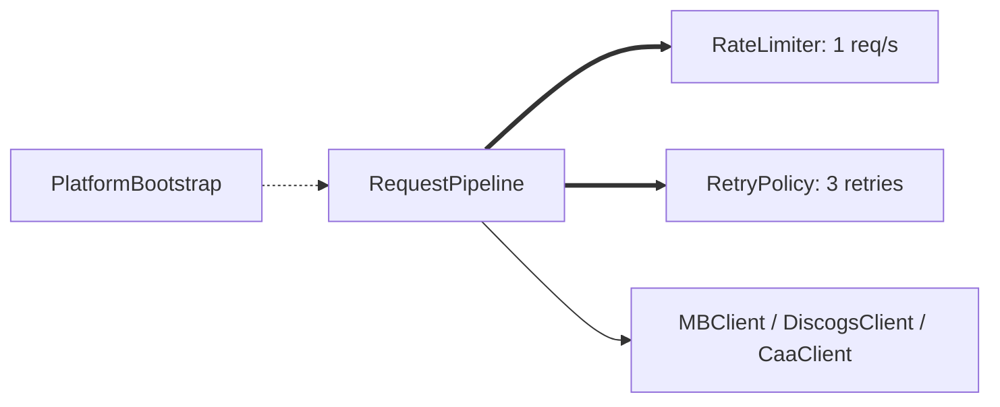
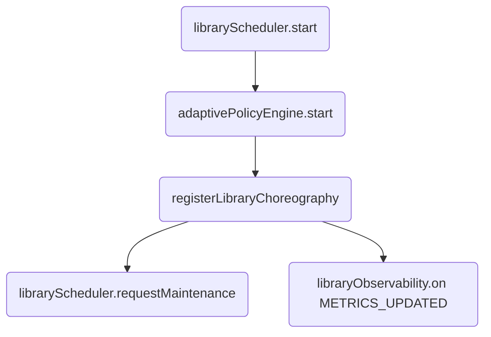
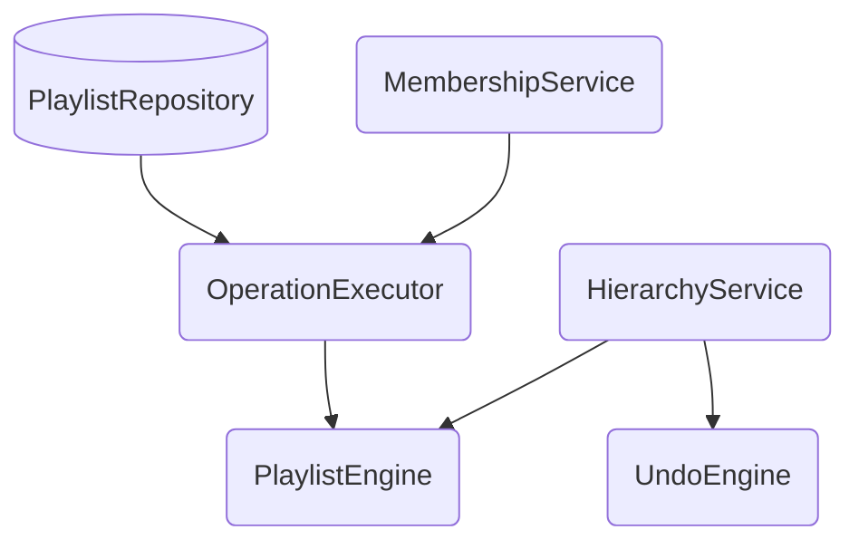
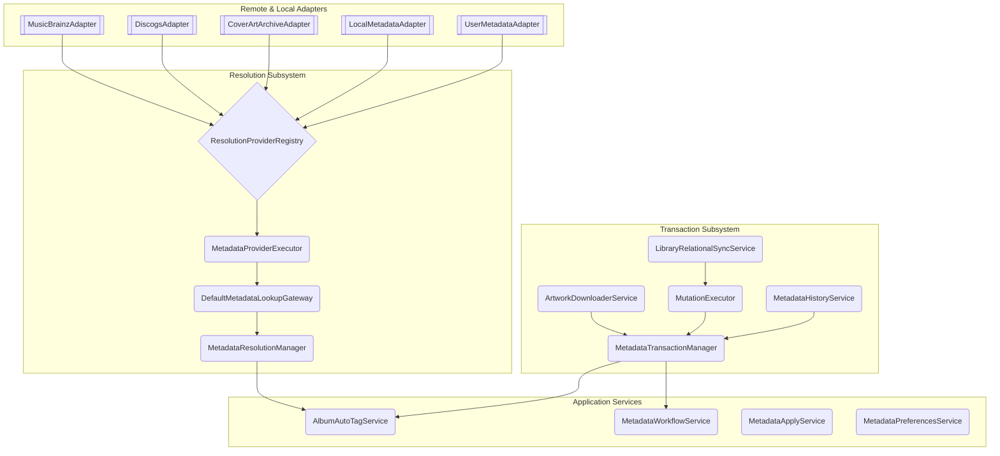
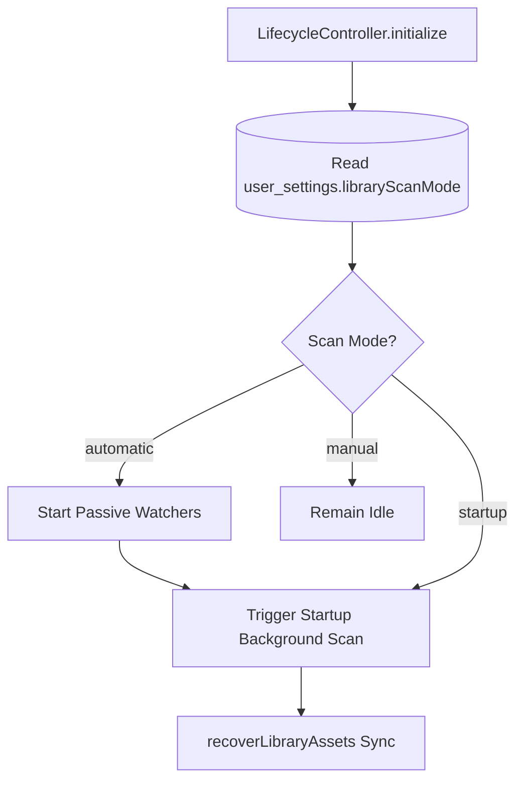
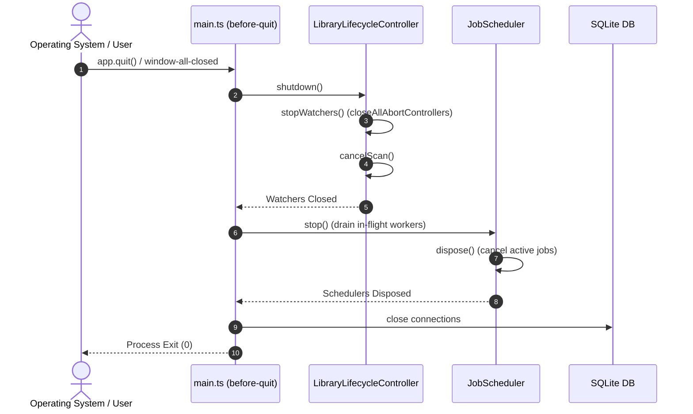

# 02. Composition Root & Bootstrap Architecture

All dependency injection, service instantiation, and lifecycle wiring in Nora takes place across dedicated, structured composition roots. This document maps the system-wide bootstrap sequence from Electron application launch to full UI readiness.

---

## 1. Master System Construction Flow

The application initializes linearly in strict dependency order inside [`src/main/main.ts`](file:///C:/Users/VINAY/.gemini/antigravity/worktrees/Nora/document_project_architecture_graphs/src/main/main.ts) and [`src/main/ipc.ts`](file:///C:/Users/VINAY/.gemini/antigravity/worktrees/Nora/document_project_architecture_graphs/src/main/ipc.ts):



---

## 2. Phase-by-Phase Bootstrap Detailed Breakdown

### Phase 1: Platform & Networking Infrastructure Setup
The [`PlatformBootstrap`](file:///C:/Users/VINAY/.gemini/antigravity/worktrees/Nora/document_project_architecture_graphs/src/main/platform/PlatformBootstrap.ts) initializes shared networking primitives used across remote API adapters.
- Instantiates a shared [`RequestPipeline`](file:///C:/Users/VINAY/.gemini/antigravity/worktrees/Nora/document_project_architecture_graphs/src/main/platform/networking/RequestPipeline.ts) configured with global rate limiting (1 req/sec for MusicBrainz compliance) and exponential backoff retry policies.
- Connects SQLite database via Drizzle ORM ([`src/main/db/db.ts`](file:///C:/Users/VINAY/.gemini/antigravity/worktrees/Nora/document_project_architecture_graphs/src/main/db/db.ts)) and verifies foreign key constraints.



---

### Phase 2: Background Schedulers & Choreography Initialization
In [`initializeIPC`](file:///C:/Users/VINAY/.gemini/antigravity/worktrees/Nora/document_project_architecture_graphs/src/main/ipc.ts#L135-L155):
1. Starts [`libraryScheduler`](file:///C:/Users/VINAY/.gemini/antigravity/worktrees/Nora/document_project_architecture_graphs/src/main/workers/jobScheduler.ts) event loop with configured concurrency limits (`interactive: 4`, `background: 2`, `maintenance: 1`).
2. Starts [`adaptivePolicyEngine`](file:///C:/Users/VINAY/.gemini/antigravity/worktrees/Nora/document_project_architecture_graphs/src/main/workers/adaptivePolicyEngine.ts) to adjust concurrency based on battery power and system load.
3. Requests startup maintenance (triggering [`garbageCollectionJob`](file:///C:/Users/VINAY/.gemini/antigravity/worktrees/Nora/document_project_architecture_graphs/src/main/workers/jobs/garbageCollectionJob.ts) once initial queues idle).
4. Invokes [`registerLibraryChoreography()`](file:///C:/Users/VINAY/.gemini/antigravity/worktrees/Nora/document_project_architecture_graphs/src/main/workers/libraryChoreography.ts) to hook event-driven pipeline transitions (`ARTWORK_READY` $\rightarrow$ Enqueue `PaletteJob`).



---

### Phase 3: Composition Roots & Dependency Wiring

#### Collections Composition Root (`src/main/collections/setup.ts`)
Assembles singleton controllers:
- `playlistRepository` $\rightarrow$ `OperationExecutor` $\rightarrow$ `PlaylistEngine`
- `hierarchyService` $\rightarrow$ `FolderStatisticsService` $\rightarrow$ `UndoEngine`



#### Metadata Composition Root (`src/main/metadata/setup.ts`)
The [`MetadataBootstrap.bootstrap()`](file:///C:/Users/VINAY/.gemini/antigravity/worktrees/Nora/document_project_architecture_graphs/src/main/metadata/setup.ts#L139-L373) method builds the entire metadata dependency tree:



---

### Phase 4: Lifecycle Controller & Watchers Initialization
In [`src/main/library/LibraryLifecycleController.ts`](file:///C:/Users/VINAY/.gemini/antigravity/worktrees/Nora/document_project_architecture_graphs/src/main/library/LibraryLifecycleController.ts):
1. Reads `user_settings.libraryScanMode` (`'automatic'`, `'startup'`, or `'manual'`).
2. If `'automatic'`, attaches passive directory watchers via [`initializePassiveWatchers()`](file:///C:/Users/VINAY/.gemini/antigravity/worktrees/Nora/document_project_architecture_graphs/src/main/fs/initializePassiveWatchers.ts) and binds generation-tracking change listeners.
3. Fires non-blocking startup background scan [`scanNow()`](file:///C:/Users/VINAY/.gemini/antigravity/worktrees/Nora/document_project_architecture_graphs/src/main/library/LibraryLifecycleController.ts#L232-L275).
4. Runs asynchronous startup asset recovery sync [`recoverLibraryAssets()`](file:///C:/Users/VINAY/.gemini/antigravity/worktrees/Nora/document_project_architecture_graphs/src/main/core/recovery.ts).



---

### Phase 5: IPC Channel Registrations
All IPC bridges are registered with strict dependency injection:
- `setupCollectionIpc(playlistEngine, undoEngine, playlistRepository, hierarchyService, sendWebContents)`
- `setupPlaylistImportIpc(playlistImportWorkflow, importHistoryService)`
- `setupPlaylistExportIpc(playlistRepository)`
- `registerMetadataHandlers(autoTagService, workflowService, preferencesService, mainWindow, providerRuntime)`
- `registerMembershipIPCHandlers()`

---

## 3. Container Namespace Structure (`MetadataContainer`)

`MetadataContainer` groups constructed services into immutable domain namespaces:

```ts
export interface MetadataContainer {
  application: {
    userService: UserMetadataService;
    albumMetadataService: AlbumMetadataService;
    autoTagService: AlbumAutoTagService;
    workflowService: MetadataWorkflowService;
    applyService: MetadataApplyService;
    preferencesService: MetadataPreferencesService;
    providerRuntime: MetadataProviderRuntime;
  };
  resolution: {
    resolutionManager: MetadataResolutionManager;
    lookupGateway: DefaultMetadataLookupGateway;
  };
  transactions: {
    transactionManager: MetadataTransactionManager;
  };
  infrastructure: {
    requestPipeline: RequestPipeline;
  };
}
```

---

## 4. Graceful Shutdown & Disposal Lifecycle

When the application closes, resources unwind deterministically:


