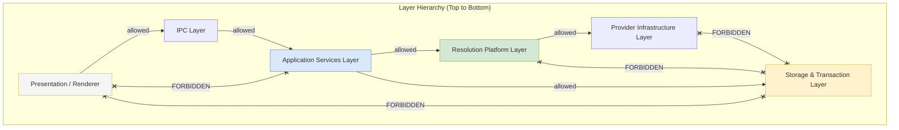
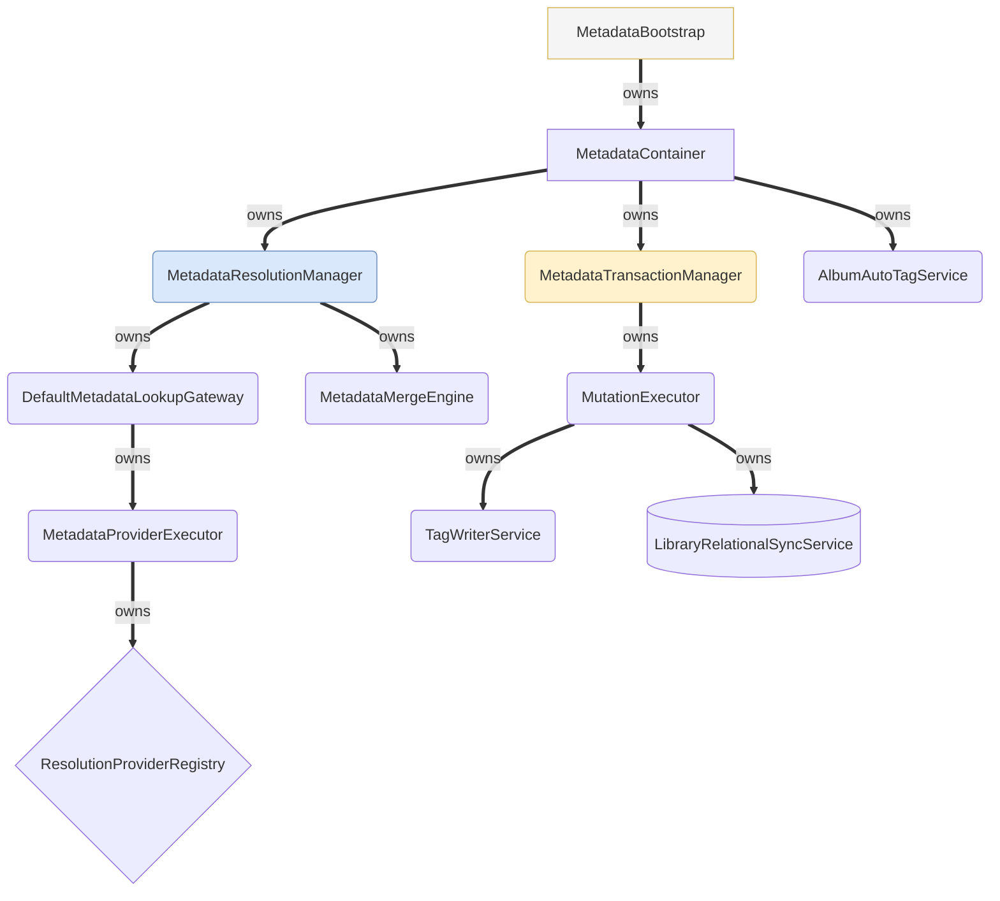

# 02. Dependency Rules & Ownership Graph

This document details the dependency rules (allowed vs. forbidden calls) and structural ownership hierarchies within Nora's Metadata Platform.

---

## 1. Allowed vs. Forbidden Dependency Hierarchy

### Forbidden Dependency Summary
1. **Providers MUST NOT Access Storage**: Data provider adapters (`MusicBrainzAdapter`, `DiscogsAdapter`) must never call SQLite databases or Tag Writers directly.
2. **Transactions MUST NOT Invoke Resolution**: `MetadataTransactionManager` coordinates writes; it never queries resolution managers.
3. **Renderer MUST NOT Access Services**: The frontend renderer communicates exclusively through IPC channels.

---

## 2. Ownership / Structural Composition Hierarchy

Ownership defines object lifetimes and composition parentage (which entity creates and holds references to child objects).

