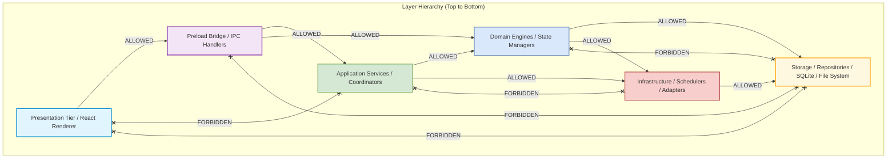
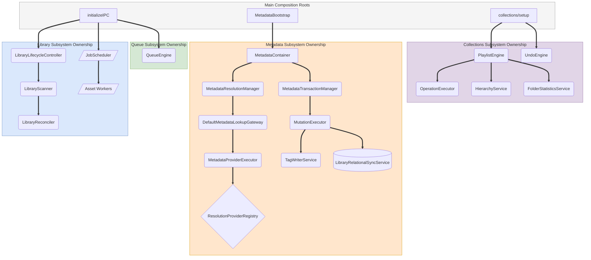

# 02. System-Wide Dependency Rules & Ownership Graph

This document details the cross-layer dependency invariants (allowed vs. forbidden calls) and structural ownership hierarchies governing the entire Nora architecture.

---

## 1. System-Wide Allowed vs. Forbidden Layer Matrix

---

## 2. Invariant Forbidden Rules Summary

| Source Subsystem | Forbidden Target | Architectural Rationale |
|---|---|---|
| **Presentation Tier (React UI)** | Any SQLite Repository or Node `fs` API | Presentation code runs in sandboxed Chromium renderer. Direct SQLite or disk access breaks security sandbox and introduces data race conditions. Calls must route through typed IPC channels. |
| **Data Provider Adapters (`MusicBrainz`, `Discogs`, `CAA`)** | Storage Repositories or SQLite Database | Provider adapters are 100% read-only remote translators. Direct DB mutation from an adapter violates single metadata authority and makes transaction rollback impossible. |
| **Transaction Coordinators (`MetadataTransactionManager`)** | Resolution Managers or Remote API Gateways | Transaction managers coordinate writes; they never perform search or candidate resolution queries. Query logic is strictly separated from mutation logic. |
| **Repositories (`PlaylistRepository`, `DatabaseMetadataRepository`)** | Application Engines or Business Rules | Repositories execute raw SQL and map database records. They must remain stateless and free of domain calculations, undo logic, or AST evaluations. |
| **Playback Queue Subsystem (`QueueEngine`)** | Operation Framework Journal (`operation_journal`) | Playback state (shuffle, cursor, upcoming tracks) is ephemeral and in-memory. Playback queues do not pollute the persistent collections undo journal. |
| **Search Subsystem (`SearchCoordinator`)** | Direct SQLite Writes / Tag Mutation Services | Search is 100% read-only. Search engines discover references (`SearchMatchReference`) and hydrate DTOs without mutating domain state. |

---

## 3. Structural Ownership & Lifetime Hierarchies

Ownership defines lifecycle parentage (which entity creates, initializes, and holds references to child objects):

