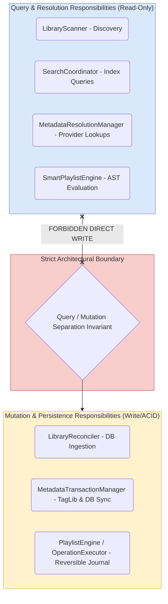

# 03. System-Wide Subsystem Responsibility Matrix

This matrix defines the authoritative owner, permitted collaborators, and forbidden calls for every major functional responsibility across the entire Nora codebase.

---

## 1. System Responsibility Matrix Table

| Core Responsibility                          | Authoritative Owner                                                                                                                                                                             | May Use (Permitted Collaborators)                                                                                                   | Must Not Use (Forbidden Calls)                             |
| -------------------------------------------- | ----------------------------------------------------------------------------------------------------------------------------------------------------------------------------------------------- | ----------------------------------------------------------------------------------------------------------------------------------- | ---------------------------------------------------------- |
| **Library Filesystem Discovery**             | [`LibraryScanner`](file:///C:/Users/VINAY/.gemini/antigravity/worktrees/Nora/document_project_architecture_graphs/src/main/library/LibraryScanner.ts)                                           | `fastDiskWalk`, `getLibraryScanRoots`, `diffFilesystemSnapshot`                                                                     | Database mutation queries, TagLib writers, Remote web APIs |
| **Pure Filesystem Diff Calculation**         | [`diffEngine`](file:///C:/Users/VINAY/.gemini/antigravity/worktrees/Nora/document_project_architecture_graphs/src/main/library/diffEngine.ts)                                                   | Pure disk & DB snapshots, `pathUtils`                                                                                               | Disk I/O, Database queries, Mutation executors             |
| **Folder Hierarchy & Song Ingestion**        | [`LibraryReconciler`](file:///C:/Users/VINAY/.gemini/antigravity/worktrees/Nora/document_project_architecture_graphs/src/main/library/LibraryReconciler.ts)                                     | `resolveOrCreateMusicFolders`, `processSongsWithWorkerPool`, `reParseSong`, `removeSongsFromLibrary`                                | Direct UI rendering, Remote network providers              |
| **Library Lifecycle & Watcher Coordination** | [`LibraryLifecycleController`](file:///C:/Users/VINAY/.gemini/antigravity/worktrees/Nora/document_project_architecture_graphs/src/main/library/LibraryLifecycleController.ts)                   | `LibraryScanner`, `libraryChangeTracker`, `initializePassiveWatchers`                                                               | ID3 file tag parsing, Database schema migrations           |
| **Playback Queue & Permutation State**       | [`QueueEngine`](file:///C:/Users/VINAY/.gemini/antigravity/worktrees/Nora/document_project_architecture_graphs/src/main/queue/QueueEngine.ts)                                                   | In-memory `QueueState`, Fisher-Yates randomizer                                                                                     | `operation_journal` repository, SQLite DB tables           |
| **Multi-Provider Candidate Resolution**      | [`MetadataResolutionManager`](file:///C:/Users/VINAY/.gemini/antigravity/worktrees/Nora/document_project_architecture_graphs/src/main/metadata/resolution/MetadataResolutionManager.ts)         | `DefaultMetadataLookupGateway`, `MetadataProviderExecutor`, `MetadataMergeEngine`                                                   | `TagWriterService`, SQLite DB writes, Disk file I/O        |
| **Field Contribution Merging**               | `MetadataMergeEngine`                                                                                                                                                                           | `FieldContribution`, `ProviderRegistry`                                                                                             | Direct HTTP network calls, Disk File I/O                   |
| **Resilient Provider Execution**             | [`MetadataProviderExecutor`](file:///C:/Users/VINAY/.gemini/antigravity/worktrees/Nora/document_project_architecture_graphs/src/main/metadata/providers/MetadataProviderExecutor.ts)            | `CircuitBreaker`, `RateLimiter`, `RetryPolicy`, `ProviderTimeoutPolicy`                                                             | SQLite DB, Transaction Managers, UI components             |
| **Metadata Transaction Coordination**        | [`MetadataTransactionManager`](file:///C:/Users/VINAY/.gemini/antigravity/worktrees/Nora/document_project_architecture_graphs/src/main/metadata/transactions/MetadataTransactionManager.ts)     | `MutationExecutor`, `ArtworkDownloaderService`, `MetadataHistoryService`                                                            | Resolution Managers, Search Gateways, Provider HTTP APIs   |
| **Physical File Tag Writing**                | `TagWriterService`                                                                                                                                                                              | Node `TagLib` / `node-id3`, Local File System                                                                                       | Database Sync, Web APIs, Resolution Services               |
| **Database Relational Sync**                 | [`LibraryRelationalSyncService`](file:///C:/Users/VINAY/.gemini/antigravity/worktrees/Nora/document_project_architecture_graphs/src/main/metadata/transactions/LibraryRelationalSyncService.ts) | Drizzle ORM queries, `reParseSong`                                                                                                  | File Tag Writers, Remote Network APIs                      |
| **Collection Mutation Orchestration**        | [`PlaylistEngine`](file:///C:/Users/VINAY/.gemini/antigravity/worktrees/Nora/document_project_architecture_graphs/src/main/collections/engine/PlaylistEngine.ts)                                | `OperationExecutor`, `HierarchyService`, `MembershipService`                                                                        | Direct SQL inserts without Operation Framework             |
| **Linear Reversible Journal Navigation**     | [`UndoEngine`](file:///C:/Users/VINAY/.gemini/antigravity/worktrees/Nora/document_project_architecture_graphs/src/main/collections/engine/UndoEngine.ts)                                        | `OperationRegistry`, `OperationJournalRepository`, `OperationExecutor`                                                              | Audio playback state, Filesystem tag writers               |
| **Smart Playlist Rule Compilation**          | [`SmartPlaylistEngine`](file:///C:/Users/VINAY/.gemini/antigravity/worktrees/Nora/document_project_architecture_graphs/src/main/collections/engine/SmartPlaylistEngine.ts)                      | `SmartPlaylistCompiler`, `RuleValidator`, Drizzle ORM SQL builder                                                                   | Raw disk reads, Remote metadata endpoints                  |
| **Global Search Federation**                 | [`SearchCoordinator`](file:///C:/Users/VINAY/.gemini/antigravity/worktrees/Nora/document_project_architecture_graphs/src/main/search/coordinator/SearchCoordinator.ts)                          | `SongSearchEngine`, `AlbumSearchEngine`, `ArtistSearchEngine`, `GenreSearchEngine`, `PlaylistSearchEngine`, `MetadataSearchGateway` | Database mutation transactions, ID3 Tag Writers            |
| **Background Asset Scheduling**              | [`JobScheduler`](file:///C:/Users/VINAY/.gemini/antigravity/worktrees/Nora/document_project_architecture_graphs/src/main/workers/jobScheduler.ts)                                               | Priority Queues, `Job` instances, `adaptivePolicyEngine`                                                                            | UI manipulation, Synchronous metadata parsing              |

---

## 2. Core Architectural Separation Rules

1. **Responsibility over Class Names**: Component responsibilities remain invariant even if class signatures evolve.
2. **Strict Separation of Concerns**: Querying and resolution code is strictly segregated from mutation and transaction code.
3. **No Direct Bypasses**: No feature may perform direct file tagging, direct SQLite record mutation, or direct unmonitored HTTP requests outside the designated authoritative engine.
