# 04. Library Scanner & Asynchronous Builder Architecture

This document provides a comprehensive technical specification of Nora's **Library Ingestion and Asynchronous Asset Processing Subsystem**. It details every individual process, data structure, mathematical invariant, and inter-process choreography.

---

## 1. High-Level Subsystem Architecture

The Library Subsystem decouples fast, synchronous metadata ingestion from expensive, background derived-asset generation.

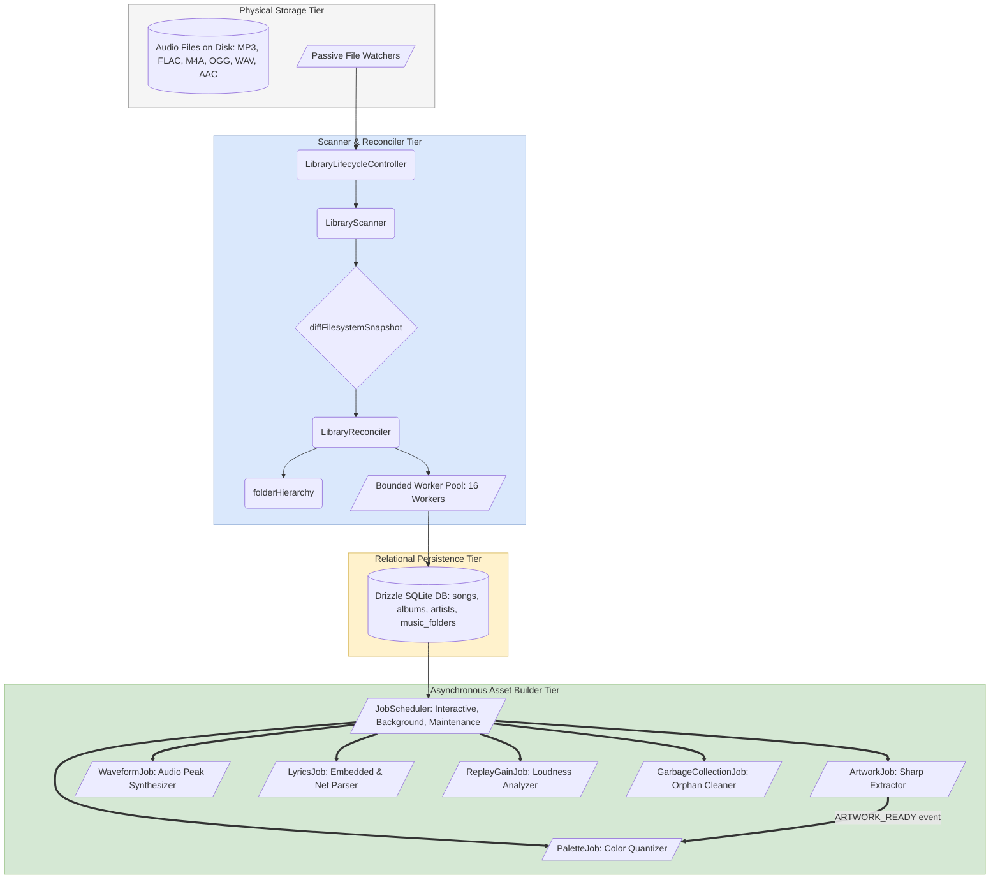

---

## 2. Detailed Process Breakdown

### Process 1: Scan Root Discovery & Accessibility Probing

Before touching the filesystem, the scanner loads all configured root music folders from the database and probes each path for physical accessibility.

**Detailed Workflow**:

1. Invokes [`getLibraryScanRoots()`](file:///C:/Users/VINAY/.gemini/antigravity/worktrees/Nora/document_project_architecture_graphs/src/main/library/getLibraryScanRoots.ts) to retrieve root folder entries from `music_folders WHERE parent_id IS NULL`.
2. Probes each path with `fs.access()`.
3. If accessible, adds root to `accessibleRoots`.
4. If inaccessible (e.g. disconnected USB drive, unmounted network share), adds root to `skippedRoots`.
5. **Safety Invariant**: Songs under `skippedRoots` are strictly protected from deletion during subsequent diffing.

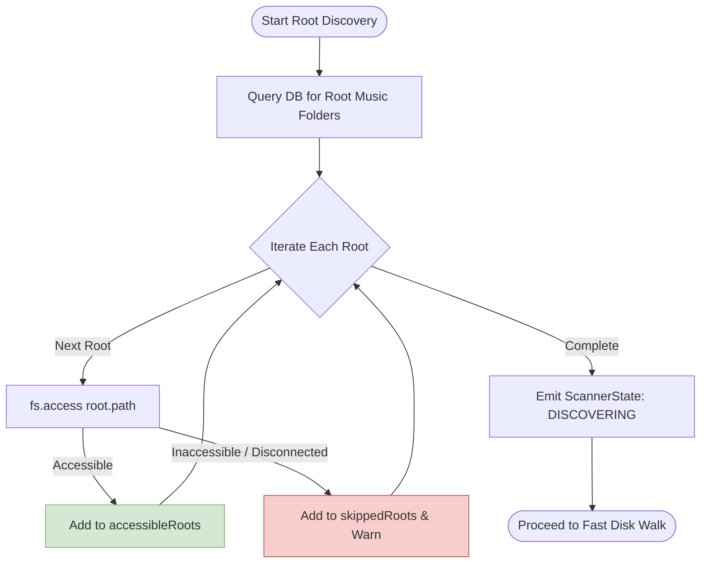

---

### Process 2: Fast Single-Pass Disk Traversal (`fastDiskWalk.ts`)

Performs high-throughput, recursive disk traversal across accessible roots with built-in subtree error containment.

**Detailed Workflow**:

1. Traverses directories recursively using Node `fs.readdir(path, { withFileTypes: true })`.
2. Gathers file entries matching supported extensions (`.mp3`, `.flac`, `.m4a`, `.ogg`, `.opus`, `.wav`, `.aac`, `.m4r`).
3. Captures individual file `mtimeMs` and `size` via `fs.stat()`.
4. **Subtree Failure Protection**: If `readdir` fails on a nested folder (permissions or I/O error), records directory in `failedSubtrees` and continues scanning sibling folders safely.
5. **Stat Failure Protection**: If `fs.stat` fails on an individual file, records path in `failedPaths` and continues.
6. Emits throttling discovery progress to UI (`discoveredFiles`, `currentPath`).

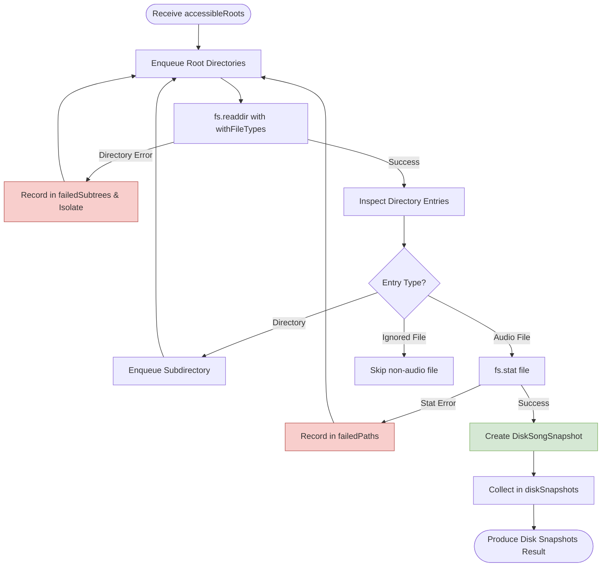

---

### Process 3: Pure In-Memory Snapshot Diffing (`diffEngine.ts`)

Computes the exact delta (`added`, `modified`, `removed`, `unchanged`) between the physical filesystem and the database.

**Mathematical Tolerance Rule**:

$$
\begin{aligned}
|t_{\text{disk}} - t_{\text{db}}| \le 1000\text{ms} &\implies \text{UNCHANGED} \\
t_{\text{disk}} > t_{\text{db}} + 1000\text{ms} &\implies \text{MODIFIED} \\
t_{\text{disk}} < t_{\text{db}} - 1000\text{ms} &\implies \text{UNCHANGED (Preserves FAT32/exFAT rounding)}
\end{aligned}
$$

**Removed Boundary Protections**:
A database record is marked `removed` ONLY IF:

1. It does not exist in `diskSnapshots`.
2. It is NOT inside any `skippedRoots`.
3. It is NOT inside any `failedSubtrees`.
4. It is NOT in `failedPaths`.
5. It belongs to a currently accessible root.
6. It is NOT marked `isBlacklisted`.

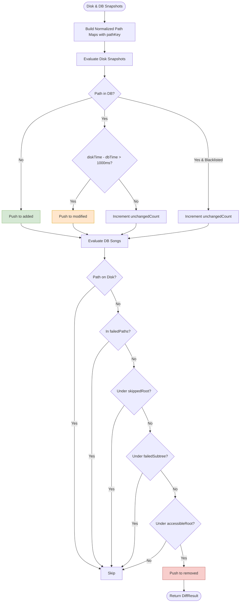

---

### Process 4: Folder Hierarchy Pre-Allocation (`folderHierarchy.ts`)

Before ingesting tracks into the database, the reconciler ensures all parent folder structures exist in `music_folders` to enforce immediate foreign key relations.

**Detailed Workflow**:

1. Extracts all unique parent directory paths for newly added songs.
2. Identifies missing folder records in the database.
3. Recursively inserts missing directory nodes from root downward, establishing correct `parentId` relationships.
4. Returns a fast memory map `Map<dirPathKey, folderId>`.

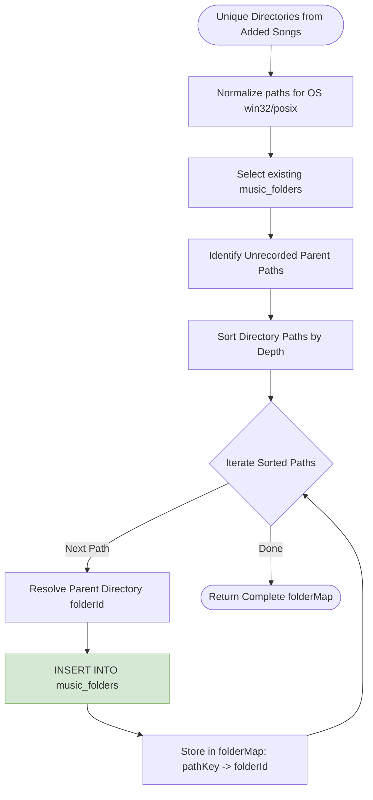

---

### Process 5: Bounded Concurrency Song Ingestion (`songWorkerPool.ts`)

Ingests newly discovered audio tracks into SQLite using a bounded worker pool (up to 16 concurrent workers).

**Detailed Workflow**:

1. Assigns each track its pre-resolved `folderId`.
2. Worker reads audio file metadata using TagLib / `parseSong.ts` (title, artists, album, track number, disk number, year, duration, bitrate, sample rate).
3. Inserts or links `artists`, `albums`, `genres` junction records.
4. Commits song record inside a dedicated short database transaction.
5. Emits `SongAdded` event and triggers derived asset queuing.

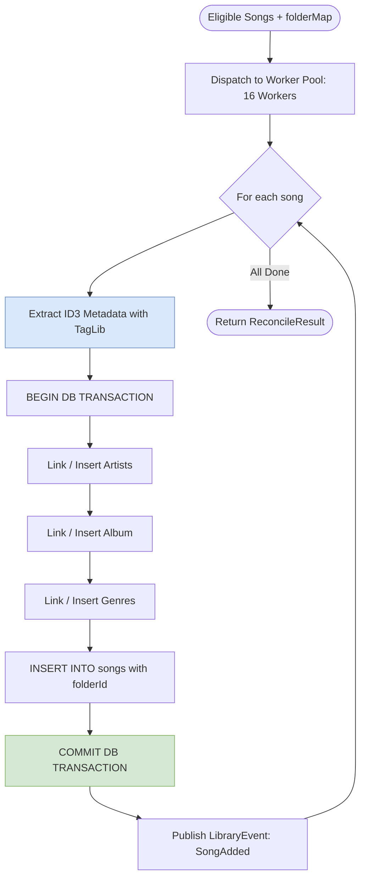

---

### Process 6: Modified Track Re-parsing (`reParseSong.ts`)

When file modification timestamps exceed tolerance ($> 1000\text{ms}$), the reconciler updates metadata in-place.

**Detailed Workflow**:

1. Re-reads physical file tags via TagLib.
2. Compares extracted tags against current database fields.
3. Updates `songs` record, updates `fileModifiedAt`, and synchronizes many-to-many artist/album/genre relations.
4. Emits `SongMetadataChanged` event on [`LibraryEventBus`](file:///C:/Users/VINAY/.gemini/antigravity/worktrees/Nora/document_project_architecture_graphs/src/main/events/LibraryEventBus.ts).

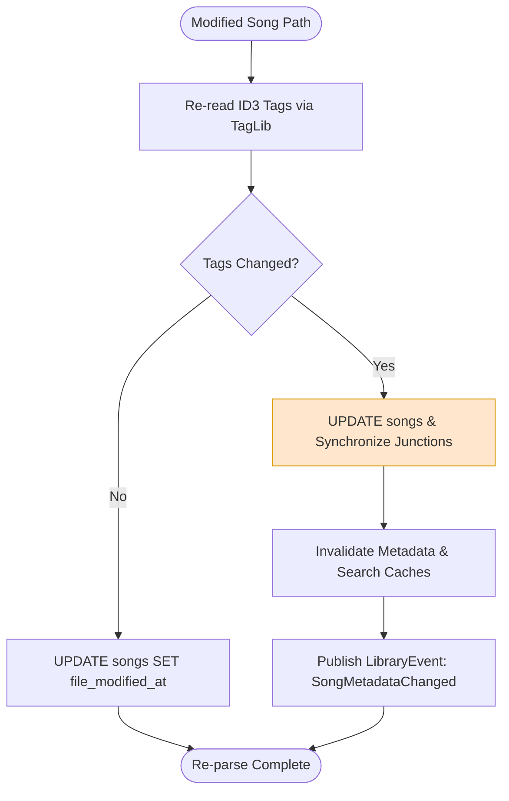

---

### Process 7: Batch Track Removal (`removeSongsFromLibrary.ts`)

Removes unlinked tracks in chunks of 500 records.

**Detailed Workflow**:

1. Takes list of removed database song IDs.
2. Removes dependent records in cascade order (`artworks_songs`, `artists_songs`, `album_songs`, `genres_songs`, `playlist_entries`, `play_history`).
3. Deletes `songs` record.
4. Performs orphan pruning on empty artists and albums.
5. Emits `SongRemoved` events.

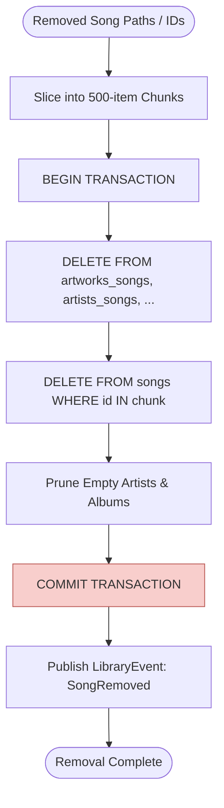

---

### Process 8: Lifecycle Control & Debounced Change Tracking

The [`LibraryLifecycleController`](file:///C:/Users/VINAY/.gemini/antigravity/worktrees/Nora/document_project_architecture_graphs/src/main/library/LibraryLifecycleController.ts) coordinates background scans, scan modes, and watcher debounce cycles.

**Debounce & Generation Tracking**:

- Watcher events increment `changeGeneration`.
- Debounces trigger for `2000ms`.
- If a scan is currently active when a change occurs, the controller waits for completion and schedules an automatic follow-up scan.

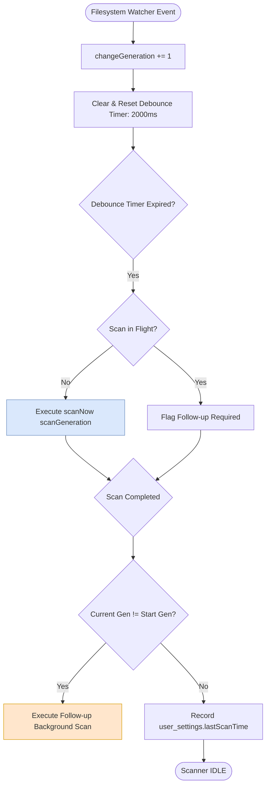

---

### Process 9: 3-Tier Job Scheduler (`jobScheduler.ts`)

Manages background CPU-intensive tasks using 3 strict priority queues:

1. **`interactive`** (Concurrency: 4) — User-triggered or high-priority viewport requests (e.g. user scrolled to album).
2. **`background`** (Concurrency: 2) — Batch derived asset generators (palettes, waveforms, lyrics, replay gain).
3. **`maintenance`** (Concurrency: 1) — Periodic garbage collection and integrity checks.

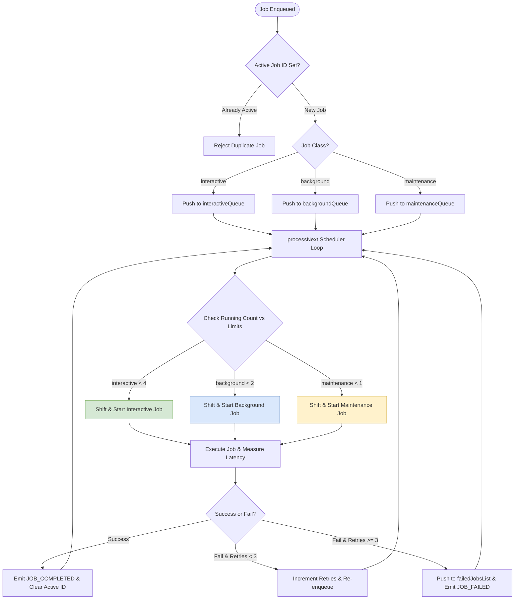

---

### Process 10: Derived Asset Job Execution & Event Choreography

Derived asset jobs are executed asynchronously without blocking the user interface:

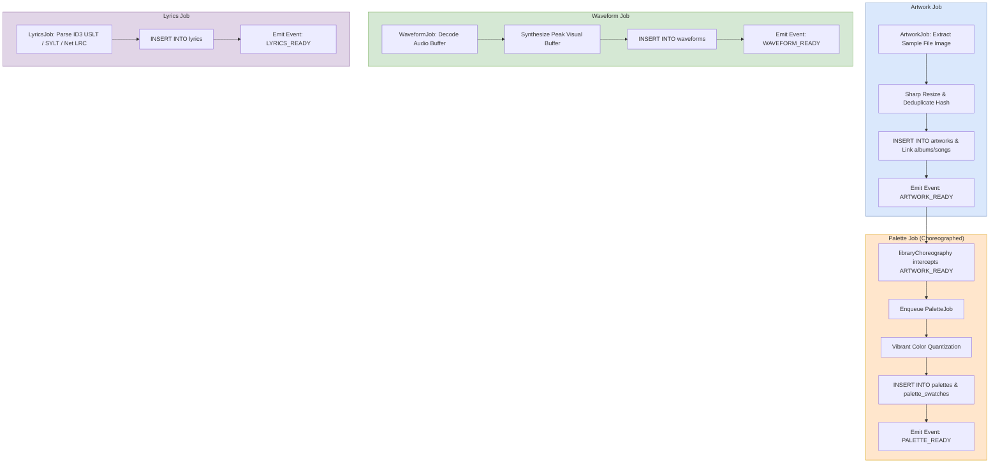

---

## 3. Inter-Process Group Choreography Graph

The following composite flowchart illustrates the complete lifecycle from file drop to background enrichment:

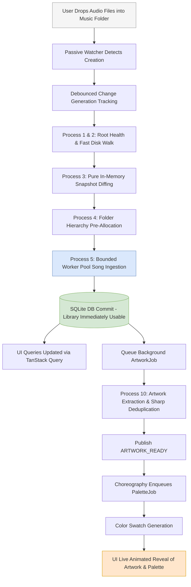
