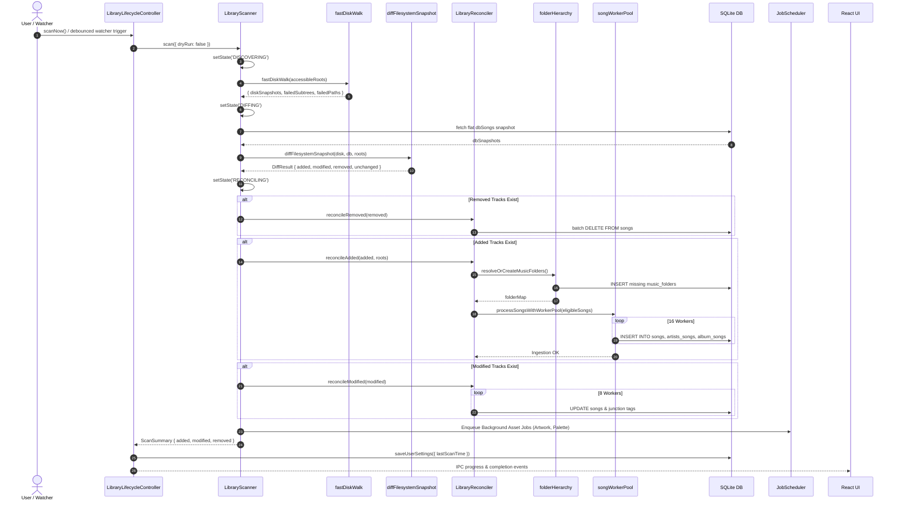
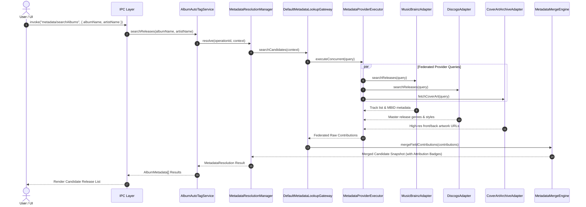
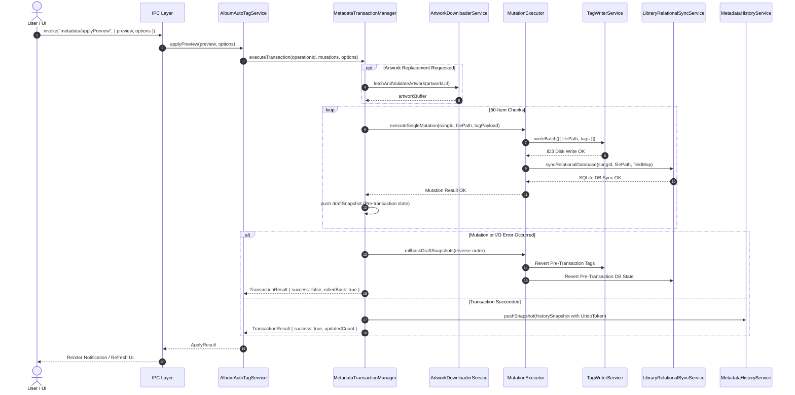
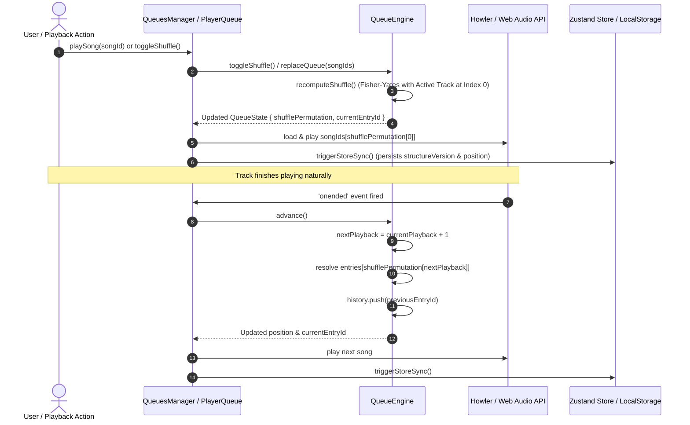
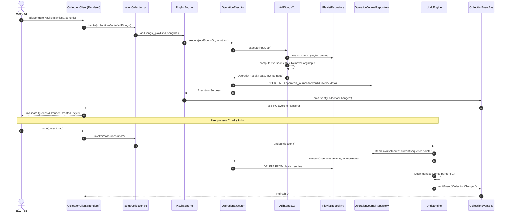
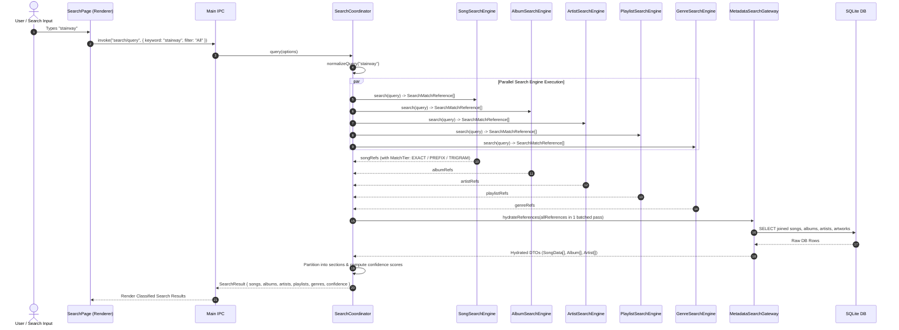

# 05. Multi-Subsystem Runtime Sequence Diagrams

This document illustrates the end-to-end runtime execution sequences for core workflows across all Nora subsystems.

---

## 1. Full Library Scan & Reconciliation Sequence

---

## 2. AutoTag Multi-Provider Resolution Sequence

---

## 3. Metadata Apply & Atomic Rollback Sequence

---

## 4. Playback Queue Permutation & Shuffled Advance Sequence

---

## 5. Playlist Mutation, Inverse Journaling & Undo Sequence

---

## 6. Global Federated Search & Batched Hydration Sequence

