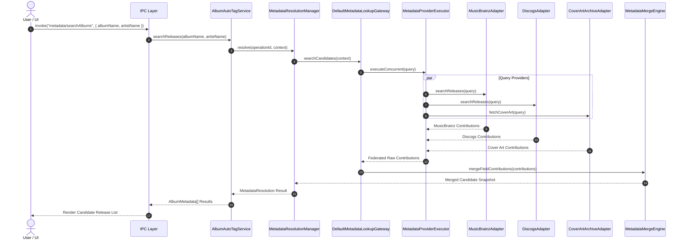
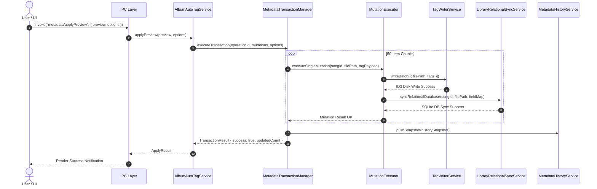

# 05. Runtime Sequence Diagrams

This document illustrates the exact execution sequence for major user workflows in the Metadata Platform.

---

## 1. AutoTag Search Runtime Sequence

---

## 2. AutoTag Apply & Transaction Runtime Sequence

