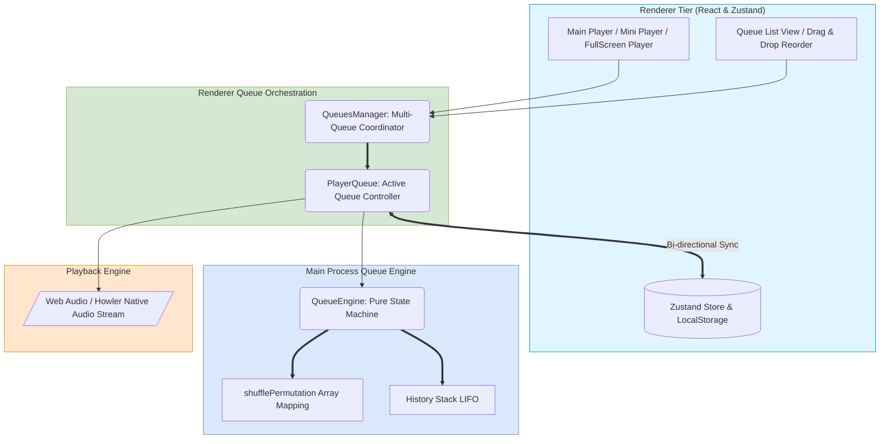
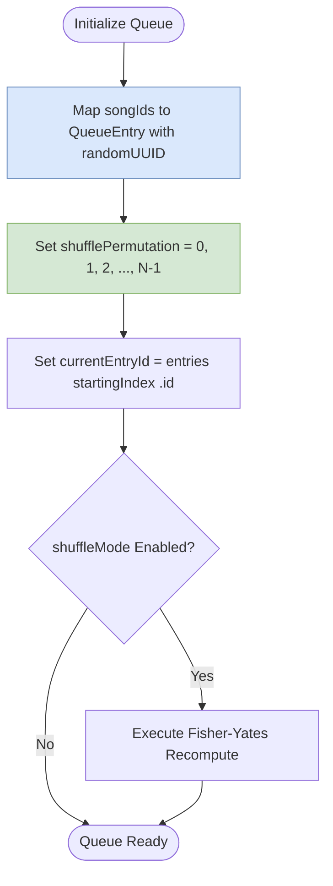
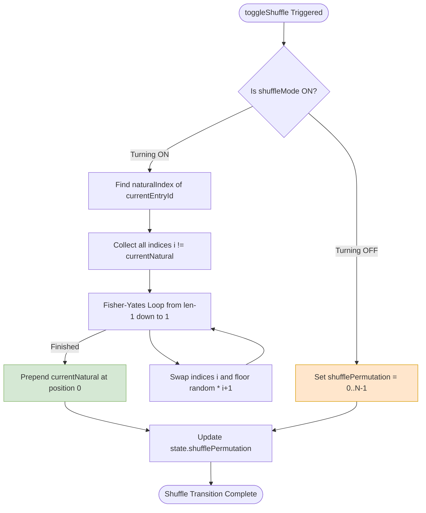
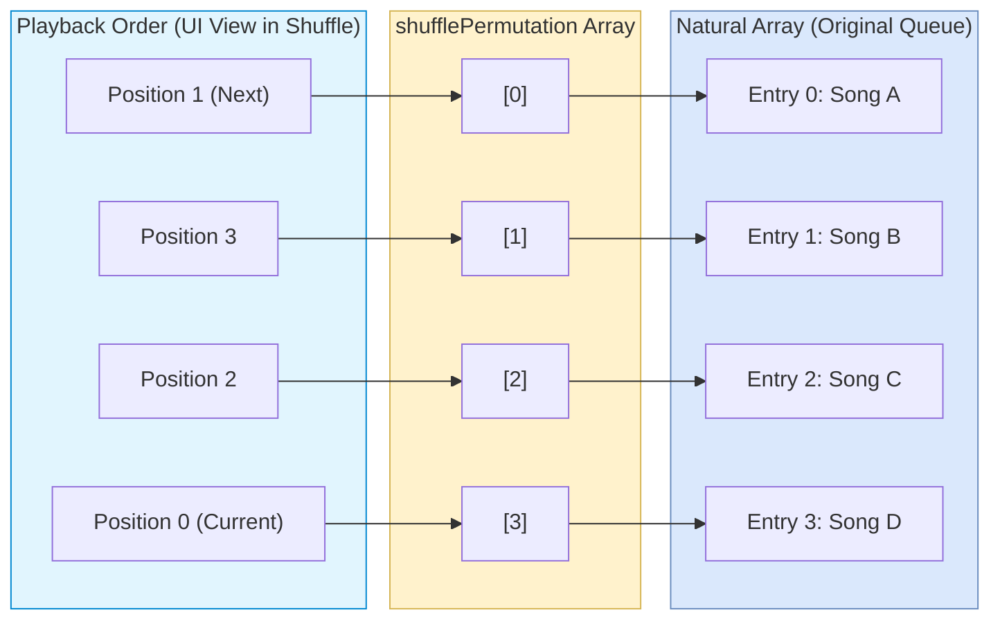
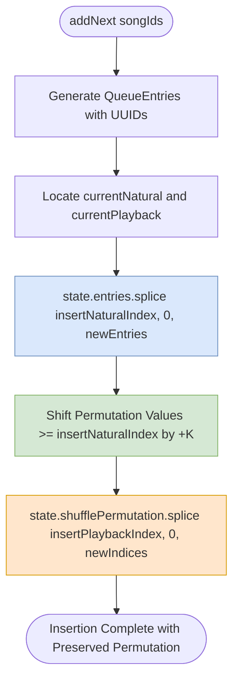
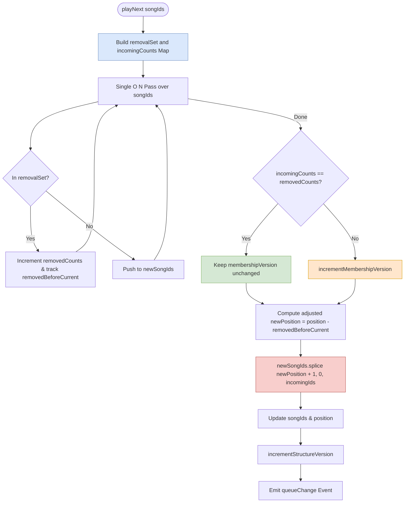
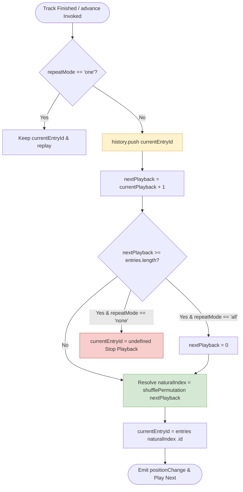
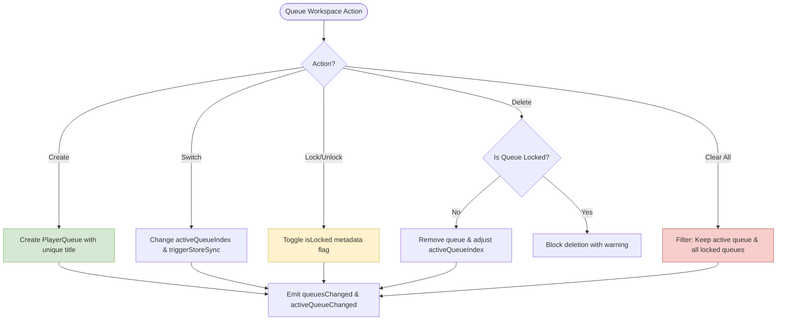
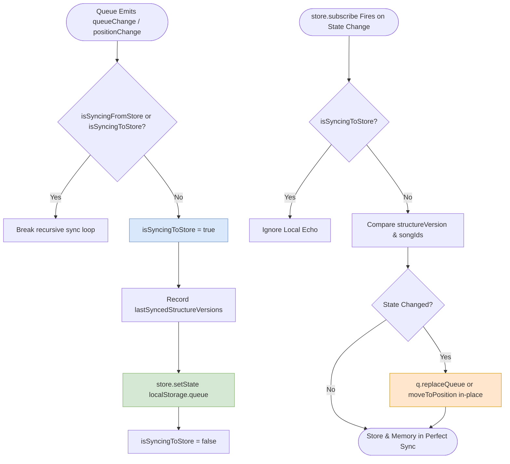
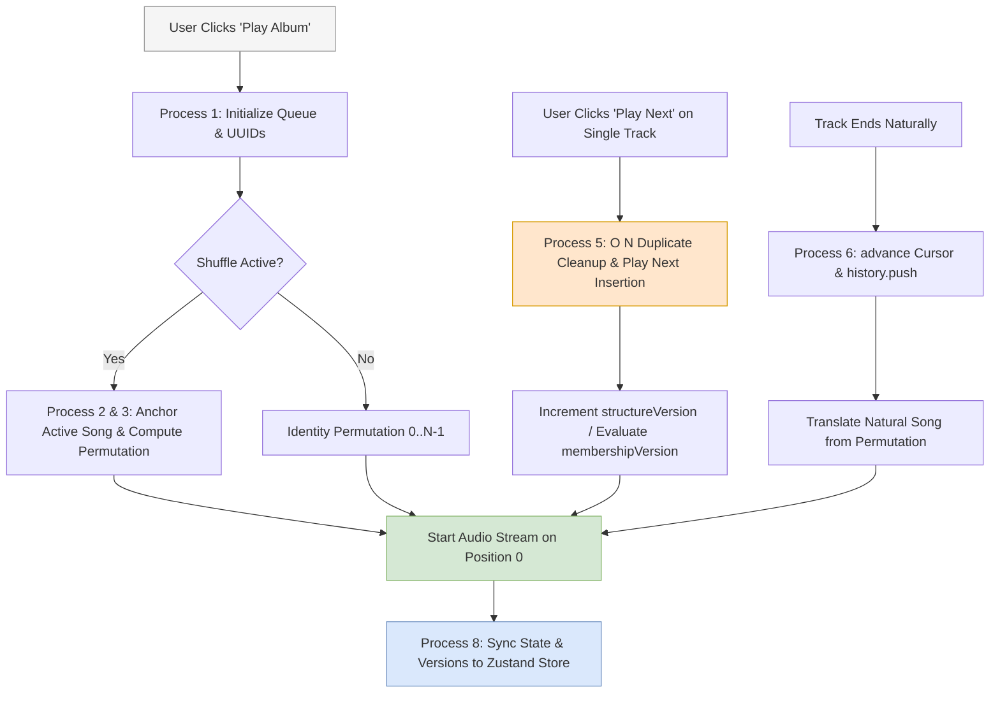

# 06. Queue & Playback Subsystem Architecture

This document specifies the architecture, data models, permutation algorithms, and multi-queue synchronization mechanisms of Nora's **Queue & Playback Subsystem**.

---

## 1. Subsystem Architectural Philosophy

The playback queue is intentionally decoupled from persistent database collections:

- **Ephemeral & In-Memory**: Current playback state, shuffle permutations, cursor positions, and history stacks live in fast memory rather than disk databases.
- **Non-Destructive Shuffling**: Shuffling does not scramble the original track order. It maintains a **Shuffled Permutation Vector** (`shufflePermutation`) that maps logical playback positions to natural indices.
- **Separation of Structure vs. Membership**: Reordering or shuffling a queue does NOT invalidate React Query caches or trigger database refetches; only adding or removing distinct songs increments `membershipVersion`.



---

## 2. Detailed Process Breakdown

### Process 1: Queue Initialization & State Model

Represents the queue as an immutable state structure containing unique entry UUIDs, sources, and mode flags.

```ts
export interface QueueEntry {
  id: string; // Unique UUID for entry lifetime
  songId: number; // Relational song reference
  source: QueueEntrySource; // playlist | album | artist | genre | songs
  metadata?: Record<string, unknown>;
}

export interface QueueState {
  entries: QueueEntry[];
  currentEntryId?: string;
  history: string[]; // Past track IDs for 'goBack()'
  repeatMode: 'none' | 'one' | 'all';
  shuffleMode: boolean;
  shufflePermutation: number[]; // Maps playback index -> natural index
}
```



---

### Process 2: Permutation-Based Shuffle Algorithm

When shuffle mode is toggled, Nora never mutates the underlying `entries` array. Instead, it recomputes `shufflePermutation`.

**Fisher-Yates Algorithm with Active Track Anchoring**:

1. Identifies the currently playing track's natural index ($N_{\text{current}}$).
2. Collects all remaining indices ($i \neq N_{\text{current}}$).
3. Executes a Fisher-Yates shuffle on the remaining indices.
4. Places $N_{\text{current}}$ at index `0` of `shufflePermutation` so playback continues seamlessly without track jumps.



---

### Process 3: Bi-Directional Index Translation Mathematics

Translates between the natural order (the original list) and the playback order (the UI list in shuffle mode).

$$
\begin{aligned}
\text{playbackIndex}(n) &= \text{shufflePermutation}.\text{indexOf}(n) \\
\text{naturalIndex}(p) &= \text{shufflePermutation}[p] \\
\text{songToPlay}(p) &= \text{entries}[\text{shufflePermutation}[p]].\text{songId}
\end{aligned}
$$



---

### Process 4: Dynamic Queue Insertion (`addNext` & `addToEnd`)

Dynamically inserts new tracks without invalidating existing shuffle indices.

**Insertion Math for `addNext`**:

1. Computes `insertNaturalIndex = currentNatural + 1`.
2. Computes `insertPlaybackIndex = getPlaybackIndex(currentNatural) + 1`.
3. Slices new entries into `state.entries`.
4. Shifts all permutation values $\ge \text{insertNaturalIndex}$ by $+K$ (where $K = \text{newEntries.length}$).
5. Inserts new index range into `state.shufflePermutation` at `insertPlaybackIndex`.



---

### Process 5: Atomic $O(N)$ `playNext` with Duplicate Removal & Versioning

When a user clicks "Play Next" on an album or track, Nora atomically strips existing duplicate instances of those tracks from the queue and inserts the incoming batch in a single $O(N)$ operation.

**Version Optimization Guarantee**:

- **`structureVersion`** increments on every order or position change (triggers local UI animation).
- **`membershipVersion`** increments ONLY IF new distinct song IDs are added or duplicate counts change. If `playNext` merely shifts existing tracks, `membershipVersion` stays unchanged (0 DB refetches, 0 IPC roundtrips).



---

### Process 6: Playback Navigation & History Stack (`advance` & `goBack`)

Coordinates cursor progression, repeat constraints, and back-button navigation.



---

### Process 7: Multi-Queue Workspace Management (`QueuesManager.ts`)

Users can maintain multiple independent queue workspaces simultaneously (e.g. "Work Queue", "Chill Queue", "Workout").



---

### Process 8: Zustand Store & LocalStorage Synchronization

Ensures zero state divergence between the in-memory queue, React component trees, and persistent local storage.



---

## 3. Multi-Process Playback & Queue Choreography Graph

The following composite diagram illustrates the complete interactive lifecycle of queue playback:


