# 07. Metadata Platform Architecture

This document provides a comprehensive technical specification of Nora's **Metadata Platform & Transaction Subsystem**, reflecting recent architectural updates, resilient provider execution, multi-provider federation, and Option A atomic transaction rollback semantics.

---

## 1. High-Level Subsystem Architecture

The Metadata Platform establishes [`MetadataEngine`](file:///C:/Users/VINAY/.gemini/antigravity/worktrees/Nora/document_project_architecture_graphs/src/main/metadata/engine/MetadataEngine.ts) as the sole authority for metadata state across Nora, completely isolating Presentation components from physical file writes and raw database queries.

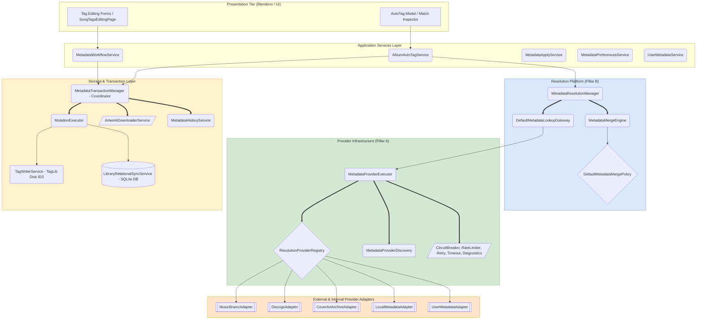

---

## 2. Detailed Process Breakdown

### Process 1: Metadata Engine & Query Pipeline (`MetadataEngine.ts`)
Executes domain metadata queries through a structured pipeline with identity resolution, cache lookups, and validation policies.

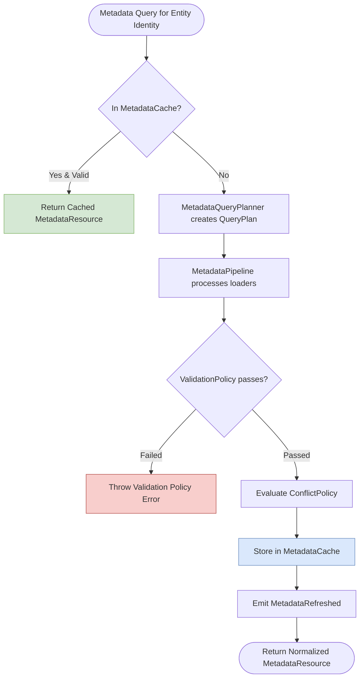

---

### Process 2: Multi-Provider Discovery & Dynamic Priority Registration
Dynamically discovers and configures local and remote providers based on user preferences and capability descriptors.

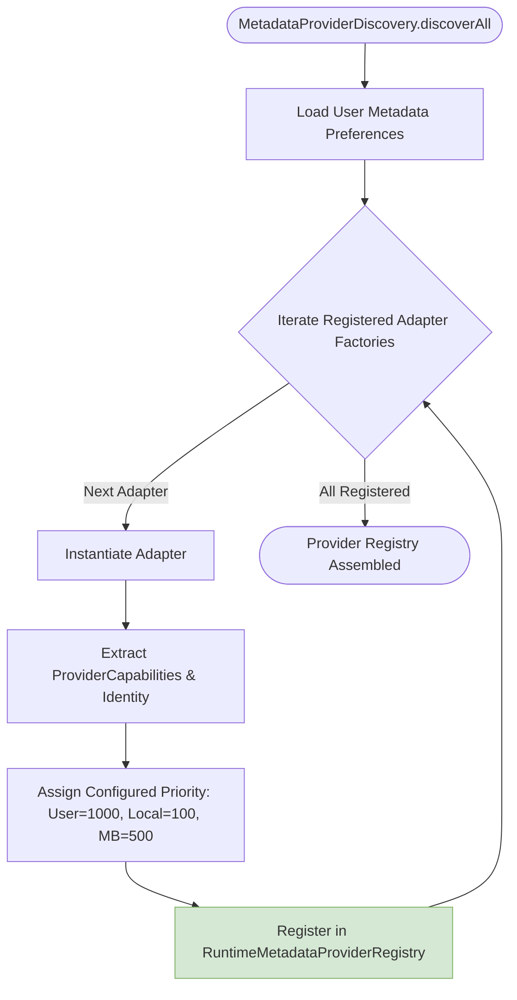

---

### Process 3: Resilient Provider Execution Pipeline (`MetadataProviderExecutor.ts`)
Guarantees 100% isolation for all external HTTP queries. No remote failure or rate limit (HTTP 429) can crash the UI or freeze the Node.js event loop.

**Resilience Layers**:
1. **`RateLimiter`**: Enforces 1 request/second per remote domain.
2. **`CircuitBreaker`**: Opens after consecutive threshold failures to prevent cascading latency.
3. **`RetryPolicy`**: 3 exponential backoff retries on network dropouts.
4. **`ProviderTimeoutPolicy`**: Hard timeout per remote request (default 8000ms).
5. **`ProviderDiagnosticsTracker`**: Centrally logs metrics and status codes.

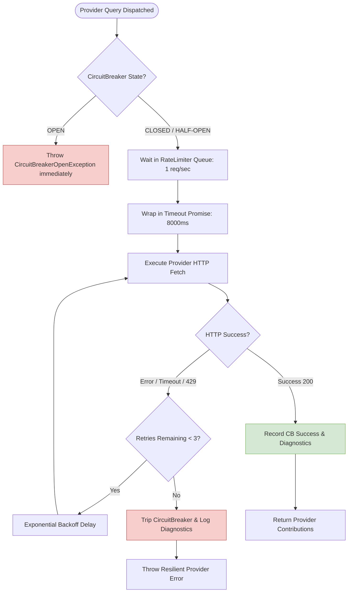

---

### Process 4: Field-Level Policy Merging & Attribution Badges (`MetadataMergeEngine.ts`)
Merges conflicting field contributions across disparate providers into a unified release snapshot, attaching explicit provider attribution badges.

**Attribution Rule Matrix**:
- **Title, Artist, Track Number, MBID**: MusicBrainz takes precedence (`badge: 'musicbrainz'`).
- **Genres & Master Styles**: Discogs takes precedence (`badge: 'discogs'`).
- **Cover Artwork URLs**: Cover Art Archive takes precedence (`badge: 'coverartarchive'`).
- **User Overrides**: Always supersede all remote providers (`priority: 1000`).

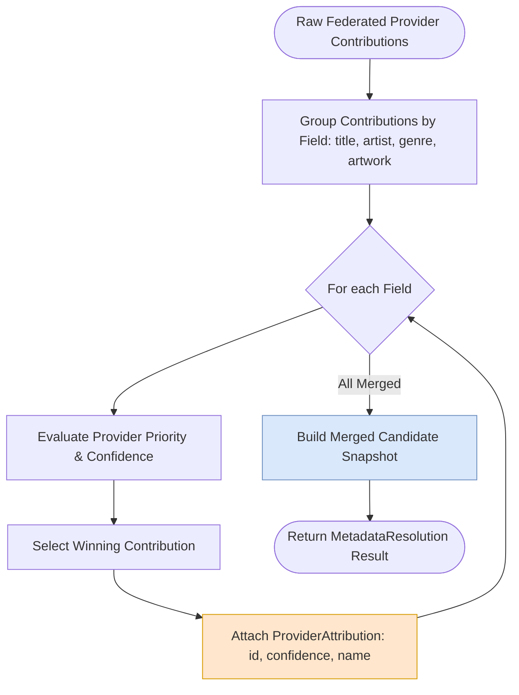

---

### Process 5: Candidate Resolution & UI Preview Generation
Coordinates user release searches, producing a typed [`MetadataPreview`](file:///C:/Users/VINAY/.gemini/antigravity/worktrees/Nora/document_project_architecture_graphs/src/common/metadata/preview.ts) showing old vs. new values before physical disk write.

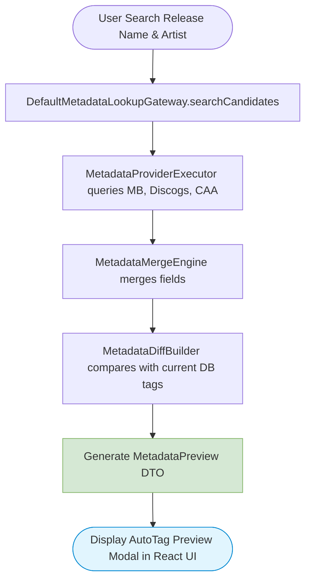

---

### Process 6: Option A Whole-Transaction Batch Execution (`MetadataTransactionManager.ts`)
Executes metadata mutations in chunks of 50 files. If ANY mutation fails, the transaction coordinator automatically rolls back all previously written files and database records to their pre-transaction states.

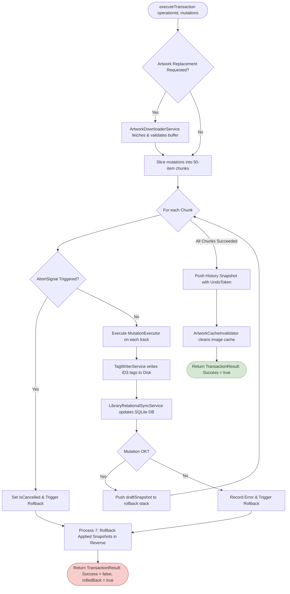

---

### Process 7: Atomic Rollback & Snapshot Playback
Iterates backwards through `draftSnapshots`, using [`MutationExecutor`](file:///C:/Users/VINAY/.gemini/antigravity/worktrees/Nora/document_project_architecture_graphs/src/main/metadata/transactions/MutationExecutor.ts) to restore both physical disk tags and SQLite rows to their exact pre-transaction state.

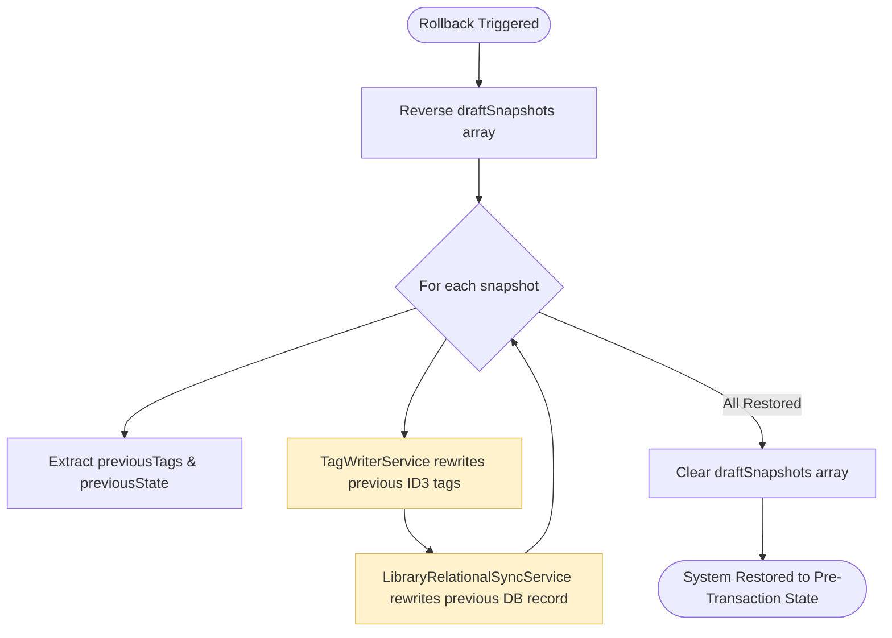

---

### Process 8: Artwork Downloading & Cache Invalidation
Validates and fetches remote artwork images via the resilient request pipeline and invalidates local image caches upon successful commit.

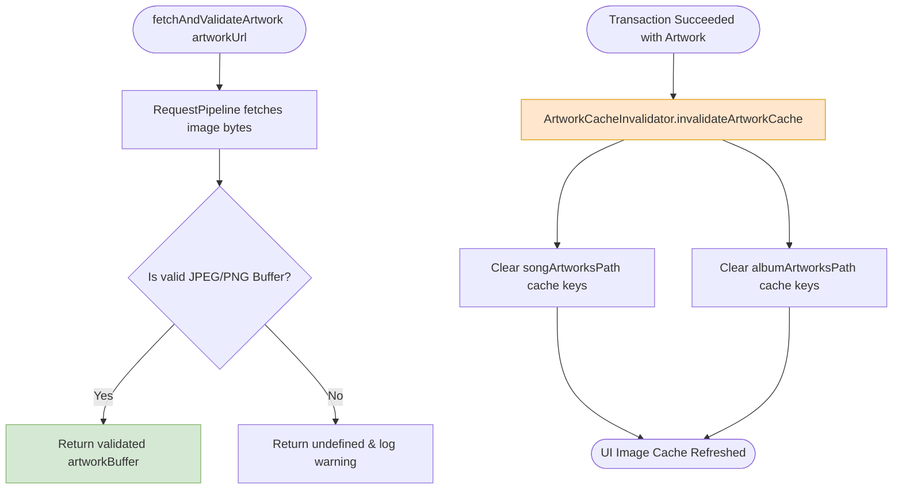

---

### Process 9: Undo Token & History Snapshot Management (`MetadataHistoryService.ts`)
Manages immutable undo snapshots, allowing one-click multi-level rollback across app sessions.

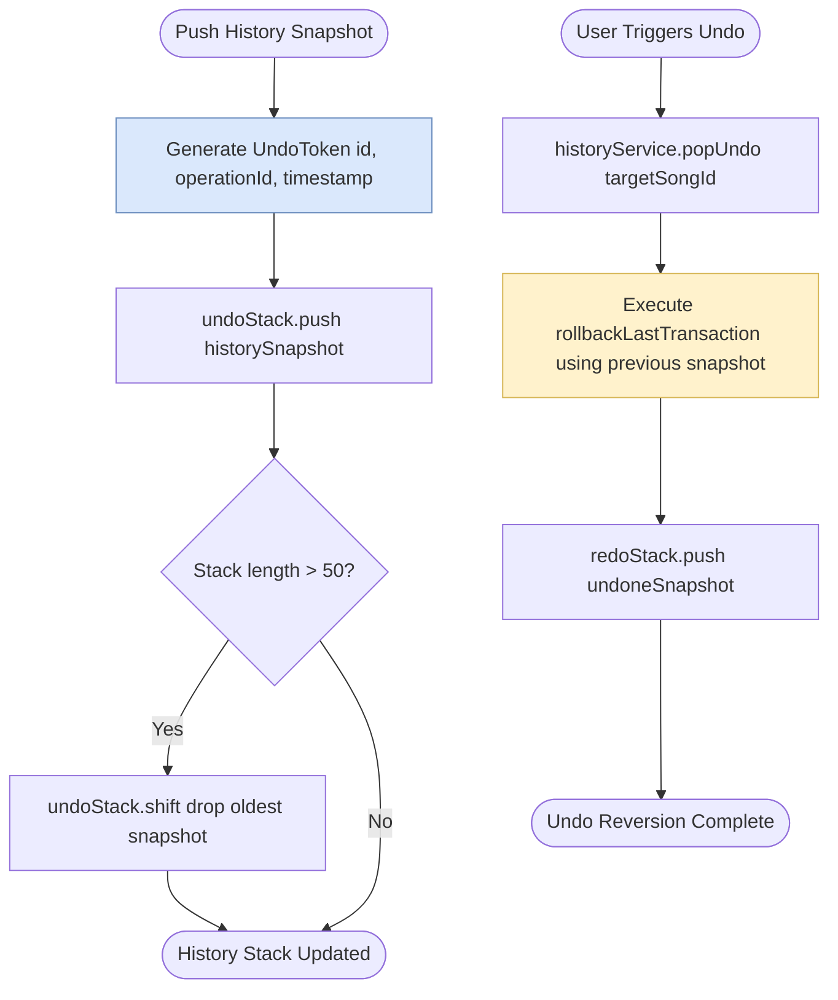

---

### Process 10: Metadata Domain Workflows (`MetadataWorkflowService.ts`)
Encapsulates specialized domain workflows for granular tag editing:
- **`AlbumWorkflow`**: Resolves multi-track album structures.
- **`GenreWorkflow`**: Fetches community-tagged musical styles from Discogs.
- **`ArtworkWorkflow`**: Resolves high-resolution cover artwork from CAA.
- **`TrackWorkflow`**: Resolves ISRC, track numbers, and MusicBrainz recording IDs.

```mermaid
flowchart TD
    WorkflowStart([WorkflowService.executeWorkflow]) --> RouteWorkflow{Workflow Type?}
    RouteWorkflow -->|Album| ExecAlbum[AlbumWorkflow.execute]
    RouteWorkflow -->|Genre| ExecGenre[GenreWorkflow.execute via Discogs]
    RouteWorkflow -->|Artwork| ExecArtwork[ArtworkWorkflow.execute via CAA & Discogs]
    RouteWorkflow -->|Track| ExecTrack[TrackWorkflow.execute via MusicBrainz]

    ExecAlbum --> BuildMutations[Build ResourceMutationPayload[]]
    ExecGenre --> BuildMutations
    ExecArtwork --> BuildMutations
    ExecTrack --> BuildMutations

    BuildMutations --> TxMgrExec[MetadataTransactionManager.executeTransaction]
    TxMgrExec --> WorkflowEnd([Workflow Completed Atomically])

    style ExecAlbum fill:#dae8fc,stroke:#6c8ebf
    style ExecGenre fill:#ffe6cc,stroke:#d79b00
    style ExecArtwork fill:#d5e8d4,stroke:#82b366
    style ExecTrack fill:#e1d5e7,stroke:#9673a6
```

---

## 3. Multi-Process Metadata Platform Choreography Graph

The following composite flowchart illustrates the complete journey of a metadata update from user search to atomic file write:

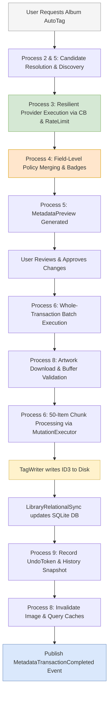
