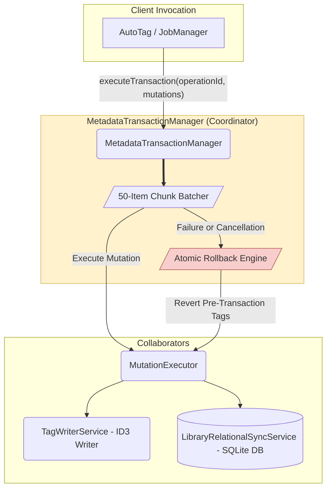

# 07. Transaction Platform Architecture (`MetadataTransactionManager`)

This document details the transaction orchestration, chunking, cancellation, and atomic partial batch rollback semantics of Nora's Transaction Platform.

---

## 1. Transaction Coordinator View

---

## 2. Option A — Whole Transaction Atomic Semantics

- **Batch Chunking**: Mutations are executed in chunks (`chunkSize`, defaulting to 50 files/chunk).
- **Atomic Rollback Guarantee**: If any file write fails or an `AbortSignal` cancellation occurs mid-flight, `MetadataTransactionManager` iterates backwards through all applied `draftSnapshots` and uses `MutationExecutor` to restore both physical ID3 file tags and SQLite database records back to their pre-transaction states.
- **Independent Metrics**:
  - `updatedCount`: Number of applied mutations.
  - `failedCount`: Number of mutation/sync write errors.
  - `cancelled`: Flag set when user aborts (cancellation does NOT increment `failedCount`).
