# 08. Collections & Playlists Engine Architecture

This document provides a comprehensive technical specification of Nora's **Collections Subsystem, Reversible Operation Framework, Smart Playlist Compiler, and Playlist Importing Engine**.

---

## 1. High-Level Subsystem Architecture

The Collections Subsystem implements a strictly layered architecture separating raw database joins from in-memory reactivity, operation journaling, and AST evaluations.

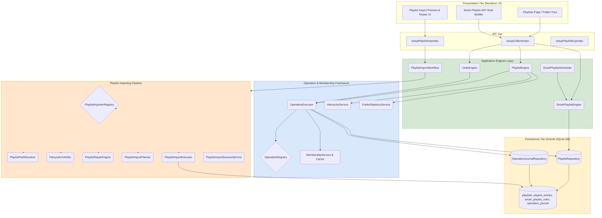

---

## 2. Detailed Process Breakdown

### Process 1: Operation Lifecycle & Inverse Computation (`OperationExecutor.ts`)
All collection mutations execute through a standardized, reversible lifecycle that automatically computes and journals its exact reverse mutation.

**4-Step Lifecycle**:
1. **Pre-Validation**: Validates inputs, target playlist existence, and permissions.
2. **Transactional SQL Execution**: Executes raw mutations via `ctx.trx` and `PlaylistRepository`.
3. **Inversion Computation**: Computes exact inverse parameters (e.g. `AddSongsOp` computes `RemoveSongsInput`; `DeleteOp` computes a full restore payload with original IDs).
4. **Journaling**: Securely stores both forward and inverse inputs in `operation_journal`.

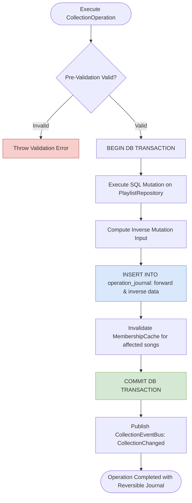

---

### Process 2: Pointer-Based Linear Undo/Redo Model (`UndoEngine.ts`)
Undo/Redo uses a **pointer-based linear history** rather than branching operation trees.

**Invariants**:
- **Zero Journal Writes on Undo/Redo**: Reverting or reapplying an operation does not create new journal records; it merely navigates the `sequenceNumber` pointer.
- **`Undo`**: Decrements pointer (`-1`), fetches `inverseInput`, and executes the registered inverse operation.
- **`Redo`**: Increments pointer (`+1`), fetches `operationInput`, and executes the forward operation.
- **Redo Branch Discard**: If a user undoes, and then performs a *new* forward mutation, the new operation takes the current sequence pointer and overwrites future history, cleanly discarding the old redo branch.

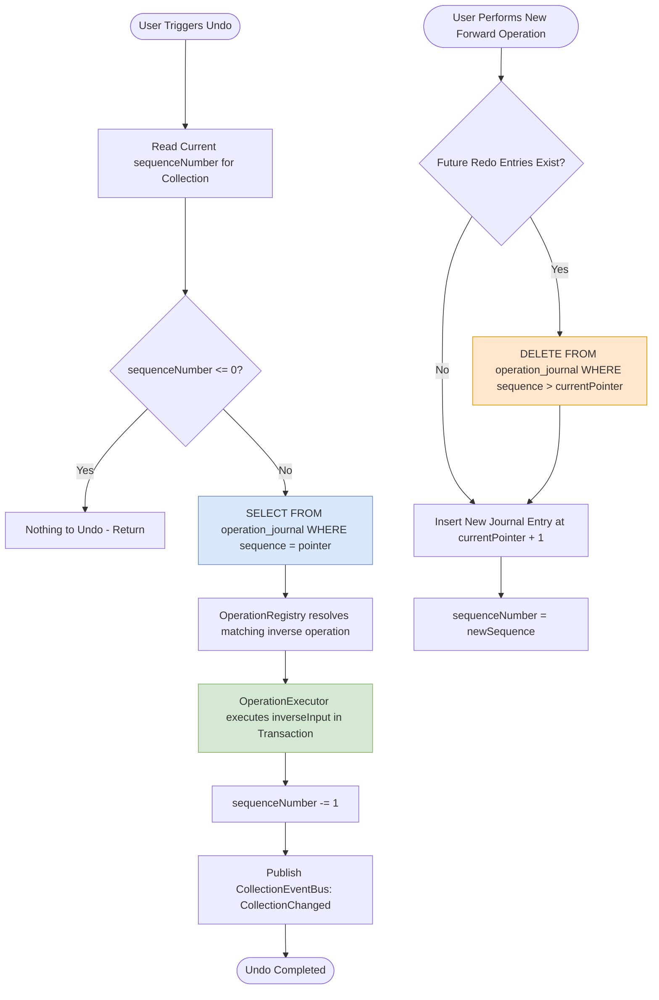

---

### Process 3: Membership Caching & Fast In-Memory Lookups (`MembershipService.ts`)
Provides ultra-high-speed answers to *"Is song X in playlist Y or favorites?"* without running repetitive SQL joins.

**Mechanics**:
- Maintains an in-memory hash set of relationships (`Set<"playlistId:songId">`).
- When mutations occur, `PlaylistEngine` selectively invalidates only the `affectedSongIds`.

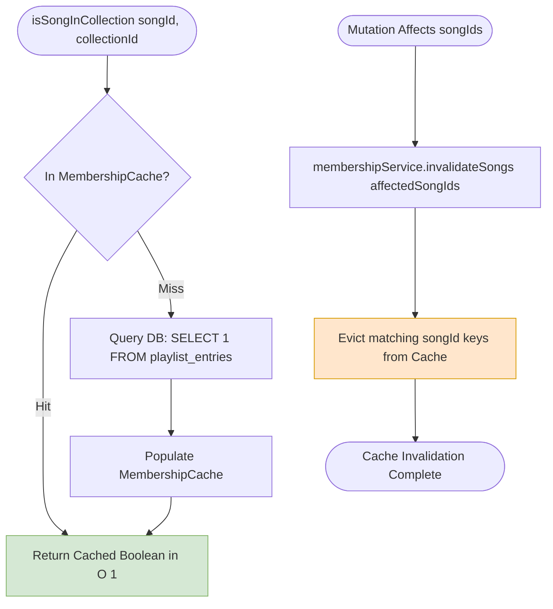

---

### Process 4: Hierarchical Folder Nesting & Subtree Mutations (`HierarchyService.ts`)
Manages nested playlist folders with arbitrary depth, circular parentage prevention, and recursive subtree deletion.

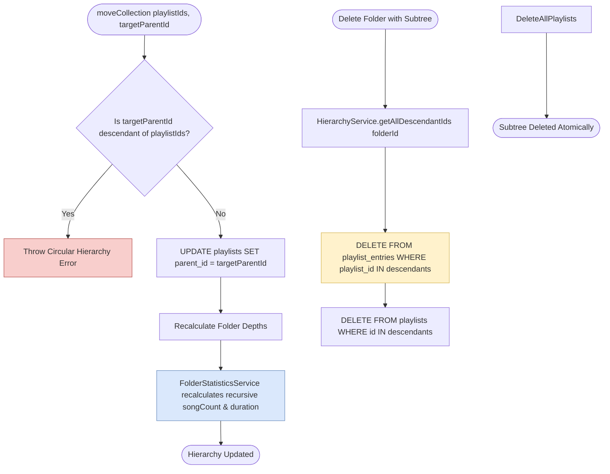

---

### Process 5: Smart Playlist AST Evaluation & Dynamic SQL Compilation (`SmartPlaylistEngine.ts`)
Compiles JSON rule ASTs into safe, parameterized SQL WHERE queries.

**Supported AST Node Types**:
- **Field Comparisons**: `title`, `artist`, `album`, `genre`, `year`, `playCount`, `skipCount`, `rating`, `duration`, `dateAdded`.
- **Operators**: `equals`, `contains`, `startsWith`, `endsWith`, `greaterThan`, `lessThan`, `inRange`, `isTrue`, `isFalse`.
- **Combinators**: `AND`, `OR`, `NOT`.

```mermaid
flowchart TD
    ASTStart([SmartPlaylistRuleAST JSON]) --> ValidateSchema{RuleValidator.validate AST}
    ValidateSchema -->|Invalid| ThrowASTErr[Throw Invalid AST Schema Error]
    ValidateSchema -->|Valid| ExtractDeps[Extract AST Field Dependencies]
    ExtractDeps --> Compiler[SmartPlaylistCompiler compiles to Drizzle SQL]
    Compiler --> BuildWhere[Generate SQL WHERE clause with parameterized values]
    BuildWhere --> ApplyLimits[Append ORDER BY sortDefinition & LIMIT maxEntries]
    ApplyLimits --> QueryDB[Execute SELECT songs JOIN ... WHERE compiledClause]
    QueryDB --> StoreRules[UPDATE smart_playlist_rules SET last_generated_at, rule_hash]
    StoreRules --> ASTDone([Return Evaluated SongData[]])

    style Compiler fill:#dae8fc,stroke:#6c8ebf
    style QueryDB fill:#d5e8d4,stroke:#82b366
```

---

### Process 6: Smart Playlist Scheduler & Reactive Invalidation (`SmartPlaylistScheduler.ts`)
Listens to global system event buses and automatically invalidates or regenerates smart playlists when their dependent fields change.

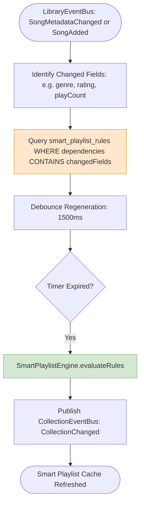

---

### Process 7: Playlist Import Pipeline (Parsing & Path Resolution)
Parses external playlist files (M3U, M3U8) and transforms relative file paths into normalized, absolute OS paths.

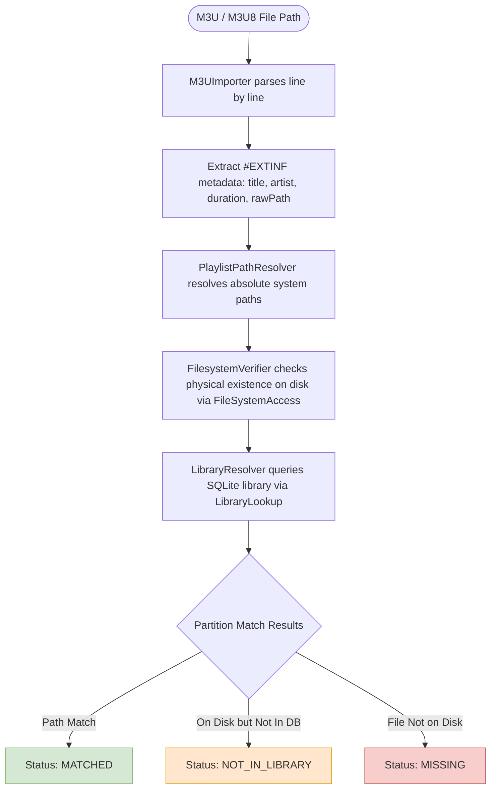

---

### Process 8: Intelligent Repair Strategies (`PlaylistRepairEngine.ts`)
Executes recovery strategies for tracks labeled `NOT_IN_LIBRARY`.

**Strategy Chain**:
1. **`ExactFilenameStrategy`**: Matches library tracks having exact filename equality.
2. **`NormalizedFilenameStrategy`**: Matches after stripping punctuation, track numbers, and case differences.
3. Generates **`RepairDiagnostics`** detailing strategy confidence scores and match provenance.

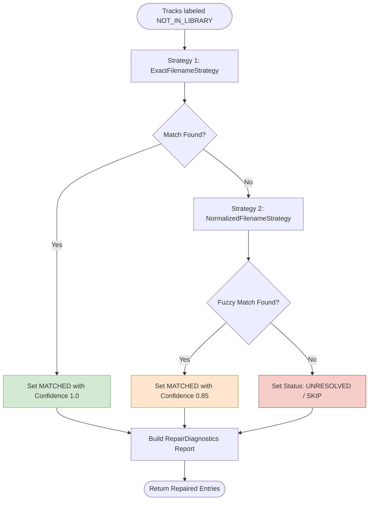

---

### Process 9: Import Plan Generation & Transactional Execution
Converts resolved entries into a [`PlaylistImportPlan`](file:///C:/Users/VINAY/.gemini/antigravity/worktrees/Nora/document_project_architecture_graphs/src/main/playlistImport/models/PlaylistImportPlan.ts) for user review before committing writes in a single atomic transaction.

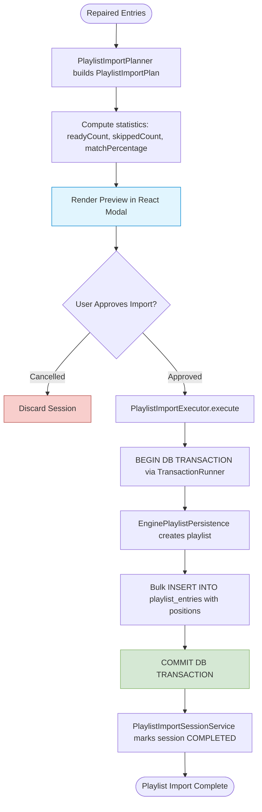

---

### Process 10: Import Session Management & One-Click Undo
Maintains an audit history of imported playlists and enables one-click undo (deleting the imported playlist without losing user songs).

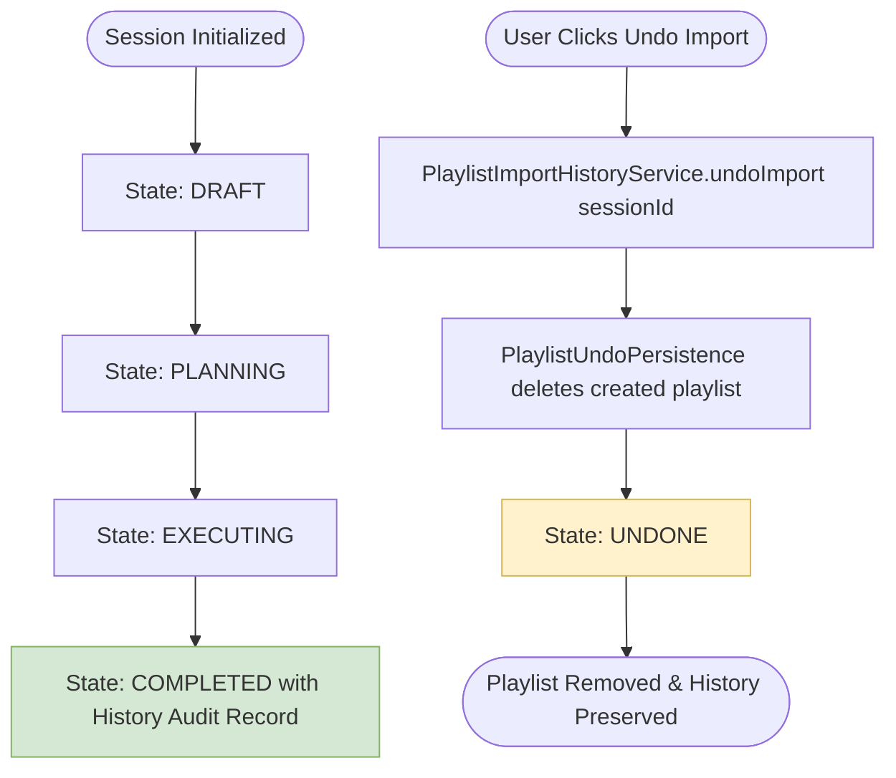

---

## 3. Multi-Process Collections & Import Choreography Graph

The following composite flowchart illustrates the interaction between playlists, operations, journaling, and imports:

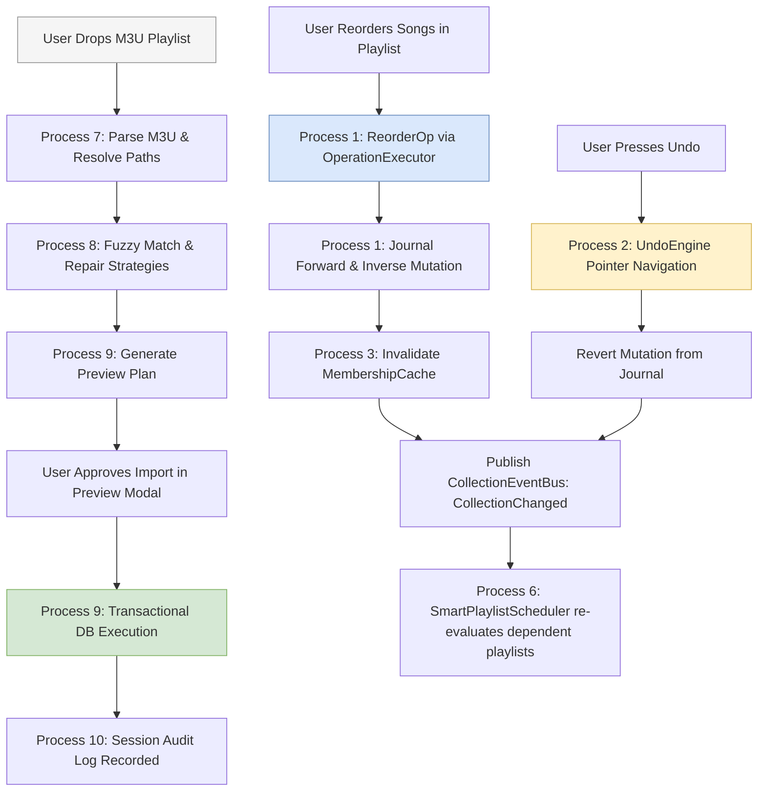
