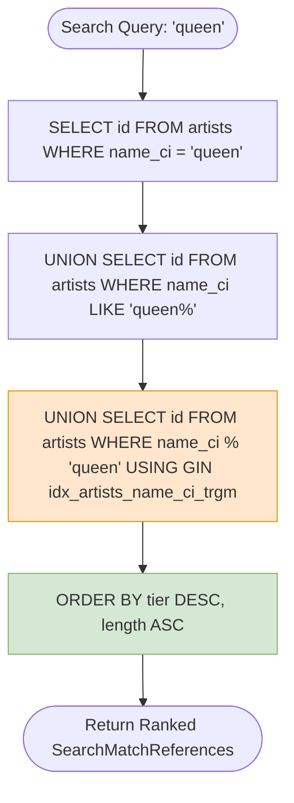
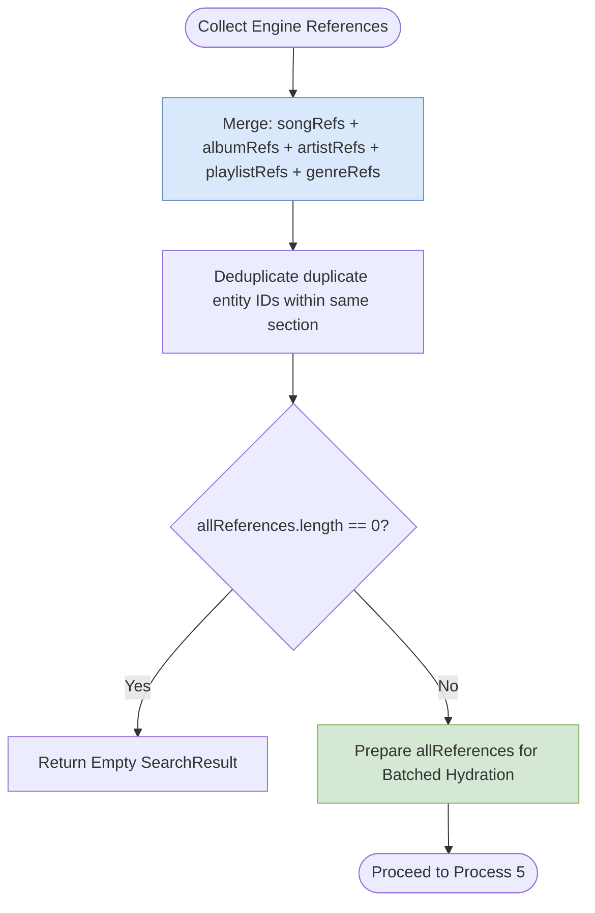
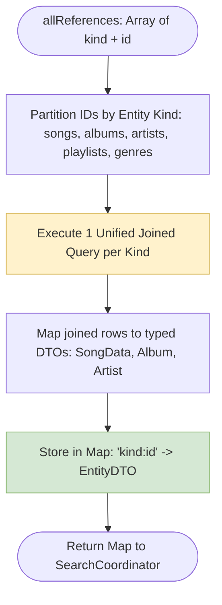
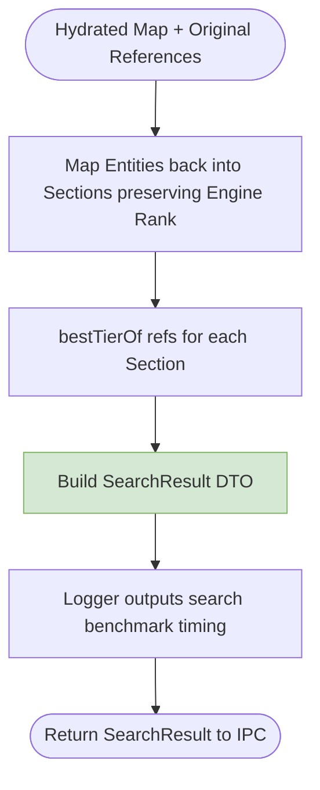
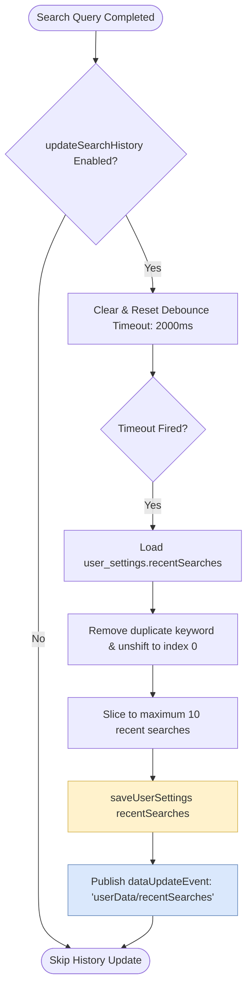
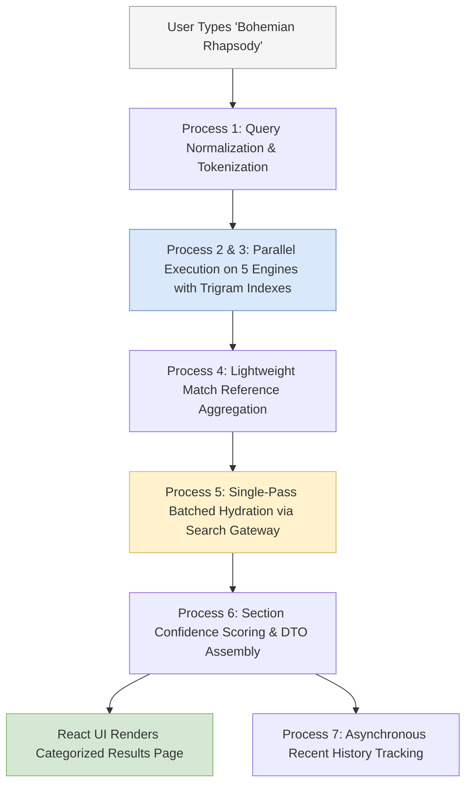

# 09. Search & Indexing Engine Architecture

This document provides a comprehensive technical specification of Nora's **Global Search & Indexing Engine**, detailing query normalization, parallel sub-engine execution, trigram database acceleration, single-pass batched hydration, and confidence tier ranking.

---

## 1. High-Level Subsystem Architecture

The Search Subsystem uses a **Federated Query & Single-Pass Hydration** architecture. Engine discovery produces lightweight references (`SearchMatchReference[]`), which are hydrated in a single batched database query through the [`MetadataSearchGateway`](file:///C:/Users/VINAY/.gemini/antigravity/worktrees/Nora/document_project_architecture_graphs/src/main/metadata/search/MetadataSearchGateway.ts).

```mermaid
graph TD
    subgraph UI_Tier ["Presentation Tier (Renderer)"]
        UI_Search[Search Input & Global Search Page]
    end

    subgraph Coordinator_Tier ["Coordinator Layer"]
        SearchCoord(SearchCoordinator: Central Dispatcher)
        Normalizer{normalizeQuery: Tokenizer}
        ConfidenceCalc{Confidence Evaluator}
    end

    subgraph Engine_Tier ["Parallel Entity Search Engines"]
        SongEng(SongSearchEngine)
        AlbumEng(AlbumSearchEngine)
        ArtistEng(ArtistSearchEngine)
        PlaylistEng(PlaylistSearchEngine)
        GenreEng(GenreSearchEngine)
    end

    subgraph Hydration_Tier ["Single-Pass Hydration Gateway"]
        SearchGateway{MetadataSearchGateway.hydrateReferences}
    end

    subgraph Storage_Tier ["Database & Trigram Index Tier"]
        DB[(Drizzle SQLite / PGlite DB)]
        TrigramIndexes[/GIN Trigram Indexes: pg_trgm & citext/]
    end

    UI_Search -->|invoke 'search/query'| SearchCoord
    SearchCoord --> Normalizer
    Normalizer --> SearchCoord

    SearchCoord --> SongEng
    SearchCoord --> AlbumEng
    SearchCoord --> ArtistEng
    SearchCoord --> PlaylistEng
    SearchCoord --> GenreEng

    SongEng --> TrigramIndexes
    AlbumEng --> TrigramIndexes
    ArtistEng --> TrigramIndexes
    PlaylistEng --> TrigramIndexes
    GenreEng --> TrigramIndexes

    SongEng -->|SearchMatchReference[]| SearchCoord
    AlbumEng -->|SearchMatchReference[]| SearchCoord
    ArtistEng -->|SearchMatchReference[]| SearchCoord
    PlaylistEng -->|SearchMatchReference[]| SearchCoord
    GenreEng -->|SearchMatchReference[]| SearchCoord

    SearchCoord -->|allReferences| SearchGateway
    SearchGateway --> DB
    DB --> SearchGateway
    SearchGateway -->|Hydrated DTOs| SearchCoord

    SearchCoord --> ConfidenceCalc
    ConfidenceCalc -->|SearchResult DTO| UI_Search

    style Coordinator_Tier fill:#dae8fc,stroke:#6c8ebf
    style Engine_Tier fill:#d5e8d4,stroke:#82b366
    style Hydration_Tier fill:#ffe6cc,stroke:#d79b00
    style Storage_Tier fill:#fff2cc,stroke:#d6b656
```

---

## 2. Detailed Process Breakdown

### Process 1: Query Normalization & Tokenization (`normalizeQuery.ts`)

Standardizes raw user keystrokes into clean, predictable search tokens.

**Transformation Pipeline**:

1. Unicode NFKC normalization.
2. Case folding (lowercasing).
3. Stripping diacritics and special punctuation (preserving alphanumeric characters and spaces).
4. Whitespace trimming and multi-space collapsing.

```mermaid
flowchart TD
    RawInput([Raw User Query: e.g. "  Stäirway to  Héaven! "]) --> NFKC[Unicode NFKC Normalization]
    NFKC --> Lower[Lowercasing: "  stäirway to  héaven! "]
    Lower --> StripDiacritics[Diacritic Stripping: "  stairway to  heaven! "]
    StripDiacritics --> StripPunctuation[Punctuation Stripping: "  stairway to  heaven "]
    StripPunctuation --> CollapseWhitespace[Collapse Whitespace & Trim: "stairway to heaven"]
    CollapseWhitespace --> ProduceTokens[Generate Tokens: 'stairway', 'to', 'heaven']
    ProduceTokens --> ReturnNorm([Return NormalizedQuery Object])

    style RawInput fill:#f5f5f5,stroke:#999999
    style ReturnNorm fill:#d5e8d4,stroke:#82b366
```

---

### Process 2: Parallel Sub-Engine Execution & Match Tier Scoring

Dispatches the normalized query to 5 specialized sub-engines concurrently. Each engine classifies results according to standardized [`MatchTier`](file:///C:/Users/VINAY/.gemini/antigravity/worktrees/Nora/document_project_architecture_graphs/src/common/search/MatchTier.ts) constants:

| Match Tier               | Score Value | Match Criteria                | Example Query: `"beatles"`    |
| ------------------------ | ----------- | ----------------------------- | ----------------------------- |
| **`EXACT`**              | 100         | Exact equality matching       | Name = `"Beatles"`            |
| **`STARTS_WITH`**        | 80          | Prefix equality               | Name = `"Beatles For Sale"`   |
| **`WORD_BOUNDARY`**      | 60          | Match begins at word boundary | Name = `"The Beatles"`        |
| **`SUBSTRING`**          | 40          | Substring match anywhere      | Name = `"Meet The Beatles!"`  |
| **`FUZZY_TRIGRAM`**      | 20          | Trigram similarity score      | Name = `"The Beetles"`        |
| **`METADATA_SECONDARY`** | 10          | Secondary field match         | Song matches via Album Artist |

```mermaid
flowchart TD
    Dispatched([Normalized Query Dispatched]) --> ParEngines{Parallel Execution}
    ParEngines --> SongRun[SongSearchEngine.search]
    ParEngines --> AlbumRun[AlbumSearchEngine.search]
    ParEngines --> ArtistRun[ArtistSearchEngine.search]
    ParEngines --> PlaylistRun[PlaylistSearchEngine.search]
    ParEngines --> GenreRun[GenreSearchEngine.search]

    SongRun --> ComputeTierSong[Compute MatchTier: EXACT..TRIGRAM]
    AlbumRun --> ComputeTierAlbum[Compute MatchTier: EXACT..TRIGRAM]
    ArtistRun --> ComputeTierArtist[Compute MatchTier: EXACT..TRIGRAM]
    PlaylistRun --> ComputeTierPlaylist[Compute MatchTier: EXACT..TRIGRAM]
    GenreRun --> ComputeTierGenre[Compute MatchTier: EXACT..TRIGRAM]

    ComputeTierSong --> SongRefs[Song SearchMatchReference[]]
    ComputeTierAlbum --> AlbumRefs[Album SearchMatchReference[]]
    ComputeTierArtist --> ArtistRefs[Artist SearchMatchReference[]]
    ComputeTierPlaylist --> PlaylistRefs[Playlist SearchMatchReference[]]
    ComputeTierGenre --> GenreRefs[Genre SearchMatchReference[]]

    style ParEngines fill:#dae8fc,stroke:#6c8ebf
    style SongRefs fill:#d5e8d4,stroke:#82b366
    style AlbumRefs fill:#d5e8d4,stroke:#82b366
```

---

### Process 3: Trigram Index Matching & Database Acceleration

Leverages generated `citext` columns and PostgreSQL `pg_trgm` GIN indexes inside the relational schema for fast fuzzy matching.



---

### Process 4: Lightweight Match Reference Aggregation

Engines return lightweight pointers ([`SearchMatchReference`](file:///C:/Users/VINAY/.gemini/antigravity/worktrees/Nora/document_project_architecture_graphs/src/main/search/models/SearchMatchReference.ts)) containing only `id`, `kind`, and `tier`—deferring expensive table joins until all matches are identified.



---

### Process 5: Single-Pass Batched Hydration (`MetadataSearchGateway.ts`)

Instead of executing dozens of small individual SQL queries per search result, the [`MetadataSearchGateway`](file:///C:/Users/VINAY/.gemini/antigravity/worktrees/Nora/document_project_architecture_graphs/src/main/metadata/search/MetadataSearchGateway.ts) fetches all matched entities in a single batched pass.



---

### Process 6: Section Confidence Calculation & DTO Assembly

Calculates section-level confidence scores based on the highest match tier found in that category.

$$
\text{confidence}(\text{section}) = \begin{cases}
100 & \text{if top match is } \text{EXACT} \\
80 & \text{if top match is } \text{STARTS\_WITH} \\
60 & \text{if top match is } \text{WORD\_BOUNDARY} \\
40 & \text{if top match is } \text{SUBSTRING} \\
20 & \text{if top match is } \text{FUZZY\_TRIGRAM} \\
0 & \text{if section is empty}
\end{cases}
$$



---

### Process 7: Recent Search History Tracking & Debounce

Stores recent search queries asynchronously without delaying search response times.



---

## 3. Multi-Process Search Choreography Graph

The following composite diagram illustrates the complete query-to-render lifecycle:


