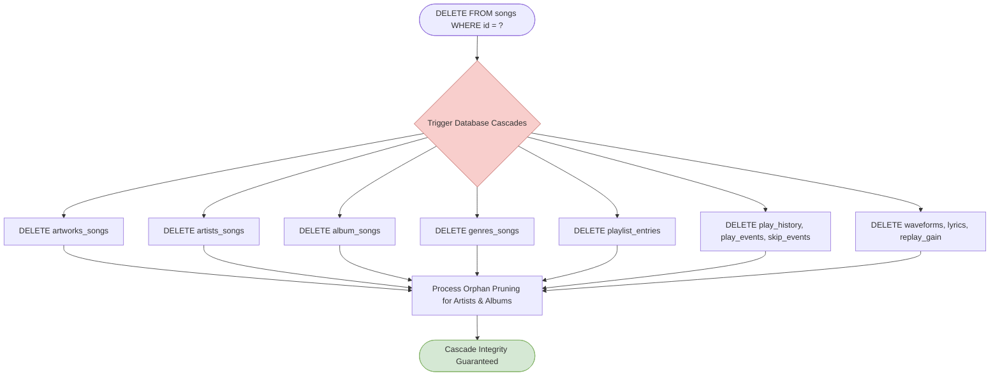
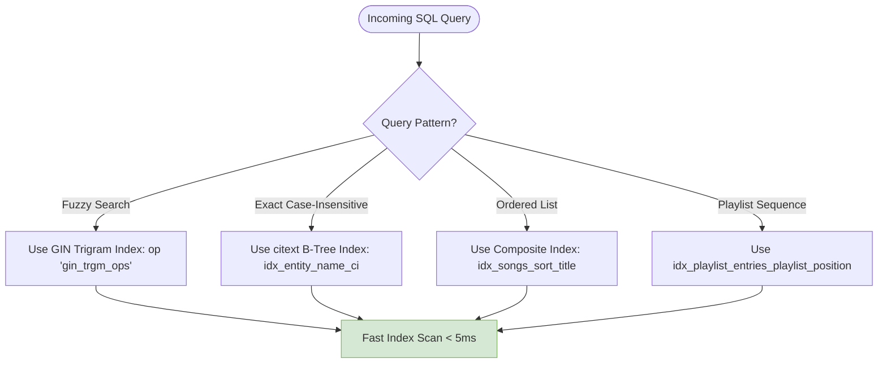
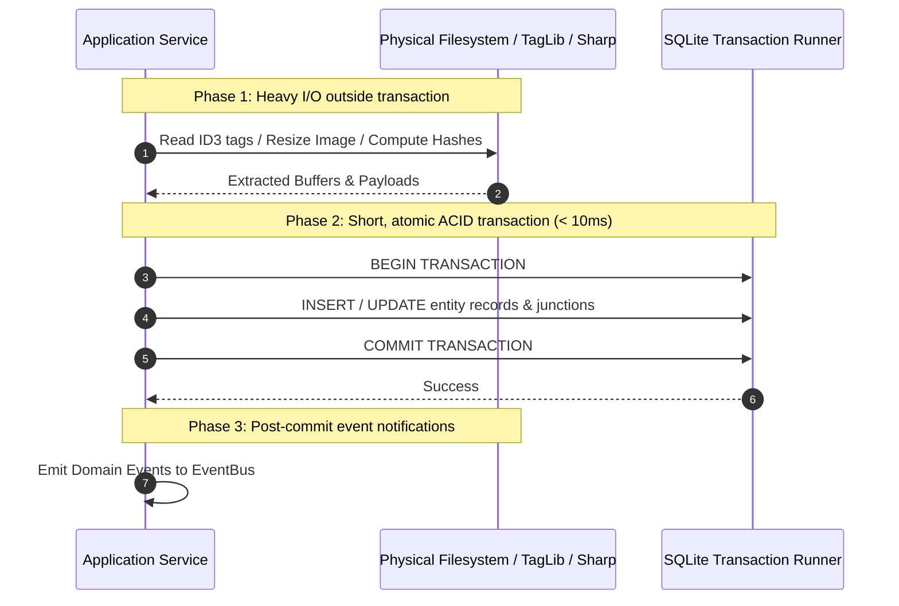
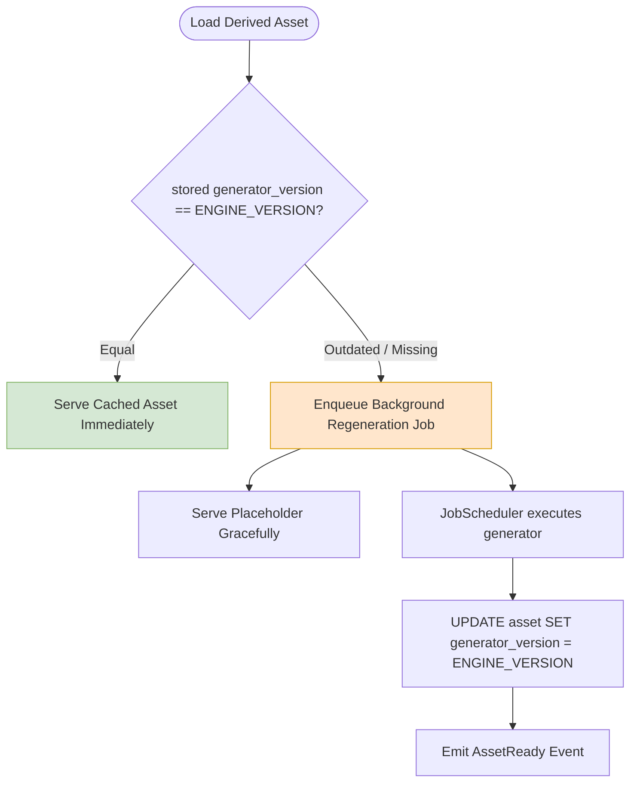
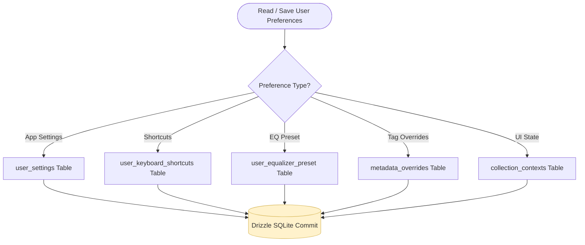
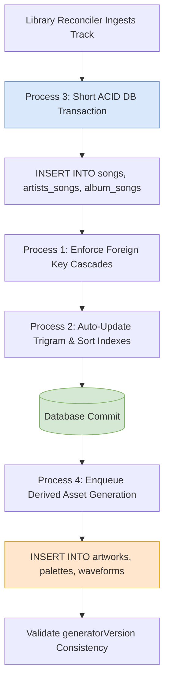

# 10. Database & Storage Architecture

This document provides a comprehensive technical specification of Nora's **Relational Persistence Tier**, covering Drizzle ORM schema definitions (24+ tables), indexing strategies, cascade integrity rules, and database transaction lifecycles.

---

## 1. Relational Schema Entity Map (ERD)

The relational schema ([`src/main/db/schema.ts`](file:///C:/Users/VINAY/.gemini/antigravity/worktrees/Nora/document_project_architecture_graphs/src/main/db/schema.ts)) models music entities, derived caches, user preferences, and operational journals:

```mermaid
erDiagram
    music_folders ||--o{ music_folders : "parent/child"
    music_folders ||--o{ songs : "contains"
    
    songs ||--o{ artists_songs : "has"
    artists ||--o{ artists_songs : "performs"
    
    songs ||--o{ album_songs : "belongs_to"
    albums ||--o{ album_songs : "groups"
    
    songs ||--o{ genres_songs : "categorized_by"
    genres ||--o{ genres_songs : "classifies"
    
    songs ||--o{ artworks_songs : "displays"
    artworks ||--o{ artworks_songs : "attached_to"
    
    artworks ||--o| palettes : "generates"
    palettes ||--o{ palette_swatches : "contains"
    
    albums ||--o{ albums_artists : "credits"
    artists ||--o{ albums_artists : "releases"
    
    albums ||--o{ albums_artworks : "featured_in"
    artworks ||--o{ albums_artworks : "illustrates"
    
    playlists ||--o{ playlist_entries : "contains"
    songs ||--o{ playlist_entries : "included_in"
    
    playlists ||--o| smart_playlist_rules : "defined_by"
    playlists ||--o{ playlists : "parent/child"
    
    songs ||--o{ play_events : "logged_in"
    songs ||--o{ seek_events : "tracks"
    songs ||--o{ skip_events : "monitors"
    songs ||--o{ play_history : "records"
    
    songs ||--o| waveforms : "visualized_as"
    songs ||--o| lyrics : "displays"
    songs ||--o| replay_gain : "normalized_by"
    
    songs ||--o{ scrobble_queue : "scrobbles"
    songs ||--o{ metadata_overrides : "overrides"
    
    playlists ||--o{ operation_journal : "journals"
```

---

## 2. Detailed Process Breakdown

### Process 1: Many-to-Many Junctions & Cascade Rules
Ensures data integrity across many-to-many relationships using strict foreign key cascade rules.

**Cascade Invariant Matrix**:
- When a `song` is deleted: All associated junction records (`artworks_songs`, `artists_songs`, `album_songs`, `genres_songs`, `playlist_entries`, `play_history`) automatically delete via `ON DELETE CASCADE`.
- When an `artwork` is deleted: Associated `palettes` and `palette_swatches` delete via `ON DELETE CASCADE`.
- When a `music_folder` is deleted: `songs.folderId` is safely updated to `NULL` via `ON DELETE SET NULL`.

---

### Process 2: Index Optimization Strategy
Maintains optimized indices across three distinct query patterns:

1. **Case-Insensitive Exact Lookups**: Generated `citext` columns with B-Tree indices (`idx_songs_title_ci`, `idx_artists_name_ci`, `idx_albums_title_ci`).
2. **Fuzzy Trigram Searches**: PostgreSQL `pg_trgm` GIN operators (`idx_songs_title_ci_trgm`, `idx_artists_name_ci_trgm`).
3. **Composite Sorting Patterns**: Multi-column indices covering compound UI sort orders:
   - `idx_songs_year_title` on `(year ASC, title ASC)`
   - `idx_songs_track_title` on `(track_number ASC, title ASC)`
   - `idx_songs_created_title` on `(created_at DESC, title ASC)`
   - `idx_playlist_entries_playlist_position` on `(playlist_id, position ASC)`

---

### Process 3: Short ACID Database Transactions
All database transactions follow Rule 10: **CPU-intensive and filesystem operations are performed strictly OUTSIDE transactions**.

---

### Process 4: Derived Asset Caching & Versioned Schema
Derived assets (`artworks`, `palettes`, `waveforms`, `lyrics`, `replay_gain`) track an integer `generatorVersion` column. If generator algorithms evolve (e.g. Palette Generator V2), obsolete caches are detected and regenerated automatically without database migration scripts.

---

### Process 5: User Preferences & State Serialization
Stores application settings, custom keyboard shortcuts, equalizer presets, and mini player geometry in structured tables:

- **`user_settings`**: Global app settings, Last.fm session keys, metadata preferences, library scan modes.
- **`user_keyboard_shortcuts`**: Key-value mapping of custom shortcut keys.
- **`user_equalizer_preset`**: Frequency band arrays and preset names.
- **`metadata_overrides`**: User-defined field overrides (`entityKind`, `entityId`, `fieldId`, `stringValue`).
- **`collection_contexts`**: Serialized UI states per collection URI.

---

## 3. Multi-Process Persistence Choreography Graph

The following composite flowchart illustrates the relationship between raw database operations and domain events:

