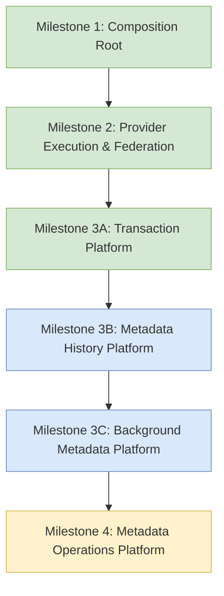

# 10. Future Evolution Roadmap & Milestone Matrix

This document tracks completed architectural milestones and outlines upcoming platform evolutions.

---

## 1. Milestone Progress Matrix

| Milestone | Subsystem Scope | Status | Key Architectural Invariant |
|---|---|---|---|
| **Milestone 1** | Composition Root (`MetadataBootstrap`) | ✅ **Completed** | `ipc.ts` performs 0 service constructions; container namespaces established. |
| **Milestone 2** | Multi-Provider Federation & Resilient Execution | ✅ **Completed** | AutoTag requests metadata fields (`title`, `artist`, `album`, `genre`, `artworkUrl`). |
| **Milestone 3A** | Transaction Platform (`MetadataTransactionManager`) | ✅ **Completed** | Option A (all-or-nothing) atomic batch rollback; clean collaborator separation. |
| **Milestone 3B** | Metadata History Platform | 🔮 **Upcoming** | Disk persistence (`history_snapshots.json`) for undo tokens across app restarts. |
| **Milestone 3C** | Background Metadata Platform | 🔮 **Upcoming** | Autonomous background library enrichment queue and scheduler. |
| **Milestone 4** | Metadata Operations Platform | 🔮 **Future** | Controlled redistribution of remaining `MetadataApplyService` responsibilities. |

---

## 2. Evolution Story Flow

