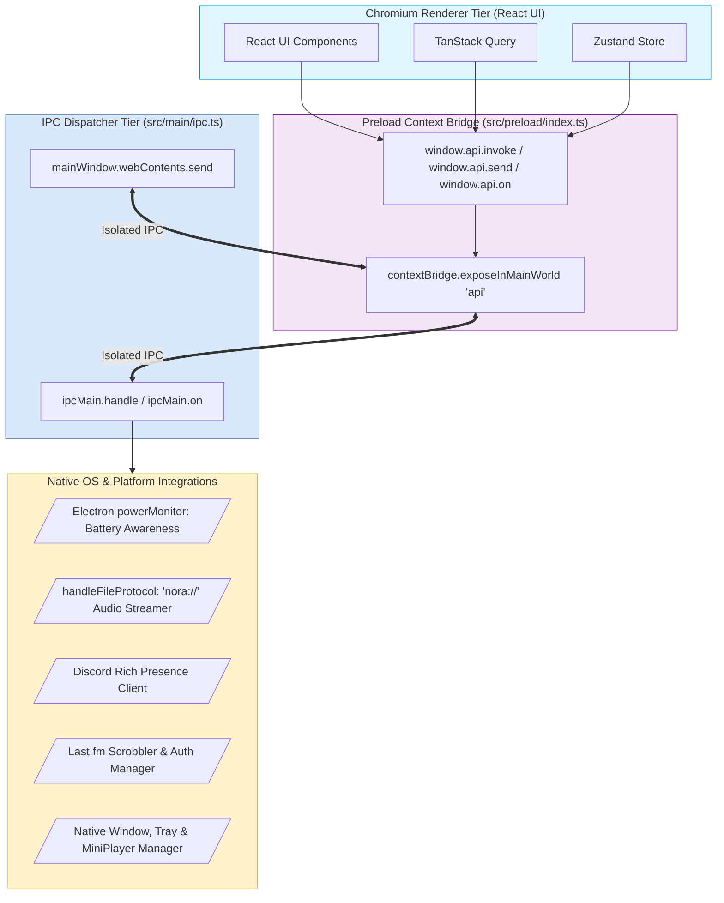
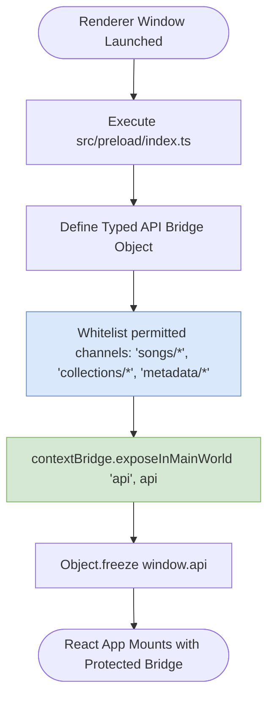
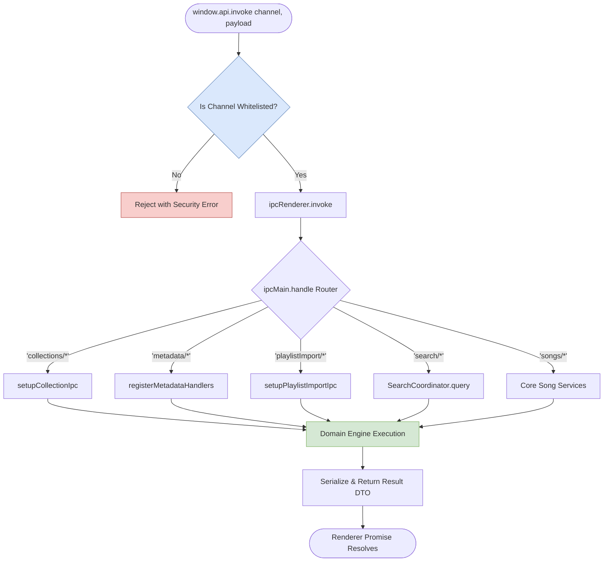
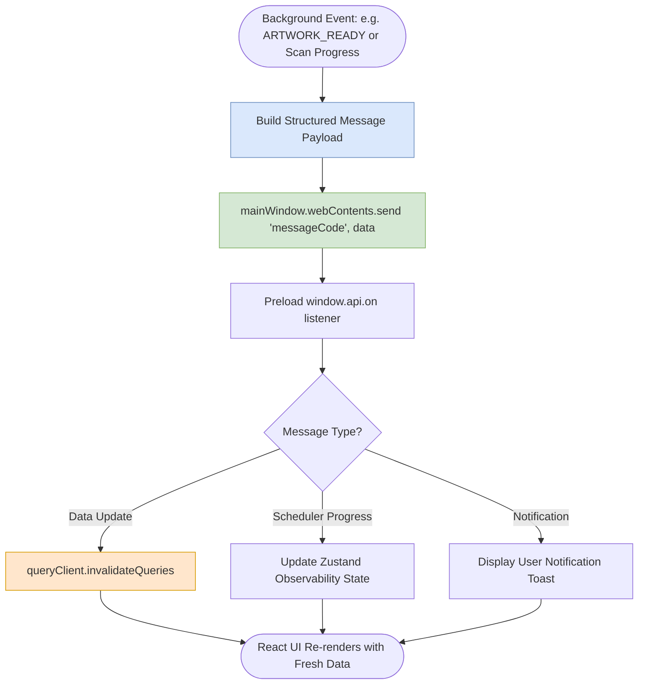
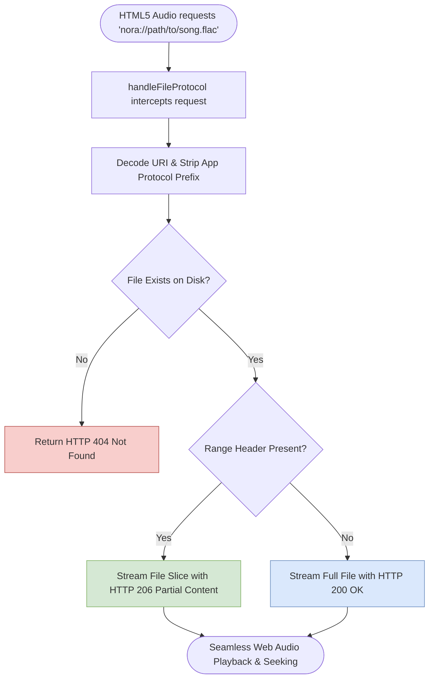
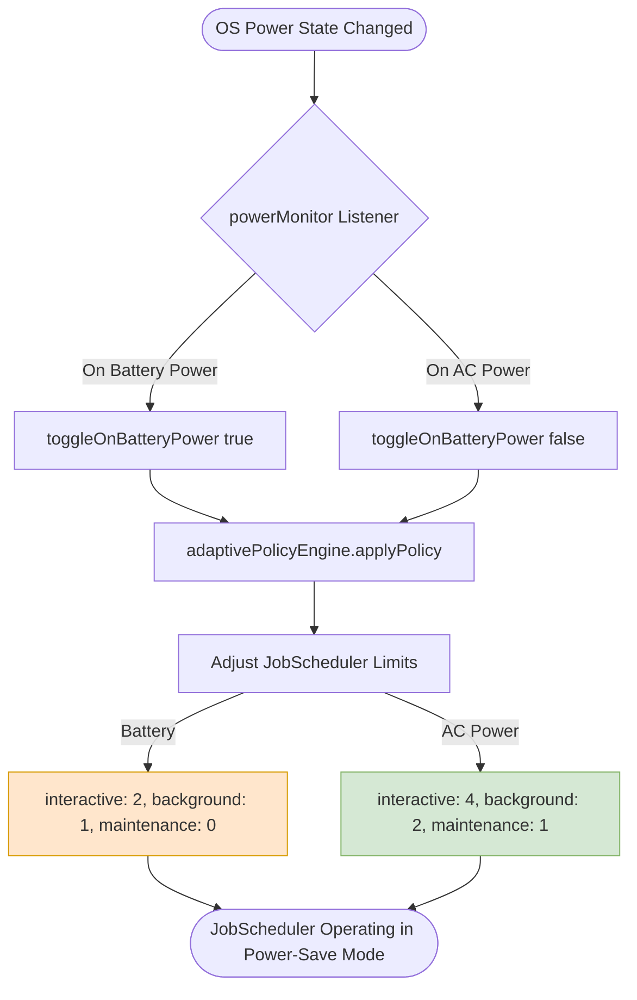
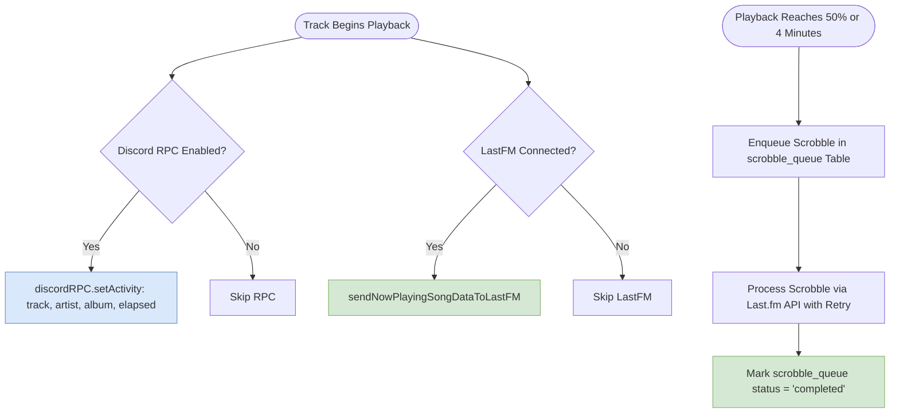
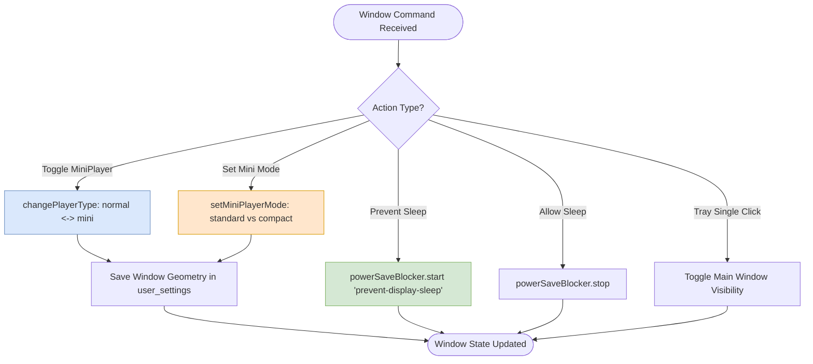
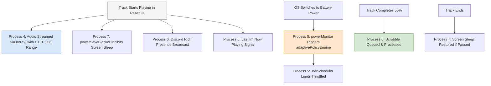

# 11. IPC, Lifecycle & Platform Bridge Architecture

This document provides a comprehensive technical specification of Nora's **IPC Bridge, Electron Process Isolation, Native OS Integrations, and Platform Lifecycle Services**.

---

## 1. High-Level Subsystem Architecture

Nora strictly enforces Electron's context isolation architecture. The Chromium Renderer process has zero direct access to Node.js built-ins or local filesystem APIs; all communication routes through a hardened preload bridge and typed IPC channels.

---

## 2. Detailed Process Breakdown

### Process 1: Electron Context Isolation & Preload Bridge (`src/preload/index.ts`)

Hardens the UI sandbox by exposing only explicitly whitelisted IPC invocation signatures to the `window.api` global object.

---

### Process 2: Type-Safe IPC Request/Response Dispatch

Routes incoming asynchronous renderer requests to authoritative domain engines.

---

### Process 3: Bi-Directional Event Streaming & Push Notifications

Pushes background state changes (library scanning progress, asset generation, transaction completion) directly to the renderer.

---

### Process 4: Custom Audio Streaming File Protocol (`nora://`)

The [`handleFileProtocol.ts`](file:///C:/Users/VINAY/.gemini/antigravity/worktrees/Nora/document_project_architecture_graphs/src/main/handleFileProtocol.ts) handler registers a secure custom `nora://` protocol allowing smooth, low-latency audio streaming with HTTP 206 Partial Content Range header support.

---

### Process 5: Power Monitor & Battery-Adaptive Worker Policy

Dynamically throttles CPU-intensive background derived-asset workers when the host machine transitions to battery power.

---

### Process 6: Discord Rich Presence & Last.fm Scrobbler

Synchronizes currently playing track metadata to external social and scrobbling networks asynchronously.

---

### Process 7: Native Window Management & Mini Player Modes

Manages window states, screen sleeping inhibition, system tray toggles, and seamless transitions between normal and mini player modes.

**Mini Player Modes**:

- **`standard`**: 3-tier deck layout with dedicated controls and artwork.
- **`compact`**: 1-tier progressive strip layout maximizing screen minimalism.

---

## 3. Multi-Process Platform Bridge Choreography Graph

The following composite flowchart illustrates the platform bridge managing audio playback, OS power adaptations, social sync, and screen keep-alive states simultaneously:

