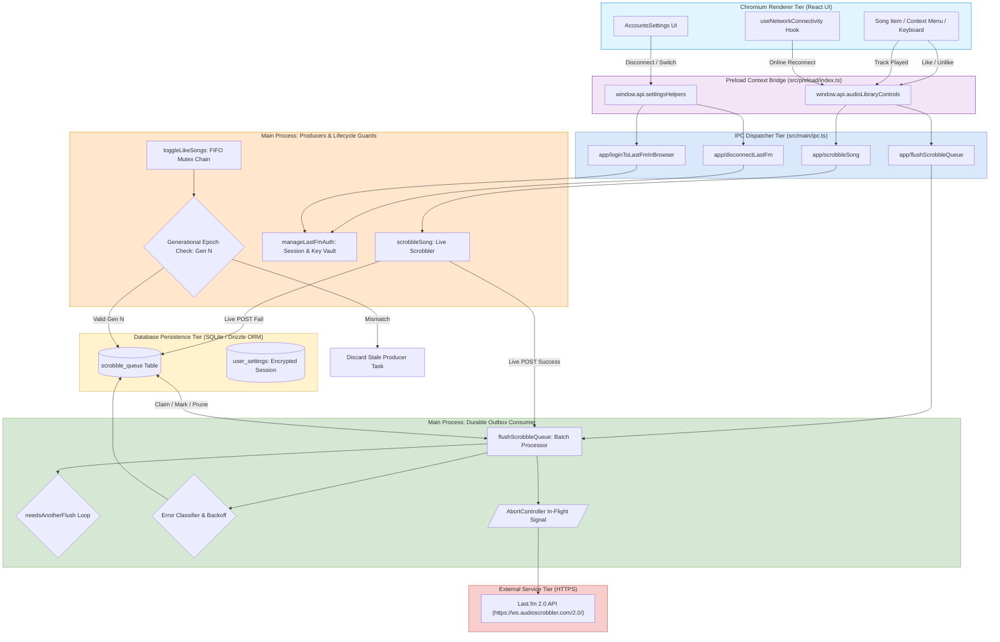
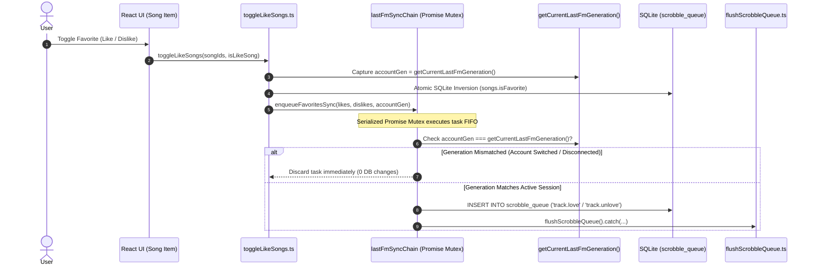
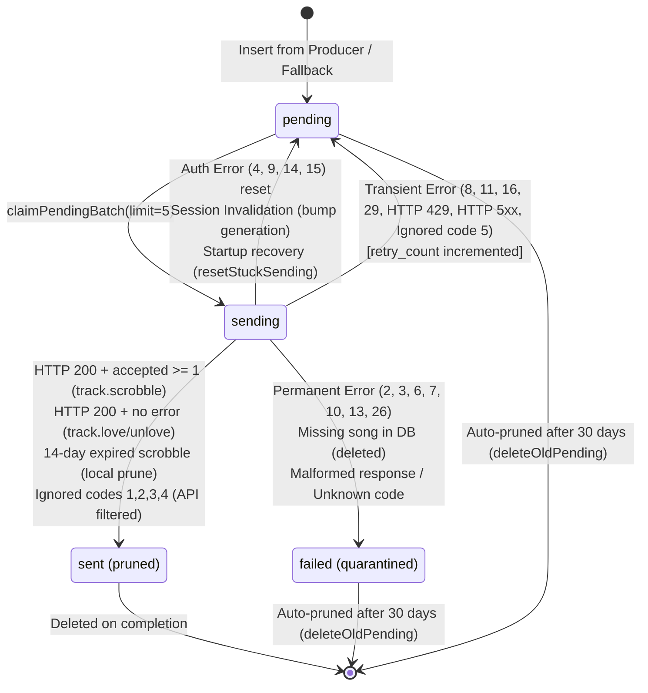
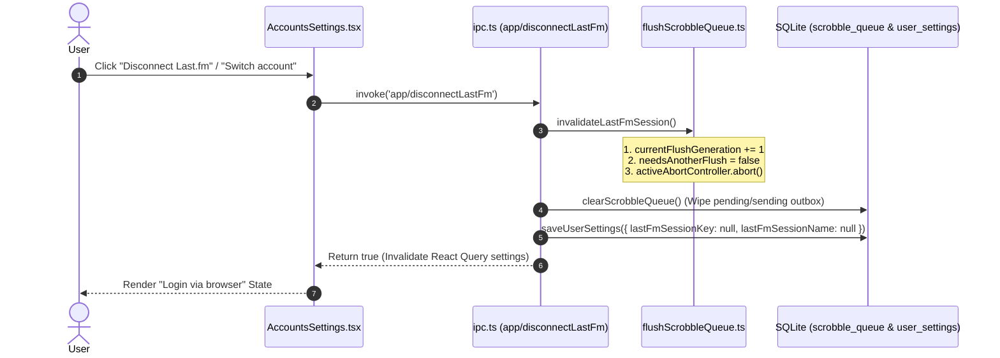

# 13. Last.fm Subsystem & Durable Outbox Architecture

This document provides the exhaustive architectural specification for Nora's **Last.fm Subsystem, Durable Scrobble Outbox, Lifecycle Epoch Isolation, and Scrobble/Favorite Synchronization Engine**.

---

## 1. High-Level Subsystem Topology

Nora integrates with the official Last.fm 2.0 API via a **durable outbox pattern**, decoupling all user interactions and playback events from network reliability and external API latency.



---

## 2. Core Architectural Principles & Invariants

1. **Non-Blocking User Experience**: UI interactions (liking songs, skipping tracks) never wait on network requests to Last.fm.
2. **Durable Persistence Before Network Delivery**: All offline scrobbles, loves, and unloves are safely committed to SQLite before transmission.
3. **Cross-Account Generational Isolation**:
   > **Invariant:** No asynchronous Last.fm operation started under Account A may create, mutate, or finalize durable state after the application transitions to Account B.
4. **Strict FIFO Producer Serialization**: Rapid like/unlike operations are serialized through an in-memory promise mutex (`lastFmSyncChain`) to prevent out-of-order race conditions.
5. **Fail-Closed Permanent Error Handling**: Malformed responses and unrecognized Last.fm error codes are marked `status = 'failed'` without burning infinite retry loops.

---

## 3. End-to-End Data Flows & Runtime Sequences

### Sequence 1: Favorites Synchronization & Producer Generation Guard



---

### Sequence 2: Durable Outbox Consumer State Machine & Batch Lifecycle



---

### Sequence 3: Account Disconnect & Switch Epoch Invalidation



---

## 4. Error Classification & Response Taxonomy

The Last.fm 2.0 REST API uses a hybrid error reporting model (HTTP Status Codes + XML/JSON Response Payloads). Nora enforces the following strict taxonomy:

| Category | Triggers / Error Codes | Action Taken | Outbox Row State |
| :--- | :--- | :--- | :--- |
| **Auth Errors** | Code `4` (Invalid Key), Code `9` (Invalid Session), Code `14` (Unauthorized), Code `15` (Expired Token) | Halts current flush cycle immediately; resets claimed items to `pending` without burning retry attempts. | `pending` (`retry_count` untouched) |
| **Transient Errors** | Code `8` (Operation Failed), Code `11` (Service Offline), Code `16` (Temporarily Unavailable), Code `29` (Rate Limit Exceeded), HTTP `429`, HTTP `5xx`, Network Timeouts, Ignored Code `5` (Daily Limit) | Records error message, increments `retry_count`, and schedules backoff retry on subsequent flush. | `pending` (`retry_count++`) |
| **Permanent Errors** | Code `2` (Invalid Service), Code `3` (Invalid Method), Code `6` (Invalid Parameters), Code `7` (Invalid Resource), Code `10` (Invalid API Key), Code `13` (Invalid Signature), Code `26` (Suspended Key), Malformed response without `@attr.accepted`, Unknown codes | Quarantines item to prevent infinite retry loops; logs error diagnostics. | `failed` (`markPermanentlyFailed`) |
| **Permanent Ignored / Filtered** | Scrobble ignored code `1` (Artist Filtered), Code `2` (Track Filtered), Code `3` (Timestamp Too Old), Code `4` (Timestamp Too New) | Last.fm permanently rejected the track. Logs info and marks sent. | Deleted (`markSent`) |
| **14-Day Expiration Rule** | Local check: `track.scrobble` where `startTimeSecs < now - 14 days` | Discards stale scrobbles locally without sending wasteful network requests. | Deleted (`markSent`) |
| **30-Day Outbox Retention** | Local query: `createdAt <= now - 30 days` and `status IN ('pending', 'failed')` | Automatic pruning query executed during flush to keep SQLite compact. | Pruned from DB |

---

## 5. Persistence Schema & Drizzle ORM Mappings

### `scrobble_queue` Table Specification

```sql
CREATE TABLE scrobble_queue (
    id SERIAL PRIMARY KEY,
    song_id INTEGER NOT NULL REFERENCES songs(id) ON DELETE CASCADE,
    operation_type TEXT NOT NULL CHECK (operation_type IN ('track.scrobble', 'track.love', 'track.unlove')),
    track_title TEXT NOT NULL,
    artist_names TEXT,
    album_title TEXT,
    start_time_secs INTEGER,
    status TEXT NOT NULL DEFAULT 'pending' CHECK (status IN ('pending', 'sending', 'failed')),
    retry_count INTEGER NOT NULL DEFAULT 0,
    last_error TEXT,
    created_at TIMESTAMP NOT NULL DEFAULT NOW()
);

CREATE INDEX scrobble_queue_status_idx ON scrobble_queue(status, created_at, id);
```

### Deterministic FIFO Batch Query

```typescript
export async function claimPendingBatch(batchSize: number = 5, trx: DB | DBTransaction = db) {
  return await trx.transaction(async (tx) => {
    const items = await tx.query.scrobbleQueue.findMany({
      where: (q) => inArray(q.status, ['pending']),
      orderBy: (q) => [asc(q.createdAt), asc(q.id)],
      limit: batchSize
    });

    if (items.length === 0) return [];

    const ids = items.map((i) => i.id);
    await tx
      .update(scrobbleQueue)
      .set({ status: 'sending' })
      .where(inArray(scrobbleQueue.id, ids));

    return items;
  });
}
```

---

## 6. Automated Verification Matrix (36 / 36 Passing Tests)

The Last.fm subsystem is continuously tested across 3 specialized test suites:

| Test Suite File | Tests | Core Invariants Verified |
| :--- | :---: | :--- |
| [`flushScrobbleQueue.test.ts`](file:///c:/Users/VINAY/intellije-workspace/Nora/src/main/other/lastFm/__tests__/flushScrobbleQueue.test.ts) | 22 | Offline skip, stuck sending recovery, valid scrobble markSent, `track.love` success, 14-day pre-check, ignored codes 1/3, daily limit code 5, error 13 permanent fail, malformed response, unknown code 999, DB failure retry, auth errors 9/15, transient error 8, HTTP 429, HTTP 500, network timeouts, flush coalescing, session aborts, 30-day prune. |
| [`toggleLikeSongs.test.ts`](file:///c:/Users/VINAY/intellije-workspace/Nora/src/main/core/__tests__/toggleLikeSongs.test.ts) | 11 | Explicit true/false, toggle inversion, sequential double invert, concurrent inverted requests, duplicate IDs, empty input, **Last.fm outbox sync, rapid like/unlike FIFO serialization, and deterministic promise-gated account switch isolation**. |
| [`manageLastFmAuth.test.ts`](file:///c:/Users/VINAY/intellije-workspace/Nora/src/main/auth/__tests__/manageLastFmAuth.test.ts) | 3 | Account switch queue wipe and session invalidation, same-account re-auth queue preservation, same-account credential rotation. |

---

## 7. Future Enhancements & Roadmap

The following non-blocking optimizations are prioritized for future subsystem iterations:

| Priority | Feature / Enhancement | Complexity | Description |
| :--- | :--- | :--- | :--- |
| **P2** | **In-Memory Favorite Coalescing** | Low | If an offline user rapidly toggles a song multiple times (*Like `->` Unlike `->` Like*), coalesce to the final state in the outbox rather than logging multiple rows. |
| **P2** | **Outbox Queue Inspector UI** | Low | Expose pending queue count in Settings > Developer / Diagnostics. |
| **P3** | **Dynamic Exponential Backoff** | Low | Implement custom backoff jitter per outbox row based on individual `retry_count` rather than fixed dispatcher intervals. |
