# 📚 Nora Architecture Atlas & Subsystem Documentation

Welcome to the **Nora Architecture Atlas**. This directory contains the exhaustive, production-grade architectural specifications, diagrams, and invariants for the entire Nora Music Player codebase.

---

## 🗺️ Master Architecture Map

```mermaid
graph TD
    Principles["00. Principles & Master Legend"] --> Overview["01. System Overview"]
    Overview --> Bootstrap["02. Composition Root & Bootstrap"]
    Overview --> Rules["02. Dependency Rules & Ownership"]
    Overview --> Matrix["03. Subsystem Responsibility Matrix"]

    Overview --> Scanner["04. Library Scanner & Asynchronous Builder"]
    Overview --> Queue["06. Queue & Playback Subsystem"]
    Overview --> Meta["07. Metadata Platform & Transactions"]
    Overview --> Coll["08. Collections, Playlists & Operations Engine"]
    Overview --> Search["09. Search & Indexing Engine"]
    Overview --> DB["10. Database & Relational Persistence Tier"]
    Overview --> Platform["11. IPC, Lifecycle & Platform Bridge"]

    Scanner --> Sequences["05. Multi-Subsystem Runtime Sequences"]
    Queue --> Sequences
    Meta --> Sequences
    Coll --> Sequences
    Search --> Sequences

    Overview --> ADR["12. Architecture Decision Records (ADR Master Log)"]

    style Principles fill:#e1f5fe,stroke:#0288d1,stroke-width:2px
    style Overview fill:#d5e8d4,stroke:#82b366,stroke-width:2px
    style Scanner fill:#dae8fc,stroke:#6c8ebf
    style Queue fill:#d5e8d4,stroke:#82b366
    style Meta fill:#ffe6cc,stroke:#d79b00
    style Coll fill:#e1d5e7,stroke:#9673a6
    style Search fill:#f8cecc,stroke:#b85450
    style DB fill:#fff2cc,stroke:#d6b656
    style Platform fill:#f3e5f5,stroke:#7b1fa2
    style Sequences fill:#e8f5e9,stroke:#388e3c
    style ADR fill:#f5f5f5,stroke:#999999
```

---

## 📑 Architecture Atlas Index

| Document | Scope & Core Topics | Key Diagrams Included |
|---|---|---|
| **[`00_Principles.md`](file:///C:/Users/VINAY/.gemini/antigravity/worktrees/Nora/document_project_architecture_graphs/architecture/00_Principles.md)** | Non-Negotiable System Constitution (10 Rules), Visual Legend Standard, Layering Invariants. | Standardized Shape & Arrow Notation Hierarchy |
| **[`01_System_Overview.md`](file:///C:/Users/VINAY/.gemini/antigravity/worktrees/Nora/document_project_architecture_graphs/architecture/01_System_Overview.md)** | High-Level System Topology (Electron Main $\leftrightarrow$ Preload $\leftrightarrow$ React), Master Subsystem Interaction Graph, Event Bus Map. | Complete Cross-Subsystem Topology Graph, Event Bus Topology |
| **[`02_Composition_Root.md`](file:///C:/Users/VINAY/.gemini/antigravity/worktrees/Nora/document_project_architecture_graphs/architecture/02_Composition_Root.md)** | Master Construction Flow, Dependency Injection, Container Namespaces, Graceful Shutdown. | 5-Phase Construction Graph, MetadataContainer Boundaries, Shutdown Lifecycle Sequence |
| **[`02_Dependency_Rules.md`](file:///C:/Users/VINAY/.gemini/antigravity/worktrees/Nora/document_project_architecture_graphs/architecture/02_Dependency_Rules.md)** | Allowed vs. Forbidden Cross-Layer Calls, Structural Composition & Lifetime Ownership Graphs. | Layer Dependency Matrix, Structural Ownership Graph |
| **[`03_Responsibility_Matrix.md`](file:///C:/Users/VINAY/.gemini/antigravity/worktrees/Nora/document_project_architecture_graphs/architecture/03_Responsibility_Matrix.md)** | System-Wide Responsibility Table: Authoritative Owners, Permitted Collaborators, Forbidden Invocations. | Query vs. Mutation Separation Boundary Graph |
| **[`04_Library_Scanner_and_Builder.md`](file:///C:/Users/VINAY/.gemini/antigravity/worktrees/Nora/document_project_architecture_graphs/architecture/04_Library_Scanner_and_Builder.md)** | Scan Root Probing, Fast Disk Walk, Pure In-Memory Diff Engine ($\pm 1000\text{ms}$), Hierarchy Pre-Allocation, Bounded Worker Pool Ingestion, ID3 Tag Re-parsing, 3-Tier Job Scheduler, Background Asset Pipelines. | 10 Individual Process Flowcharts + Full End-to-End Choreography Flowchart |
| **[`05_Runtime_Sequences.md`](file:///C:/Users/VINAY/.gemini/antigravity/worktrees/Nora/document_project_architecture_graphs/architecture/05_Runtime_Sequences.md)** | Sequence Diagrams for: Full Library Scan, AutoTag Multi-Provider Search, Atomic Tag Commit/Rollback, Playback Shuffled Advance, Reversible Playlist Undo/Redo, Federated Search. | 6 Detailed Runtime Sequence Diagrams (with Autonumbering & Participants) |
| **[`06_Queue_and_Playback_Subsystem.md`](file:///C:/Users/VINAY/.gemini/antigravity/worktrees/Nora/document_project_architecture_graphs/architecture/06_Queue_and_Playback_Subsystem.md)** | Ephemeral In-Memory State Model, Non-Destructive Permutation Shuffle with Active Anchoring, Index Translation Math, Dynamic Insertion, Atomic $O(N)$ `playNext`, Multi-Queue Workspaces, Zustand Sync. | 8 Individual Process Flowcharts + Shuffled Permutation Vector Mapping Diagram |
| **[`07_Metadata_Platform.md`](file:///C:/Users/VINAY/.gemini/antigravity/worktrees/Nora/document_project_architecture_graphs/architecture/07_Metadata_Platform.md)** | Single Metadata Authority, Multi-Provider Discovery, Resilient Execution (Circuit Breakers, Rate Limiters), Field Policy Merging, Option A Whole-Transaction Batching & Atomic Rollback, Undo Snapshots. | 10 Individual Process Flowcharts + Complete Metadata Choreography Graph |
| **[`08_Collections_and_Playlists_Engine.md`](file:///C:/Users/VINAY/.gemini/antigravity/worktrees/Nora/document_project_architecture_graphs/architecture/08_Collections_and_Playlists_Engine.md)** | Reversible Operation Framework, Linear Pointer Undo/Redo Engine, Membership Caching, Hierarchical Folder Subtree Mutations, Smart Playlist AST Compiler & Scheduler, M3U Import & Fuzzy Repair Strategies. | 10 Individual Process Flowcharts + Collections & Import Choreography Graph |
| **[`09_Search_and_Indexing_Engine.md`](file:///C:/Users/VINAY/.gemini/antigravity/worktrees/Nora/document_project_architecture_graphs/architecture/09_Search_and_Indexing_Engine.md)** | Query Normalization & Tokenization, 5 Parallel Entity Engines, Trigram GIN & `citext` Indexing, Single-Pass Batched Hydration via Gateway, Section Confidence Scoring, Debounced Recent Searches. | 7 Individual Process Flowcharts + Query-to-Render Choreography Flowchart |
| **[`10_Database_and_Storage_Architecture.md`](file:///C:/Users/VINAY/.gemini/antigravity/worktrees/Nora/document_project_architecture_graphs/architecture/10_Database_and_Storage_Architecture.md)** | Relational Schema ERD (24+ tables), Junction Cascades, Multi-Column & Trigram Indexing, Short ACID Boundaries, Derived Asset Generator Versioning, Preferences Tables. | Entity-Relationship Diagram (ERD), Cascade Integrity Graph, Short ACID Sequence |
| **[`11_IPC_Lifecycle_and_Platform_Bridge.md`](file:///C:/Users/VINAY/.gemini/antigravity/worktrees/Nora/document_project_architecture_graphs/architecture/11_IPC_Lifecycle_and_Platform_Bridge.md)** | Electron Context Isolation, Whitelisted Channel Dispatch, Push Stream Invalidation, Custom `nora://` Audio Protocol with HTTP 206 Range Streaming, Battery-Adaptive Throttling, Discord RPC, Last.fm. | 7 Individual Process Flowcharts + Platform Bridge Composite Flowchart |
| **[`12_Architecture_Decision_Records.md`](file:///C:/Users/VINAY/.gemini/antigravity/worktrees/Nora/document_project_architecture_graphs/architecture/12_Architecture_Decision_Records.md)** | Master ADR Log covering ADR-001 through ADR-014 (Context, Decision, Consequences for all foundational architectural choices). | Architectural Decision Matrix |
