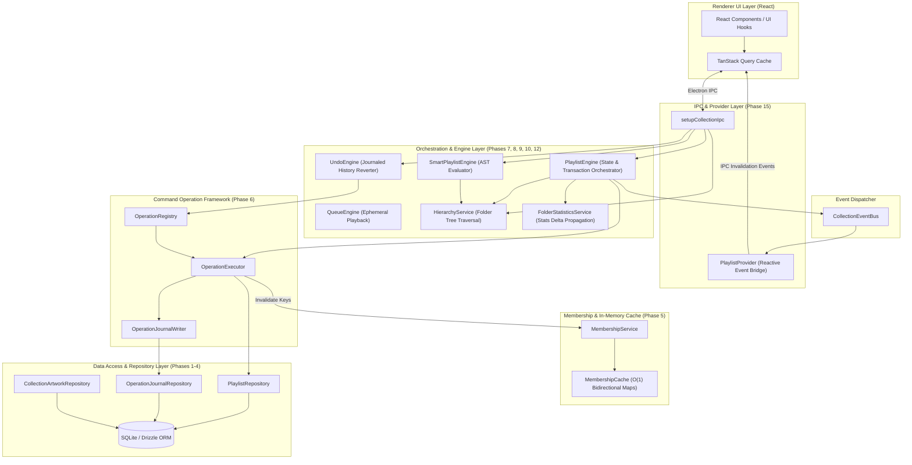
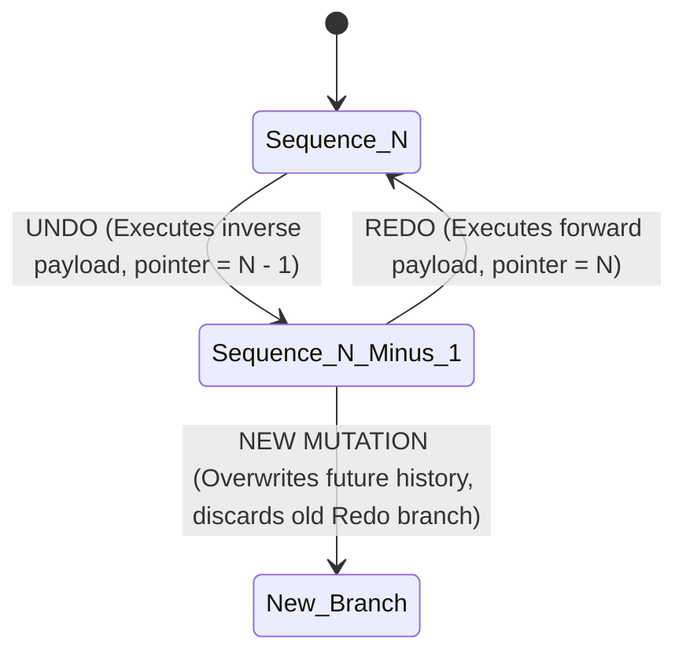
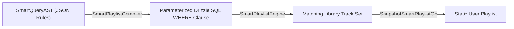

# Phase 16 — Platform Stabilization, Legacy Retirement & Full Architecture

## Objective
Finalize end-to-end behavioral testing, retire legacy playlist helpers, stabilize platform contracts, and document the **Full Systems Architecture** of Era 1 Collections Engine.

## Components Created / Finalized
- `src/main/collections/setup.ts`
- `src/main/collections/registry.ts`
- Behavioral test suites in `tests/collections/`

---

## 1. Phase 16 Stabilization Highlights
1. **Behavioral Test Coverage**: Validates multi-join queries, recursive folder stats propagation, undo/redo sequence bounds, and AST compiler execution under stress.
2. **Legacy Code Cleanup**: Replaces legacy standalone playlist helpers with unified `PlaylistEngine` calls.
3. **Build & Type Stabilization**: Fixes export type mismatches, IPC contract discrepancies, and Vite build errors.

---

# 2. FULL ARCHITECTURE OVERVIEW (Era 1 Collections Engine)

The **Nora Collections Engine** is a high-performance, strictly layered system running inside Electron's main process. It provides ACID-compliant collection mutations, linear undo/redo journal history, $O(1)$ track membership lookups, dynamic rule-based smart playlists, nested folder DAG traversal, and reactive IPC state synchronization.



---

## 3. Subsystem Architecture Specifications

### 3.1. Layer Isolation & Dependency Flow
Dependencies point strictly downwards:
$$\text{Providers} \longrightarrow \text{Engines} \longrightarrow \text{Operation Framework} \longrightarrow \text{Repositories} \longrightarrow \text{SQLite DB}$$

- **Repositories** execute parameterized Drizzle SQL queries without maintaining state.
- **Operations** encapsulate single mutation steps, enforcing pre-validation, SQL updates, and symmetric inverse calculation.
- **Engines** manage concurrency locks, database transactions, cache invalidations, and event dispatching.
- **Providers** bridge state updates over IPC to the React frontend.

---

### 3.2. Command-Pattern Operation Framework & Reversible Journal
All mutations (e.g. `AddSongs`, `RemoveSongs`, `Rename`, `Reorder`, `MoveCollection`, `Duplicate`) implement `CollectionOperation`:

```typescript
export interface CollectionOperation<TInput, TResult> {
  readonly type: string;
  execute(input: TInput, ctx: OperationContext): Promise<OperationResult<TResult>>;
}
```

Every operation execution yields an `OperationResult` containing:
1. **Mutation Outcome**: Updated track position or entity metadata.
2. **Inverse Payload**: The exact inverse operation class (`inverseType`) and input parameters (`inverseInput`) required to reverse the mutation.
3. **Folder Stats Delta**: Integer changes (`itemCountDelta`, `durationDelta`) for automatic ancestor folder propagation.

The **`OperationJournalWriter`** saves both forward and inverse payloads to the `operation_journal` SQLite table inside the same transaction as the data edit.

---

### 3.3. Linear Undo / Redo Engine
The **`UndoEngine`** navigates a linear sequence pointer per collection:



#### Key Undo Invariants:
- **Zero Journal Writes**: Reverting or reapplying an operation does not append new rows to `operation_journal`. It simply moves the sequence pointer.
- **Dynamic Resolution**: `UndoEngine` delegates execution to `OperationRegistry`, keeping history reversal completely decoupled from domain rules.

---

### 3.4. $O(1)$ In-Memory Membership Layer
To support real-time UI badges and song status indicators, **`MembershipCache`** maintains bidirectional in-memory index maps:
- `collectionToSongs: Map<CollectionId, Set<SongId>>`
- `songToCollections: Map<SongId, Set<CollectionId>>`

`MembershipService.isMember(collectionId, songId)` executes in $O(1)$ time. When operations execute, `OperationExecutor` triggers targeted key invalidations on `MembershipCache` rather than rebuilding the cache.

---

### 3.5. Smart Playlist Compiler & AST Evaluation
Smart playlists use an Abstract Syntax Tree (AST) supporting nested logical conditions (`AND`, `OR`) over field metadata (`genre`, `artist`, `playCount`, `rating`, `dateAdded`).



`DependencyAnalyzer` inspects AST rules to register database table dependencies. When songs or metadata update, `SmartPlaylistScheduler` debounces and re-evaluates affected smart playlists in the background.

---

### 3.6. Folder Hierarchy & Cycle-Safe DAG Traversal
**`HierarchyService`** manages parent/child folder structures:
- **Cycle Prevention**: `validateMove(sourceId, targetParentId)` verifies destination folders are not descendants of the source node, preventing circular tree references.
- **Topological Sorting**: `topologicalOrder(nodes)` orders nodes deterministically (parents before children, siblings sorted case-insensitively by name).
- **Aggregate Propagation**: `FolderStatisticsService` propagates `itemCountDelta` and `durationDelta` recursively up the ancestor chain in $O(\text{depth})$ time.

---

### 3.7. Concurrency Control & Transaction Isolation
- **Async Mutex Locks**: `PlaylistEngine` acquires an async lock per collection ID during mutations to prevent parallel write race conditions.
- **Atomic Transactions**: All mutations, journal writes, statistics updates, and parent folder delta updates execute inside a single Drizzle SQLite transaction (`ctx.trx`). If any step fails, the entire transaction is rolled back cleanly.

---

## 4. Complete Phase Directory Matrix

| Phase File | Title & Focus Area | Key Architectural Component |
| :--- | :--- | :--- |
| **[p1-domain-entities-and-schema.md](file:///c:/Users/VINAY/intellije-workspace/Nora/collections%20engine/p1-domain-entities-and-schema.md)** | Domain Entities & DB Schema | `CollectionType`, `CollectionEntry`, `operation_journal` schema |
| **[p2-repository-contracts.md](file:///c:/Users/VINAY/intellije-workspace/Nora/collections%20engine/p2-repository-contracts.md)** | Repository Contracts & Abstractions | `IPlaylistRepository`, `IOperationJournalRepository` |
| **[p3-drizzle-repository-implementation.md](file:///c:/Users/VINAY/intellije-workspace/Nora/collections%20engine/p3-drizzle-repository-implementation.md)** | Drizzle SQLite Repositories | `PlaylistRepository`, `OperationJournalRepository` SQL joins |
| **[p4-data-layer-invariants-and-integrity.md](file:///c:/Users/VINAY/intellije-workspace/Nora/collections%20engine/p4-data-layer-invariants-and-integrity.md)** | Data Layer Invariants | `normalizePositions`, position gap repair algorithms |
| **[p5-membership-layer-and-caching.md](file:///c:/Users/VINAY/intellije-workspace/Nora/collections%20engine/p5-membership-layer-and-caching.md)** | Membership Layer & Cache | `MembershipService`, `MembershipCache`, $O(1)$ lookups |
| **[p6-operation-framework-and-inverses.md](file:///c:/Users/VINAY/intellije-workspace/Nora/collections%20engine/p6-operation-framework-and-inverses.md)** | Operation Framework | `CollectionOperation`, `OperationExecutor`, Symmetric Inverses |
| **[p7-playlist-engine-coordinator.md](file:///c:/Users/VINAY/intellije-workspace/Nora/collections%20engine/p7-playlist-engine-coordinator.md)** | Playlist Engine Coordinator | `PlaylistEngine`, Transaction & Mutex Lock Orchestration |
| **[p8-queue-engine-and-playback-integration.md](file:///c:/Users/VINAY/intellije-workspace/Nora/collections%20engine/p8-queue-engine-and-playback-integration.md)** | Queue Subsystem | `QueueEngine`, Ephemeral Shuffle Permutation Mapping |
| **[p9-undo-redo-engine.md](file:///c:/Users/VINAY/intellije-workspace/Nora/collections%20engine/p9-undo-redo-engine.md)** | Undo / Redo Engine | `UndoEngine`, Linear Sequence Pointer Navigation |
| **[p10-smart-playlist-ast-and-compiler.md](file:///c:/Users/VINAY/intellije-workspace/Nora/collections%20engine/p10-smart-playlist-ast-and-compiler.md)** | Smart Playlist Query Compiler | `SmartQueryAST`, `SmartPlaylistCompiler`, `SmartPlaylistEngine` |
| **[p11-sync-engine-and-scheduler.md](file:///c:/Users/VINAY/intellije-workspace/Nora/collections%20engine/p11-sync-engine-and-scheduler.md)** | Sync & Scheduler Engine | `DependencyAnalyzer`, `SmartPlaylistScheduler`, Hash Tracking |
| **[p12-folder-hierarchy-service.md](file:///c:/Users/VINAY/intellije-workspace/Nora/collections%20engine/p12-folder-hierarchy-service.md)** | Folder Hierarchy Service | `HierarchyService`, Cycle Prevention, Topological Sorting |
| **[p13-folder-stats-pinning-and-duplication.md](file:///c:/Users/VINAY/intellije-workspace/Nora/collections%20engine/p13-folder-stats-pinning-and-duplication.md)** | Stats, Pinning & Duplication | `FolderStatisticsService`, `DuplicatePlanner`, `PinOp`, `MergePlaylistsOp` |
| **[p14-di-setup-and-audit-refinements.md](file:///c:/Users/VINAY/intellije-workspace/Nora/collections%20engine/p14-di-setup-and-audit-refinements.md)** | DI Setup & Refinements | `setupCollectionsEngine`, `CollectionRegistry`, Cycle Elimination |
| **[p15-ipc-bridge-and-read-layer-migration.md](file:///c:/Users/VINAY/intellije-workspace/Nora/collections%20engine/p15-ipc-bridge-and-read-layer-migration.md)** | IPC Bridge & React Providers | `setupCollectionIpc`, `PlaylistProvider`, `CollectionEventBus` |
| **[p16-stabilization-legacy-retirement-and-full-architecture.md](file:///c:/Users/VINAY/intellije-workspace/Nora/collections%20engine/p16-stabilization-legacy-retirement-and-full-architecture.md)** | System Architecture Overview | Full Systems Architecture Synthesis |
