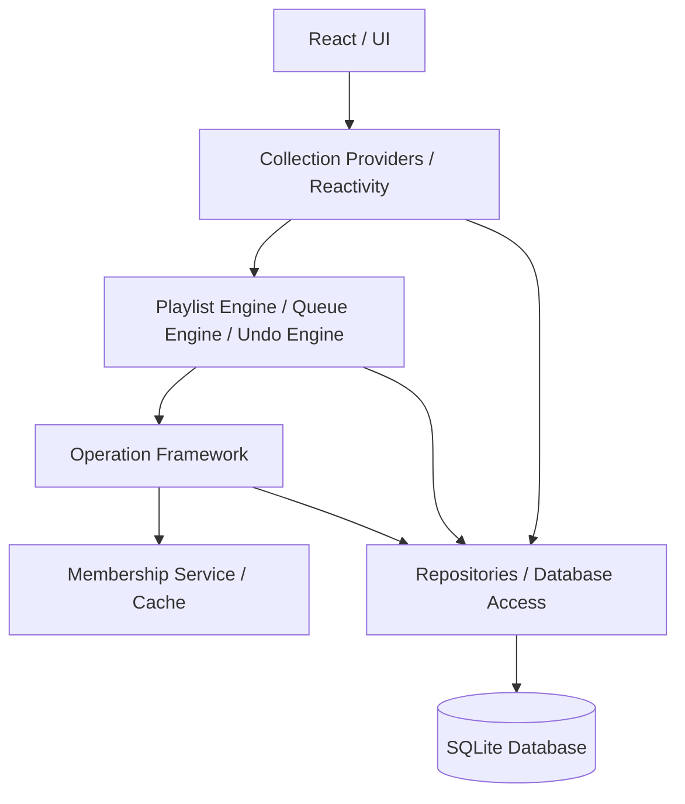

# Nora Collections Architecture

This document provides a high-level overview of the Collections framework, built to support playlists, queues, favorites, and history with robust extensibility and undo/redo capabilities.

## 1. Layer Responsibilities

The architecture is strictly layered, separating database concerns from memory state, reactivity, and business logic.

### 1.1 Repositories

The lowest layer. Repositories (`PlaylistRepository`, `OperationJournalRepository`) execute raw SQL, enforce schema invariants, and abstract away database joins. They are stateless and do not hold reactivity or caching logic.

### 1.2 Membership Service

Responsible for answering "is this song in collection X?" at high speed. It maintains an in-memory cache of relationships (e.g. `playlist_entries`, `favorites`) and pushes reactive IPC events when these memberships change.

### 1.3 Operation Framework

Provides a uniform abstraction for mutations (`AddSongsOp`, `RenameOp`, etc.). Each operation:

1. Validates inputs.
2. Performs the mutation.
3. Automatically computes the exact **inverse operation** (e.g. `AddSongs` returns a `RemoveSongs` inverse).

### 1.4 Engines

Stateful singleton controllers that coordinate tasks.

- **PlaylistEngine**: The primary entry point for manipulating playlists (adding, renaming, reordering). It coordinates with the Operation Framework to execute tasks.
- **UndoEngine**: Manages the linear history pointer and journal. It coordinates with the Operation Framework to execute inverse or forward operations.
- **QueueEngine**: Manages playback state (current song, shuffle permutation, upcoming songs).

### 1.5 Providers

Reactivity wrappers that bind raw database data or memory states to the UI. They handle IPC boundaries (in an Electron/Tauri architecture) and provide hooks for React.

## 2. Dependency Flow

Dependencies always point downwards.

- **Engines** depend on **Repositories** and **Operations**.
- **Operations** depend on **Repositories** and **Membership**.
- **Repositories** depend exclusively on the **DB / Schema**.

No repository knows about an Engine. The Operation Framework does not know about the UndoEngine. This acyclic flow ensures that we can add new operations or engines without breaking existing abstractions.

## 3. Engine Interactions

Engines act as the orchestrators.

When the UI requests a song to be added:

1. `PlaylistEngine.addSongs()` is invoked.
2. It starts a database transaction.
3. It passes `AddSongsOp` to `OperationExecutor`.
4. `OperationExecutor` executes the operation, updates the database, and computes the `inverseInput`.
5. `OperationExecutor` writes both the forward and inverse data into the `OperationJournalRepository`.
6. Finally, `PlaylistEngine` invalidates the `MembershipCache` and fires reactive events.

## 4. Operation Lifecycle

All collection mutations (other than ephemeral queue states) go through the Operation Framework.

An operation (`CollectionOperation`) implements an `execute` method that takes `(input, ctx)` and returns an `OperationResult`.

1. **Pre-validation**: Checking if the playlist exists or input is well-formed.
2. **Execution**: Issuing SQL via the `ctx.trx` (Transaction) and the relevant Repository.
3. **Inversion**: Computing the exact data needed to reverse the state transition (e.g., if we delete a playlist, the inverse is restoring that exact playlist with all its entries and original IDs).
4. **Journaling**: The `OperationExecutor` securely stores this lifecycle result in `operation_journal`.

By strictly enforcing this lifecycle, the architecture guarantees that all operations are journaled and fully reversible.

## 5. Undo/Redo Model

The Undo/Redo model uses a **pointer-based linear history** (no branching trees of operations).

### 5.1 Architecture Invariants

- **No Journal Writes**: Reverting or reapplying an operation does not create new journal entries. It merely moves a sequence pointer.
- **Pointer Navigation**: `UndoEngine` maintains an in-memory `sequenceNumber` pointer per collection.
  - `Undo` moves the pointer backwards (`-1`), reading `inverseInput` and executing the inverse operation.
  - `Redo` moves the pointer forwards (`+1`), reading `operationInput` and executing the forward operation.
- **Redo Branch Discard**: If the user performs Undo, and then makes a _new_ forward operation (e.g. Add), the new operation takes the current sequence pointer and overwrites the future history, logically discarding the old redo branch.

### 5.2 Decoupling

Because `UndoEngine` dynamically resolves operations via `OperationRegistry`, it contains no playlist-specific logic. As new features (e.g. nested folders, smart playlists) are added to the application, the `UndoEngine` automatically supports them as long as they provide a registered `CollectionOperation`.

## 6. Queue Subsystem

The Queue is deliberately excluded from the Collection Operation Framework.

While playlists are persistent, identifiable, undoable, and database-backed, the Queue is:

- **Ephemeral**: It represents current playback state.
- **In-Memory**: Fast access and shuffling is prioritized over database persistence.
- **Un-journaled**: Users do not "Undo" a queue shuffle in the same way they Undo a playlist deletion.

The `QueueEngine` manages a `QueueState` object directly. It handles shuffle permutations (mapping logical indices to physical queues), cursor management, and history. It avoids the indirection of `OperationExecutor` because queue modifications are transient playback concerns, not persistent data operations.

## 3. Mutation Sequence Diagram

The following sequence diagram illustrates the flow of a mutation (e.g., adding a song to a playlist) through the platform layers.

\\\mermaid
sequenceDiagram
participant UI as React UI (Renderer)
participant Client as CollectionClient
participant IPC as CollectionIpc (Main)
participant Engine as PlaylistEngine
participant Op as OperationExecutor
participant Repo as PlaylistRepository
participant Event as CollectionEventBus

    UI->>Client: addSongs(playlistId, songIds)
    Client->>IPC: ipcRenderer.invoke('collections/write/addSongs')
    IPC->>Engine: addSongs({ playlistId, songIds })
    Engine->>Op: execute(new AddSongsOp(...))
    Op->>Repo: insert(playlistEntries)
    Op->>Op: computeInverse()
    Op-->>Engine: operationResult (with inverse)
    Engine->>UndoEngine: appendJournal(inverse)
    Engine->>Event: emitEvent(CollectionEntriesAdded)
    Event-->>Client: ipcRenderer.send('collection:event')
    Client-->>UI: queryClient.invalidateQueries()
    UI->>Client: fetch updated entries (React Query)

\\\
