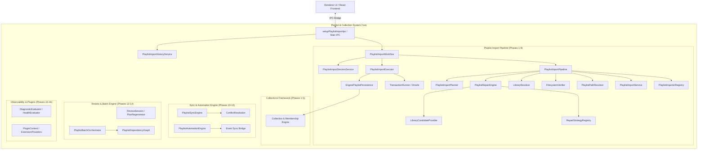
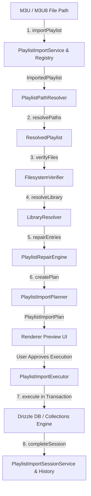

# Nora Architecture & Playlist Importing Framework Specification

This document provides a comprehensive technical overview of the architecture implemented on the `play` branch, with an in-depth breakdown of the **Playlist Importing Subsystem** (Phases 1–16).

---

## 1. High-Level Architecture Overview

The application architecture is organized as a modular, decoupled engine system running within Electron's main process, interfaced with the renderer UI via type-safe IPC contracts.

---

## 2. Playlist Importing Architecture: Detailed Pipeline Flow

The importing architecture decouples **Preview Plan Generation** (non-destructive inspection) from **Import Plan Execution** (atomic transactional writing).

### Import Pipeline Flow Diagram

---

## 3. Core Component Breakdown

### 3.1. Parsing & Importer Registry (`importers`, `registry`)

- **[PlaylistImporterRegistry](file:///c:/Users/VINAY/intellije-workspace/Nora/src/main/playlistImport/registry/PlaylistImporterRegistry.ts)**: Central registry for registering file parsers based on format extensions or MIME types.
- **[M3UImporter](file:///c:/Users/VINAY/intellije-workspace/Nora/src/main/playlistImport/importers/M3UImporter.ts)**: Handles line-by-line parsing of M3U/M3U8 playlists, extracting `#EXTINF` metadata (title, artist, duration) and original file locations.
- **[PlaylistImportService](file:///c:/Users/VINAY/intellije-workspace/Nora/src/main/playlistImport/services/PlaylistImportService.ts)**: Dispatches file paths to the matching registered importer.

### 3.2. Path Resolution Engine (`resolver`)

- **[PlaylistPathResolver](file:///c:/Users/VINAY/intellije-workspace/Nora/src/main/playlistImport/resolver/PlaylistPathResolver.ts)**: Transforms raw entries into absolute system paths. Converts relative tracks (`./songs/track.mp3`) into absolute paths relative to the playlist directory, and standardizes URI formats across operating systems.

### 3.3. Filesystem Verification (`verifier`)

- **[FilesystemVerifier](file:///c:/Users/VINAY/intellije-workspace/Nora/src/main/playlistImport/verifier/FilesystemVerifier.ts)**: Verifies physical file existence on disk via the abstract **[FileSystemAccess](file:///c:/Users/VINAY/intellije-workspace/Nora/src/main/playlistImport/interfaces/FileSystemAccess.ts)** interface (abstracting Node `fs` for testing and portability).

### 3.4. Library Matching Engine (`resolver`)

- **[LibraryResolver](file:///c:/Users/VINAY/intellije-workspace/Nora/src/main/playlistImport/resolver/LibraryResolver.ts)**: Matches verified file paths against Nora's SQLite library using **[LibraryLookup](file:///c:/Users/VINAY/intellije-workspace/Nora/src/main/playlistImport/interfaces/LibraryLookup.ts)**.
  - Matches set status to `MATCHED` with `matchedSongId`.
  - Unmatched files on disk receive status `NOT_IN_LIBRARY`.
  - Non-existent files receive status `MISSING`.

### 3.5. Intelligent Matching & Repair Framework (`repair`, `strategies`)

- **[PlaylistRepairEngine](file:///c:/Users/VINAY/intellije-workspace/Nora/src/main/playlistImport/repair/PlaylistRepairEngine.ts)**: Executes fuzzy recovery for tracks labeled `NOT_IN_LIBRARY`.
- **[RepairStrategyRegistry](file:///c:/Users/VINAY/intellije-workspace/Nora/src/main/playlistImport/registry/RepairStrategyRegistry.ts)**: Manages strategy chains:
  - **[ExactFilenameStrategy](file:///c:/Users/VINAY/intellije-workspace/Nora/src/main/playlistImport/strategies/ExactFilenameStrategy.ts)**: Matches candidate songs in Nora library with exact filename equality.
  - **[NormalizedFilenameStrategy](file:///c:/Users/VINAY/intellije-workspace/Nora/src/main/playlistImport/strategies/NormalizedFilenameStrategy.ts)**: Matches candidates after stripping punctuation, track numbers, and case differences.
- Produces **RepairDiagnostics** detailing strategy confidence scores and match provenance.

### 3.6. Planning Engine (`planner`)

- **[PlaylistImportPlanner](file:///c:/Users/VINAY/intellije-workspace/Nora/src/main/playlistImport/planner/PlaylistImportPlanner.ts)**: Converts resolved entries into a **[PlaylistImportPlan](file:///c:/Users/VINAY/intellije-workspace/Nora/src/main/playlistImport/models/PlaylistImportPlan.ts)** containing:
  - Entry decisions (`IMPORT`, `SKIP_MISSING`, `SKIP_NOT_IN_LIBRARY`, `SKIP_INVALID`).
  - Import statistics (total entries, ready count, skipped count, match percentage).
  - Categorized warnings (missing files, library gaps).

### 3.7. Execution Engine & Persistence (`executor`, `services`)

- **[PlaylistImportExecutor](file:///c:/Users/VINAY/intellije-workspace/Nora/src/main/playlistImport/executor/PlaylistImportExecutor.ts)**: Takes an approved `PlaylistImportPlan` and executes writes within a single atomic database transaction via **[TransactionRunner](file:///c:/Users/VINAY/intellije-workspace/Nora/src/main/playlistImport/interfaces/TransactionRunner.ts)** and **[EnginePlaylistPersistence](file:///c:/Users/VINAY/intellije-workspace/Nora/src/main/playlistImport/services/EnginePlaylistPersistence.ts)**.

### 3.8. Session Management, Audit History & Undo (`services`)

- **[PlaylistImportSessionService](file:///c:/Users/VINAY/intellije-workspace/Nora/src/main/playlistImport/services/PlaylistImportSessionService.ts)**: Manages session lifecycle (`DRAFT` -> `PLANNING` -> `EXECUTING` -> `COMPLETED` / `FAILED` -> `UNDONE`).
- **[PlaylistImportHistoryService](file:///c:/Users/VINAY/intellije-workspace/Nora/src/main/playlistImport/services/PlaylistImportHistoryService.ts)**: Maintains history audit logs and allows one-click **Undo** (deleting the imported playlist via `PlaylistUndoPersistence`) or **Replay**.

### 3.9. Orchestration & IPC Boundary (`workflow`, `ipc`)

- **[PlaylistImportWorkflow](file:///c:/Users/VINAY/intellije-workspace/Nora/src/main/playlistImport/workflow/PlaylistImportWorkflow.ts)**: Coordinates pipeline plan generation, progress callback events, session creation, and plan execution.
- **[setupPlaylistImportIpc](file:///c:/Users/VINAY/intellije-workspace/Nora/src/main/playlistImport/ipc/setupPlaylistImportIpc.ts)**: Registers type-safe Electron IPC handlers for `playlistImport:preview`, `playlistImport:execute`, `playlistImport:history`, `playlistImport:undo`, and `playlistImport:replay`.

---

## 4. Phase-by-Phase Architectural Milestone Matrix

| Phase            | Subsystem                | Description & Key Exports                                                                          |
| :--------------- | :----------------------- | :------------------------------------------------------------------------------------------------- |
| **Phases 1–5**   | Collections Engine       | Base collection model, hierarchical folders, smart query evaluation, membership operations.        |
| **Phase 6**      | Execution Engine         | `PlaylistImportExecutor`, `TransactionRunner`, `EnginePlaylistPersistence`.                        |
| **Phase 7**      | Workflow Orchestration   | `PlaylistImportPipeline`, `PlaylistImportWorkflow`, preview progress models.                       |
| **Phase 8**      | Intelligent Repair       | `PlaylistRepairEngine`, `ExactFilenameStrategy`, `NormalizedFilenameStrategy`, `RepairDiagnostic`. |
| **Phase 9**      | Sessions, History & Undo | `PlaylistImportSessionService`, `PlaylistImportHistoryService`, `PlaylistUndoPersistence`.         |
| **Phases 10–11** | Playlist Sync Engine     | `PlaylistSyncEngine`, `ConflictResolution`, hash tracking, operational sync models.                |
| **Phase 12**     | Event-Driven Sync        | `PlaylistAutomationEngine`, event bridge for automatic filesystem watcher triggers.                |
| **Phase 13**     | Interactive Review       | `ReviewSession`, `PlanRegenerator`, override applier map for preview tuning.                       |
| **Phase 14**     | Batch Orchestration      | `PlaylistBatchOrchestrationService`, `PlaylistDependencyGraph`, parallel execution levels.         |
| **Phase 15**     | Observability            | `DiagnosticEvaluator`, `HealthEvaluator`, operational health diagnostics.                          |
| **Phase 16**     | Plugin Framework         | `PluginContext`, API versioning, typed extension providers for custom importers/repairers.         |
