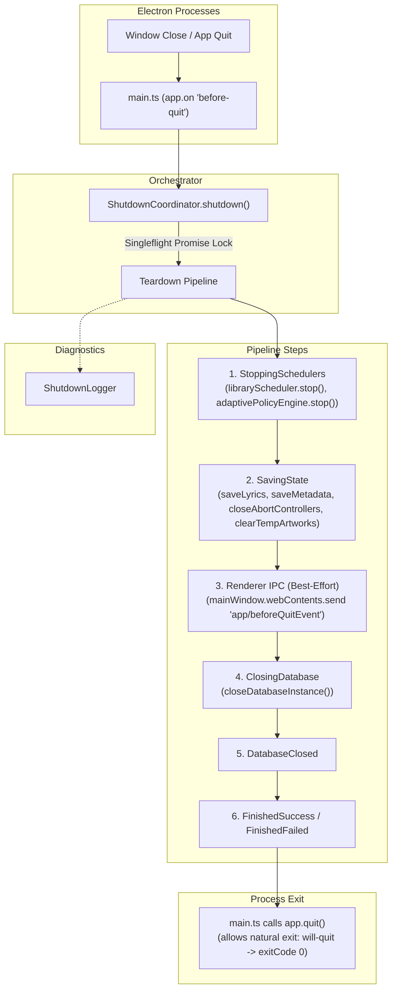

# Nora Application Lifecycle & Shutdown Architecture

> **Authoritative documentation for Electron & PGlite database lifecycle management in Nora.**

---

## 1. Overview

In Nora v4.0.0+, database durability and zero-corruption shutdowns are guaranteed through a single-pass, idempotent lifecycle architecture. 

During application shutdown or window exit, all teardown steps (stopping schedulers, persisting unwritten metadata/lyrics, aborting ongoing background tasks, flushing and closing the PGlite WASM database) are orchestrated sequentially by `ShutdownCoordinator`.

---

## 2. Ownership Boundaries

To avoid race conditions, duplicate logging, or premature process exits, lifecycle responsibilities are strictly partitioned:

| Component | Responsibility | Emits State Machine Logs? |
| :--- | :--- | :---: |
| **`ShutdownCoordinator`** | Orchestrates the entire shutdown sequence, single-flight locking, and state machine transitions. | ✅ **Yes** |
| **`ShutdownLogger`** | Formats, timestamps, and outputs session-scoped diagnostic logs (`[Boot #N]`, `[Shutdown #N]`). | ✅ **Yes** |
| **`closeDatabaseInstance()`** | Low-level helper that closes the PGlite database instance. | ❌ **No** *(Debug diagnostics only)* |
| **`libraryScheduler.stop()`** | Stops the library background job scheduler. | ❌ **No** |
| **`adaptivePolicyEngine.stop()`** | Stops the CPU/resource policy engine. | ❌ **No** |
| **`main.ts`** | Single owner of Electron event registration (`before-quit`, `will-quit`, `window-all-closed`). Delegates to `ShutdownCoordinator`. | ❌ **Observational Event Logs Only** |
| **`ipc.ts`** | Defines IPC handlers only. Does **not** own lifecycle events or call `app.exit()`. | ❌ **No** |

---

## 3. Architecture & Control Flow



---

## 4. State Machine Transitions

Every shutdown session follows a strict, single-directional state machine:

```
    Idle
     │
     ▼
  Started
     │
     ▼
StoppingSchedulers
     │
     ▼
 SavingState
     │
     ▼
ClosingDatabase
     │
     ▼
 DatabaseClosed
     │
     ▼
Finished (Success / Failed)
```

---

## 5. Architectural Invariants

1. **Singleflight Idempotency**:
   `ShutdownCoordinator.shutdown(...)` maintains `shutdownPromise: Promise<void> | null`. Concurrent invocations from multiple sources return the exact same in-flight `Promise` instance.

2. **Infrastructure Cleanup Immunity**:
   IPC notification to the renderer window (`mainWindow.webContents.send('app/beforeQuitEvent')`) is **best-effort** and safely wrapped in `try/catch`. Database closing (`closeDatabaseInstance()`) is **guaranteed** to run regardless of renderer state or window destruction.

3. **Single Lifecycle Event Owner**:
   All Electron lifecycle events (`before-quit`, `will-quit`, `window-all-closed`) are registered exclusively in `main.ts`. `ipc.ts` and lower-level modules do not register shutdown events or invoke `app.exit()`.

4. **Single Teardown Invariant**:
   `closeDatabaseInstance()` is called exclusively by `ShutdownCoordinator` during `ClosingDatabase`.

---

## 6. Directory Structure

```
src/main/lifecycle/
 ├── ShutdownState.ts        # State machine enum (Started, SavingState, ClosingDatabase, DatabaseClosed, etc.)
 ├── ShutdownLogger.ts       # Timestamped, session-scoped diagnostic & milestone logger
 ├── ShutdownCoordinator.ts  # Idempotent single-pass orchestrator
 └── README.md               # Lifecycle architecture documentation (this document)
```
